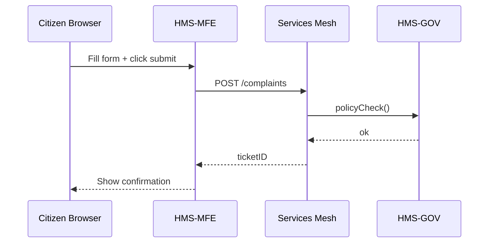

# Chapter 2: Interface Layer (User & Admin Portals)


*File: `02_interface_layer__user___admin_portals__.md`*

---

## 0. From Council-Room to Counter-Top  
In [Chapter 1: Governance Layer (HMS-GOV)](01_governance_layer__hms_gov__.md) we saw **how** every rule is vetted behind the scenes.  
Now we step outside the chamber and greet the public. The **Interface Layer** is the glass counter where:

* Citizens interact through **HMS-MFE** (“Modern Front-End”)  
* Officials log into **HMS-GOV Portal** to review, approve, or override

Think of it as the DMV, but paperless and (hopefully) line-free.

---

## 1. Why Do We Need an Interface Layer?  

### Central Use-Case: Filing a Noise Complaint  
Maria lives near a construction site that works past 10 p.m. She wants the city to intervene.

1. She opens **citizen.city.gov** (our HMS-MFE portal).  
2. A guided form asks for location, time, and decibel readings.  
3. She hits “Submit.”  
4. Officer Chen opens the **HMS-GOV Portal** the next morning, sees Maria’s complaint, and clicks **Approve**.  
5. The **Governance Layer** records the action; a work-order is dispatched.

The Interface Layer solves three big problems:

| Problem | How Interface Layer Helps |
|---------|---------------------------|
| Paper forms are slow & opaque | Digital forms auto-validate and give instant tracking numbers |
| Inconsistent look & feel | Shared **Component Library** enforces the same buttons, colors, fonts |
| Two very different users | Separate portals but one underlying codebase |

---

## 2. Key Concepts in Plain English  

| Term | Analogy | One-Liner |
|------|---------|-----------|
| HMS-MFE (Citizen Portal) | Public lobby | Where citizens fill and track forms |
| HMS-GOV Portal (Admin) | Staff back-office window | Officers approve, deny, or edit |
| Component Library | Lego set | Re-usable buttons, date-pickers, and file-upload widgets |
| Form Schema | Blueprint | JSON that describes each question (label, type, validation) |
| View-State Store | Clipboard | Keeps what the user typed when they navigate between steps |
| Portal Bridge API | Mail chute | Sends data to the backend microservices |

---

## 3. Hands-On: Building Maria’s Form (10 Lines!)

Below is a **super-condensed** React-ish snippet that would live in `forms/NoiseComplaint.jsx`.

```javascript
const schema = [
  { id: "address",  type: "text",  label: "Location" },
  { id: "date",     type: "date",  label: "Date of incident" },
  { id: "decibel",  type: "number",label: "Approx. decibels" }
];

export default function NoiseComplaint() {
  const [data,set] = useState({});
  return <Form schema={schema} data={data} onChange={set}
               onSubmit={() => api.post("/complaints", data)} />;
}
```

What happens?  
1. `schema` tells the **Component Library** which widgets to render.  
2. When Maria presses submit, `api.post()` hands the payload to the **Portal Bridge API**.  
3. She instantly receives `{"ticket":"NC-230584"}` for tracking.

---

## 4. Under the Hood (No Code Yet)

1. **Render** – Browser downloads a JS bundle containing the component library.  
2. **Validate** – Widgets enforce local rules (e.g., decibel must be a number).  
3. **Submit** – A POST request flows to the **Backend Microservices Mesh** (see [Chapter 8](08_backend_microservices_mesh__hms_svc__.md)).  
4. **Governance Check** – If the request triggers a new rule (e.g., “auto-fine if > 90 dB”), the call is routed to [Governance Layer](01_governance_layer__hms_gov__.md).  
5. **Response** – The portal shows “Complaint filed ✔️” or surfaces any error.

### Tiny Sequence Diagram



Only five players—easy to memorize!

---

## 5. Where Do Admins Fit In?  

Officer Chen uses a **mirror** application with elevated permissions.

```javascript
function ReviewQueue() {
  const {data} = useFetch("/complaints?status=pending");
  return data.map(c =>
    <Card key={c.ticket}>
      {c.address} · {c.date}
      <Button onClick={()=>api.post(`/complaints/${c.id}/approve`)}>
        Approve
      </Button>
    </Card>);
}
```

The same Component Library renders cards and buttons, but the API endpoints require roles defined in the [Access & Authorization Matrix](03_access___authorization_matrix_.md).

---

## 6. Implementation Peek (Server Side, 16 Lines)

File: `routes/complaints.py`

```python
@router.post("/complaints")
def submit(data: NoiseComplaint, user: User = Depends(anon)):
    # 1. Save minimal record
    ticket = db.insert("complaints", data.dict())
    # 2. Emit event for async processing
    event_bus.publish("complaint.submitted", {"id": ticket})
    return {"ticket": ticket}

@router.post("/complaints/{id}/approve")
def approve(id: str, user: User = Depends(staff)):
    hms_gov.assert_permitted(user, "approve_complaint")
    db.update("complaints", id, {"status": "approved"})
    return {"status": "ok"}
```

Explanation:

* Two endpoints: one for citizens (`anon`), one for staff (`staff`).  
* `event_bus.publish` notifies other services (see [Event Bus & Real-Time Monitoring](11_event_bus___real_time_monitoring_.md)).  
* The **Governance Layer** is consulted only for the admin action.

---

## 7. Styling & Consistency with the Component Library  

Screenshot in your mind: every page has the same *Gov Sans* font, azure header, and “Next” button at bottom-right.  
That uniformity comes from a shared NPM package:

```
@hms/ux-kit
 ├─ Button
 ├─ DatePicker
 └─ GovForm
```

Versioning is handled by the [Deployment & Versioning Service](15_deployment___versioning_service_.md), so portals always pull compatible UI bits.

---

## 8. Checklist Before You Continue  

☑ Citizen & admin share one codebase, two views.  
☑ JSON schema drives forms—no duplicated HTML.  
☑ Component Library guarantees accessibility & branding.  
☑ All sensitive actions still route back to [HMS-GOV](01_governance_layer__hms_gov__.md).  

---

## 9. What’s Next?  

Access is great, but who decides *who* can click **Approve** or even see a complaint?  
Time to meet the bouncer at the door: the [Access & Authorization Matrix](03_access___authorization_matrix_.md).

---

*End of Chapter 2*

---

Generated by [AI Codebase Knowledge Builder](https://github.com/The-Pocket/Tutorial-Codebase-Knowledge)