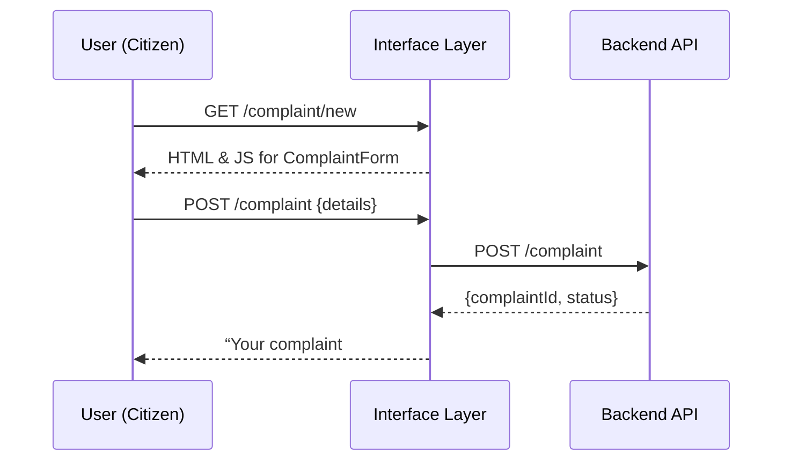
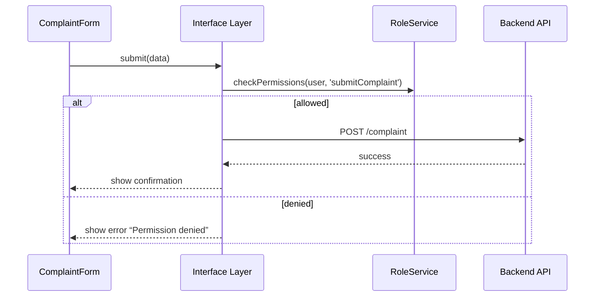

# Chapter 2: Interface Layer

Welcome back! In [Chapter 1: User Roles and Actors](01_user_roles_and_actors_.md) we set up who can do what. Now, let’s build the “customer service desk” where those people actually work—the **Interface Layer**.

## Why the Interface Layer Matters

Imagine a citizen wants to file a toxic‐waste complaint:

- They visit a friendly web portal, fill out details, upload photos.
- Behind the scenes, that portal calls APIs, shows status updates.
- Officials log in to a separate admin console to approve or route the case.

All of this happens in the **Interface Layer**—the web sites, shared UI widgets, navigation and routing glue. It’s where your users (citizens, staff, experts) click and type, so it must be simple, consistent, and secure.

## Key Concepts

1. **Web Portals**  
   - **HMS-MFE**: public portal for citizens.  
   - **HMS-GOV**: admin console for officials.

2. **Shared UI Library**  
   - Reusable buttons, forms, tables, notifications.  
   - Think of it like a government‐branded design kit.

3. **Routing & Navigation**  
   - URL structure and page flow (e.g. `/complaint/new`, `/complaint/status`).  
   - Maps clicks to components.

## Solving Our Use Case

Let’s wire up a simple “Submit Complaint” page using React Router and a shared UI library.

```tsx
// src/interface/routes.tsx
import { BrowserRouter, Route, Switch } from 'react-router-dom'
import { ComplaintForm, StatusPage } from 'hms-ui-lib'

export function AppRouter() {
  return (
    <BrowserRouter>
      <Switch>
        <Route path="/complaint/new" component={ComplaintForm} />
        <Route path="/complaint/status" component={StatusPage} />
      </Switch>
    </BrowserRouter>
  )
}
```
Explanation:
- We import two ready-made components from our shared UI library (`hms-ui-lib`).
- `/complaint/new` renders a form to file a toxic-waste complaint.
- `/complaint/status` shows the current status.

### What Happens at Run-Time?



1. The browser requests the form page.  
2. Interface Layer serves code and assets.  
3. User submits data; Interface Layer forwards to Backend API.  
4. Shows confirmation back to the user.

## Inside the Interface Layer

### 1. Project Structure

```
src/
  interface/
    routes.tsx        ← our router
    index.tsx         ← mounts <AppRouter />
  ui-lib/
    Button.tsx        ← shared component
    ComplaintForm.tsx ← form using Button, Input, etc.
```

### 2. Mounting the Router

```tsx
// src/interface/index.tsx
import React from 'react'
import ReactDOM from 'react-dom'
import { AppRouter } from './routes'

ReactDOM.render(<AppRouter />, document.getElementById('root'))
```
Explanation:
- We tell React to start with `AppRouter`.
- All portal pages come from our routing config.

### 3. A Peek at a Shared Component

```tsx
// src/ui-lib/Button.tsx
export function Button({ onClick, children }) {
  return (
    <button className="hms-button" onClick={onClick}>
      {children}
    </button>
  )
}
```
Explanation:
- A simple styled button used everywhere—one source of truth for look & feel.

## Behind the Scenes: Request Flow

When you call `ComplaintForm.submit()`, here’s what happens:


1. Form asks Interface Layer to submit.  
2. Interface Layer checks roles ([Chapter 1](01_user_roles_and_actors_.md)).  
3. If OK, it calls backend; otherwise it blocks.

## Summary

You’ve learned how the **Interface Layer**:

- Provides web portals (HMS-MFE, HMS-GOV)  
- Hosts a shared UI library for consistent look & feel  
- Routes user actions to the right pages and APIs  
- Ties into roles & permissions ([User Roles and Actors](01_user_roles_and_actors_.md))  

Next up, we’ll dive into the building blocks of those pages—our **Frontend Interface Components**. See you in [Chapter 3: Frontend Interface Components](03_frontend_interface_components_.md)!

---

Generated by [AI Codebase Knowledge Builder](https://github.com/The-Pocket/Tutorial-Codebase-Knowledge)