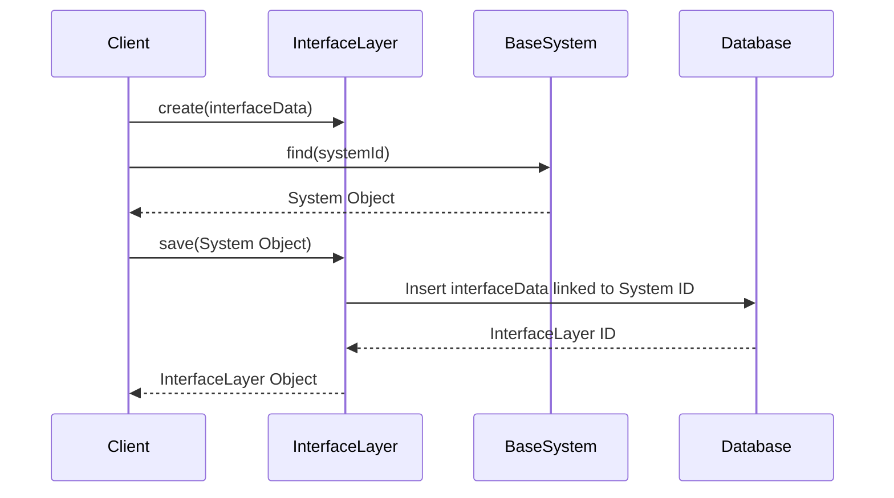

# Chapter 2: InterfaceLayer

In the previous chapter, [BaseSystem](01_basesystem.md), we learned how to create a basic blueprint for any system, like Sunnyside Elementary School.  Now, let's think about how users interact with that system.  This is where the `InterfaceLayer` comes in.

## What problem does InterfaceLayer solve?

Imagine you want to access information about Sunnyside Elementary.  You might visit their website, call their office, or use a mobile app.  The `InterfaceLayer` represents all these different ways users can interact with the system.  It's like the school's customer service department, managing all communication channels and ensuring everyone can easily access and use the system.

## Key Concepts

1. **User Interfaces:** These are the actual tools users interact with, like the school's website or mobile app.

2. **User Experience (UX):** This focuses on making the interaction pleasant and efficient.  A good UX means the website is easy to navigate, the app is intuitive, and the customer service representatives are helpful.

3. **Communication Channels:** These are the different ways users can connect with the system, such as phone calls, emails, or online chat.

## Using InterfaceLayer: Connecting with Sunnyside Elementary

Let's create a website interface for Sunnyside Elementary.

```php
// Simplified example - see InterfaceLayer.php for full implementation
use App\Models\InterfaceLayer;

$school = BaseSystem::find(1); // Assuming Sunnyside Elementary has ID 1
$interfaceLayer = new InterfaceLayer([
    'url' => 'https://sunnyside.edu',
    'interface_type' => 'website'
]);

$school->interfaceLayer()->save($interfaceLayer); // Link to the school system
```

This code creates a new `InterfaceLayer` representing Sunnyside Elementary's website.  We link it to the `BaseSystem` we created in the previous chapter.

## Internal Implementation

When you call `save` on the `InterfaceLayer`, it creates a new entry in the database representing the interface layer and links it to the corresponding `BaseSystem`.



The code for saving the `InterfaceLayer` can be found in `Gov/Entities/Base/Interface/InterfaceLayer.php`. Here's a simplified snippet:

```php
// Gov/Entities/Base/Interface/InterfaceLayer.php (simplified)
public function system(): BelongsTo
{
    return $this->belongsTo(BaseSystem::class, 'system_id');
}
```

This code defines the relationship between the `InterfaceLayer` and the `BaseSystem`.

## Conclusion

In this chapter, we learned about the `InterfaceLayer`, which manages how users interact with a system. We saw how to create a website interface for Sunnyside Elementary. In the next chapter, [SystemInterface](03_systeminterface.md), we'll explore the specific components within an interface layer, like individual web pages or app screens.


---

Generated by [AI Codebase Knowledge Builder](https://github.com/The-Pocket/Tutorial-Codebase-Knowledge)