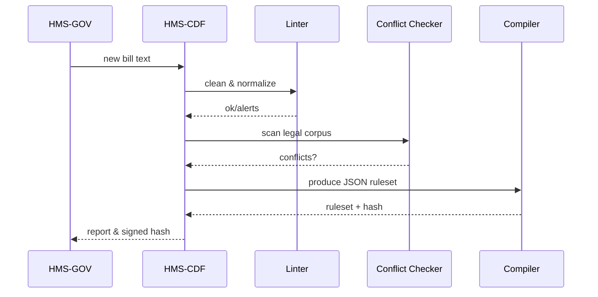

# Chapter 2: Legislative Codification Engine (HMS-CDF)

*(a friendly continuation from [Chapter 1: Governance Layer (HMS-GOV)](01_governance_layer__hms_gov__.md))*  

---

## 1. Why Do We Need HMS-CDF?

Imagine Congress just approved a **plain-language bill**:

> “All federal agencies must accept electronic signatures for veteran benefit forms within 180 days.”

Great idea—until 1 000 existing regulations, half-written footnotes, and unknown budget impacts muddy the waters.  
HMS-CDF is our **digital bill drafter** that:

1. Reads the text in real-time (like a court stenographer).  
2. Flags legal conflicts or redundancies (like a seasoned staff attorney).  
3. Estimates money matters (like a CBO scorekeeper).  
4. Emits a **machine-readable ruleset** so downstream systems can enforce it without guessing.

In short: *“From plain English → bullet-proof code law.”*

---

## 2. Running Example

We will follow a tiny use-case:  
*The Office of Science and Technology Policy (OSTP) wants a rule requiring agencies to publish data sets in open formats.*

Plain-language draft (user story):

```
SECTION 1. OPEN DATA.
All executive agencies shall publish machine-readable copies of publicly releasable data
sets on agency.gov/data within 120 days of creation.
```

Your task: feed this to HMS-CDF and receive a structured rule the computers (and lawyers!) can trust.

---

## 3. Key Concepts (Zero Legalese)

| Concept | Beginner Description |
|---------|----------------------|
| Ingestor | Reads the bill text—accepts `.txt`, `.docx`, or API payload. |
| Linter | Basic grammar + style fixer: catches undefined acronyms, vague deadlines, etc. |
| Conflict Checker | Searches the U.S. Code & CFR for overlaps or contradictions. |
| Budget Scorer | Calls a cost model to guess $$$ effects. |
| Compiler | Converts approved text into JSON/YAML that machines enforce. |
| Version Vault | Git-style history so every semicolon change is traceable. |

---

## 4. Using HMS-CDF in 10 Lines

Below is a **Python wrapper** that hits the Rust micro-service under the hood. (We stay in Python only so beginners don’t need Rust installed.)

```python
# file: demo_cdf.py
from hms_cdf import CDF

cdf = CDF(endpoint="http://localhost:8080")

draft = """
SECTION 1. OPEN DATA.
All executive agencies shall publish machine-readable copies ...
"""

report, ruleset = cdf.process(draft)
print(report["summary"])
print(ruleset[:120] + "...")
```

Expected console:

```
✓ Grammar OK | ✓ No legal conflicts | Estimated cost: $2.3M/yr
{
  "id": "USC_2024_4215",
  "effective_in": "120 days",
  ...
}
```

**What happened?**  
1. `process()` called every sub-module (ingest → linter → scorer → compiler).  
2. `report` is human-readable; `ruleset` is machine-readable.

---

## 5. Peek Inside (5-Step Walkthrough)



---

## 6. Under-the-Hood Code Bites

### 6.1. Top-Level Router (Rust)

```rust
// file: src/main.rs (simplified)
use axum::{routing::post, Router};
mod modules;            // linter, checker, compiler

#[tokio::main]
async fn main() {
    let app = Router::new().route("/process", post(modules::process));
    axum::Server::bind(&"0.0.0.0:8080".parse().unwrap())
        .serve(app.into_make_service())
        .await.unwrap();
}
```

*Explanation:* Sets up a single `/process` endpoint—think of it as the bill drop box.

### 6.2. The `process` Pipeline (Rust)

```rust
// file: src/modules.rs (snippet)
pub async fn process(body: String) -> Json<Output> {
    let cleaned = linter::run(&body)?;
    let legal_ok = checker::scan(&cleaned)?;
    let budget  = scorer::estimate(&cleaned);
    let rules   = compiler::compile(&cleaned)?;
    Json(Output { summary: legal_ok, budget, ruleset: rules })
}
```

*Explanation:* Each helper returns a `Result<T>`; any error short-circuits with details for reviewers.

---

## 7. Version Control Magic

Every successful compile writes to an **immutable Git commit**:

```
/var/lib/hms_cdf/repo
│
└── 2024-05-14_15h32m
    ├── bill.txt
    ├── ruleset.json
    └── report.md
```

So auditors (or citizens via FOIA) can always diff *what* changed and *when*—no more “mystery amendments.”

---

## 8. Common Questions

1. **Q: What if the Conflict Checker finds a clash?**  
   A: The report lists the statute numbers; the proposal auto-returns to [HMS-GOV](01_governance_layer__hms_gov__.md) with a “needs revision” flag.

2. **Q: Does HMS-CDF write to production systems?**  
   A: No. It only creates **validated artifacts**. Enforcement is handled later by [Compliance & Legal Reasoning (HMS-ESQ)](03_compliance___legal_reasoning__hms_esq__.md).

3. **Q: Can agencies plug in their own budget model?**  
   A: Yes—`scorer::estimate()` reads a config that can swap in custom WASM modules.

---

## 9. Mini Challenge (Optional)

Try altering the draft to read *“within 30 days.”* The Conflict Checker should now warn that **OMB Circular A-130** requires 90-day notice for data collection changes. Observe the updated report.

---

## 10. What We Learned

• HMS-CDF transforms approved text into **conflict-free, budget-scored, machine-enforceable rules**.  
• It provides automatic version control, human reports, and computer-ready artifacts in one sweep.  
• Any detected issue sends the bill back upstream; otherwise, the codified rules flow downstream to compliance engines.

Ready to see how those rules are actually enforced in live systems? Continue to [Chapter 3: Compliance & Legal Reasoning (HMS-ESQ)](03_compliance___legal_reasoning__hms_esq__.md).

---

Generated by [AI Codebase Knowledge Builder](https://github.com/The-Pocket/Tutorial-Codebase-Knowledge)