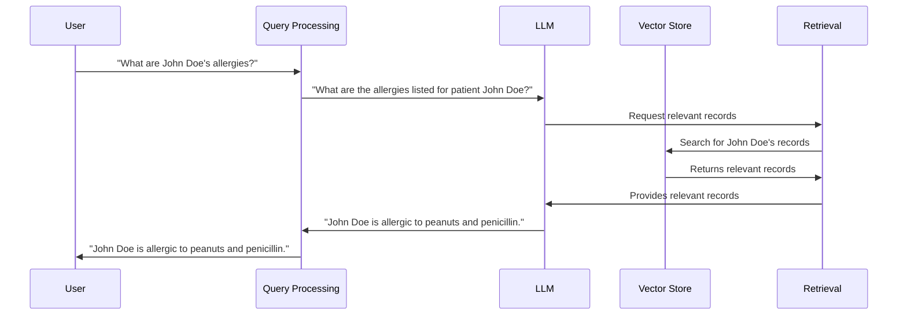

# Chapter 2: LLM (Large Language Model)

In the previous chapter, [Prompt](01_prompt.md), we learned how to give instructions to a super-smart helper. Now, let's learn more about this helper itself: the LLM (Large Language Model).

Imagine you want to ask a question about a patient's medical history, like "What allergies does John Doe have?".  An LLM is the component that can understand this question and generate an answer.  It's like the "brain" of the operation.

An LLM is like a super-smart student who has read tons of books and can answer questions, write stories, and even translate languages. However, just like a student, it needs good instructions (prompts) and relevant information (context) to perform well.

## How LLMs Work (Simplified)

Think of an LLM as a giant matching game.  When you give it a prompt, it tries to find the "pieces" of information in its vast knowledge base that best match the prompt.  It then uses these pieces to construct a response.

## Using LLMs in HMS-MED

In HMS-MED, the LLM works together with other components to answer your questions about medical records.  Here's a simplified example:

1. You ask: "What allergies does John Doe have?"
2. HMS-MED turns your question into a prompt for the LLM.
3. The LLM receives the prompt.
4. The LLM searches a database (called a [Vector Store](06_vector_store.md)) for relevant information about John Doe's allergies.
5. The LLM uses the retrieved information and the prompt to generate an answer, such as "John Doe is allergic to peanuts and penicillin."

## Internal Implementation

Let's visualize how the LLM interacts with other components:



The code for interacting with the LLM can be found in `HMS-EHR/_scripts/evaluate_chains.py`.  Here's a simplified example:

```python
# ... other code ...

# This is where the LLM is called.  The 'chain' object contains the LLM and other components.
result = chain({"question": "What are John Doe's allergies?", "chat_history": []})

# ... more code to process the result ...
```

The `create_chain` function in `HMS-EHR/backend/chain.py` shows how the LLM is initialized and connected to other components like the [Retrieval](04_retrieval.md) system.  The code is complex, but the key takeaway is that the LLM is set up to receive prompts and access the [Vector Store](06_vector_store.md).

```python
# ... other code ...

llm = ChatOpenAI(model="gpt-3.5-turbo-1106", streaming=True, temperature=0) # Initialize the LLM

# ... code to create the chain, connecting the LLM to other components ...
```

## Conclusion

LLMs are powerful tools for understanding and generating text. In HMS-MED, they are the core component that allows us to ask complex questions about medical records.  Now that we understand LLMs, let's learn how HMS-MED analyzes our questions to make them even better: [Query Analysis](03_query_analysis.md).


---

Generated by [AI Codebase Knowledge Builder](https://github.com/The-Pocket/Tutorial-Codebase-Knowledge)