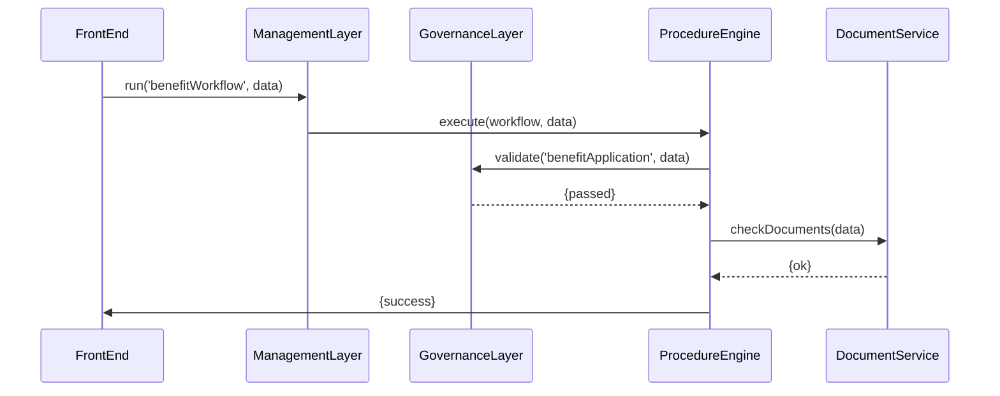

# Chapter 2: Management Layer

Welcome back! In [Chapter 1: Governance Layer](01_governance_layer_.md) we saw how our system enforces policies (the “referee”). Now we’ll meet the **Management Layer**—the “coaching staff” that turns those rules into real game-plans for our application.

## Why Do We Need a Management Layer?

Imagine a federal agency portal where citizens apply for unemployment benefits. The **Governance Layer** checks age, residency, and privacy rules. Once passed, we need to:

1. Split the process into steps (e.g., verify documents, perform background check).  
2. Call different services in order.  
3. Handle retries, errors, and notifications.  

The **Management Layer** takes those governance decisions and designs the day-to-day workflow:  
- “If document check fails, ask the citizen to re-upload.”  
- “After all checks pass, trigger the fund-disbursement API.”

It’s like a coaching staff that reads the referee’s calls (Governance) and tells the players (your services) exactly what to do, when, and how.

---

## 1. Central Use Case: Benefit Application Workflow

Use case: A citizen submits an unemployment benefit form. The Management Layer will:

1. Ask the Governance Layer to validate rules.  
2. If passed, run tasks in sequence:  
   - **Check Documents** via DocumentService  
   - **Background Check** via CentralRegistry  
   - **Notify Applicant** via EmailService  
3. Report final status back to the front end.

---

## 2. Key Concepts

1. **Workflow Definition**  
   A JSON or JS object describing the ordered tasks and error-handling steps.  
2. **Task Handlers**  
   Small functions that call external services (e.g., DocumentService).  
3. **Procedure Engine**  
   The runtime that reads the workflow and runs each task in turn.  
4. **Policy Binding**  
   Linking workflow steps with governance tags so that rules apply at each stage.

---

## 3. Using the Management Layer

### 3.1 Define a Workflow

Create `management/workflows/benefitWorkflow.js`:

```js
module.exports = {
  id: 'benefitWorkflow',
  steps: [
    { name: 'govCheck',       handler: 'governanceValidate' },
    { name: 'verifyDocs',     handler: 'checkDocuments' },
    { name: 'backgroundCheck',handler: 'runBackgroundCheck' },
    { name: 'notifyApplicant',handler: 'sendNotification' }
  ]
}
```

Explanation:
- `id` – Unique workflow name.  
- `steps` – Ordered tasks. The first step ties back to our [Governance Layer](01_governance_layer_.md).

### 3.2 Kick Off a Workflow

```js
import Management from '../management/ManagementLayer'

async function startBenefitProcess(formData) {
  const result = await Management.run('benefitWorkflow', formData)
  if (result.success) {
    alert('All set! Check your email for updates.')
  } else {
    alert('Process failed at step: ' + result.failedStep)
  }
}
```

Explanation:
- `run()` returns `{ success: true }` or `{ success: false, failedStep: '...' }`.  
- On failure, you can re-trigger or inform the user which step failed.

---

## 4. What Happens Under the Hood?

### 4.1 Step-by-Step (Non-Code)

1. **Front End** calls `ManagementLayer.run('benefitWorkflow', data)`.  
2. **ManagementLayer** loads the workflow from the **TaskStore**.  
3. It sees the first step is `governanceValidate` → calls the [Governance Layer](01_governance_layer_.md).  
4. If policies pass, each task handler runs in sequence.  
5. On error, the procedure stops and returns the failed step.

### 4.2 Sequence Diagram



---

### 4.3 Core Files

#### management/ManagementLayer.js

```js
import TaskStore from './TaskStore'
import ProcedureEngine from './ProcedureEngine'

class ManagementLayer {
  async run(workflowId, data) {
    const wf = await TaskStore.get(workflowId)
    return ProcedureEngine.execute(wf, data)
  }
}

export default new ManagementLayer()
```

_Explanation_:  
- `get()` loads the workflow definition.  
- `execute()` drives the steps one by one.

#### management/TaskStore.js

```js
import wfDef from './workflows/benefitWorkflow'
export default {
  async get(id) {
    // In real life, look up a DB or file system
    return id === wfDef.id ? wfDef : null
  }
}
```

_Explanation_:  
- Simplified store returning our single workflow.

#### management/ProcedureEngine.js

```js
export default {
  async execute(workflow, data) {
    for (const step of workflow.steps) {
      // map handler names to real functions
      const handler = this.handlers[step.handler]
      const ok = await handler(data)
      if (!ok) return { success: false, failedStep: step.name }
    }
    return { success: true }
  },

  handlers: {
    governanceValidate: data => /* call Governance */ true,
    checkDocuments:     data => /* call DocumentService */ true,
    runBackgroundCheck: data => /* call RegistryAPI */ true,
    sendNotification:   data => /* call EmailService */ true
  }
}
```

_Explanation_:  
- Loops each step, calls the matching handler.  
- Stops on first failure.

---

## Conclusion

You’ve learned how the **Management Layer**:

- Defines multi-step workflows  
- Orchestrates policy checks and service calls  
- Reports success or detailed failures  

Next up is the [Interface Layer](03_interface_layer_.md), where we’ll build the UI components that trigger these workflows. Stay tuned!

---

Generated by [AI Codebase Knowledge Builder](https://github.com/The-Pocket/Tutorial-Codebase-Knowledge)