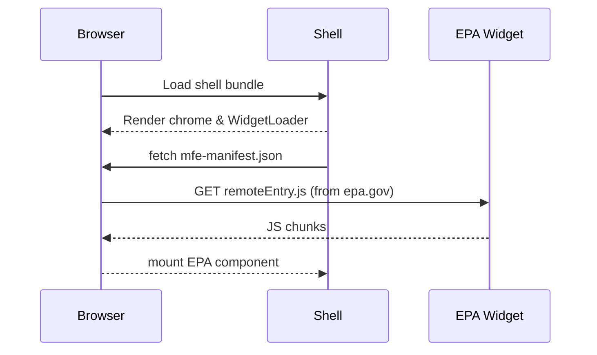

# Chapter 2: Micro-Frontend Architecture (HMS-MFE)


➡️ *Coming from Chapter&nbsp;1?* Catch up here: [Policy Management Dashboard](01_policy_management_dashboard_.md)

---

## 0. The 60-Second Pitch

Imagine the **Department of Veterans Affairs (VA)** team wakes up at 9 AM and ships a new “Benefits Calculator” widget.  
At 2 PM the **Voice of America (VOA)** team deploys a language-switcher tool in 40 dialects.  
Neither team waits for the other, neither needs the same code repo, and—most importantly—neither can accidentally break the **DMV “Renew-Vehicle” screen**.

That freedom is delivered by **HMS-MFE**—our Micro-Frontend architecture.  
Think of it as LEGO® for government web apps: each agency builds its own colorful brick, but the bricks always snap into the same board.

---

## 1. Why Do We Need Micro-Frontends?

Real-world pain before HMS-MFE:

| Pain                             | Example in Government                                             |
|----------------------------------|-------------------------------------------------------------------|
| Release Bottlenecks              | IRS must wait for Passport Office tests to finish.               |
| Brand Clashes                    | One CSS file turns every page *IRS green*.                        |
| Risky Rollbacks                  | A small DMV fix takes down the National Archives search panel.    |

Goal: **Decouple** agency UIs into independent, independently deployable “slices” that still feel like one coherent system to citizens.

---

## 2. Key Concepts (Plain English)

| Term              | What it Means (Beginner Version)                              |
|-------------------|---------------------------------------------------------------|
| Shell             | The master page chrome: nav bar, footer, routing.             |
| Widget (MFE)      | A self-contained app—e.g., “IRS Tax Rule Viewer”.             |
| Remote Entry      | A tiny JS bundle (`remoteEntry.js`) that tells the shell *what* the widget exposes. |
| Manifest          | JSON file describing name, version, and where to fetch the widget. |
| Sandboxing        | Isolation tricks so one widget’s CSS/JS can’t ruin others.    |

---

## 3. A Concrete Walk-Through: Plug In an EPA “Clean Air Act Explorer”

We will:

1. Scaffold a new widget in 60 seconds.  
2. Expose it via **Module Federation**.  
3. Tell the shell to load it dynamically.

### 3.1 Scaffold the Widget

```bash
# 1. Create project
npm create vite@latest epa-clean-air -- --template vue

# 2. Jump in & install federation helper
cd epa-clean-air
npm i -D @originjs/vite-plugin-federation
```

### 3.2 Expose the Widget

```js
// File: epa-clean-air/vite.config.js
import { defineConfig } from 'vite'
import federation from '@originjs/vite-plugin-federation'

export default defineConfig({
  plugins: [
    federation({
      name: 'epa_caa',                 // widget id
      filename: 'remoteEntry.js',      // auto-generated manifest
      exposes: { './Widget': './src/App.vue' }
    })
  ]
})
```

Explanation (Beginner-friendly):

* `name`: a unique handle—must match what the shell will request.  
* `exposes`: which file(s) outsiders may import; here our entire mini-app.  
* When you run `npm run build`, Vite outputs `remoteEntry.js` plus chunks.

### 3.3 Tell the Shell About the New Widget

```json
// File: shell/public/mfe-manifest.json
{
  "epa_caa": {
    "url": "https://epa.gov/widgets/clean-air/remoteEntry.js",
    "module": "./Widget"
  }
}
```

Think of this as the **address book** the shell consults at runtime.

### 3.4 Runtime Loader (simplified)

```vue
<!-- File: shell/components/WidgetLoader.vue -->
<script setup>
import { onMounted, ref } from 'vue'

const props = defineProps({ name: String })  // e.g., "epa_caa"
const El = ref(null)                         // mounted component

onMounted(async () => {
  // 1. fetch manifest
  const manifest = await fetch('/mfe-manifest.json').then(r => r.json())
  const entry = manifest[props.name]

  // 2. inject <script src="...remoteEntry.js">
  await import(entry.url)

  // 3. import exposed module & store in El
  const { default: Comp } = await window[props.name].get(entry.module).then(m => m())
  El.value = Comp
})
</script>

<template>
  <component :is="El" v-if="El"></component>
  <span v-else>Loading {{ props.name }}…</span>
</template>
```

What happens:

1. Loader fetches the address book.  
2. Dynamically injects the remote script (Module Federation runtime handles caching).  
3. Renders the remote Vue component once available.

### 3.5 Add It to the Dashboard

```vue
<!-- File: shell/pages/Home.vue -->
<template>
  <h1>Unified HMS-GOV Portal</h1>
  <WidgetLoader name="epa_caa" />
</template>

<script setup>
import WidgetLoader from '../components/WidgetLoader.vue'
</script>
```

Open the browser—🎉 the EPA widget appears, neatly living beside IRS, DMV, and VOA widgets.

---

## 4. Under the Hood (Non-Code)



Key Ideas:

1. **Runtime Composition** – The shell doesn’t *bundle* widgets; it *fetches* them.  
2. **Cache Safety** – If EPA ships v2, only EPA cache busts; others stay untouched.  
3. **Isolation** – Each widget carries its own scoped CSS and only shared libs (e.g., Vue) are deduped.

---

## 5. Internal File Cheat-Sheet

| File                                   | Purpose                        |
|----------------------------------------|--------------------------------|
| `shell/components/WidgetLoader.vue`    | Generic runtime loader.        |
| `shell/public/mfe-manifest.json`       | Address book of widgets.       |
| `epa-clean-air/vite.config.js`         | Exposes the widget to the world.|

---

## 6. Best-Practice Snippets

*Version Pinning* (to avoid “latest” surprises):

```json
"epa_caa": {
  "url": "https://epa.gov/widgets/clean-air/1.2.0/remoteEntry.js"
}
```

*Shared Libraries* (save download time):

```js
// in vite.config.js
shared: ['vue', 'pinia']  // host and widget reuse single copy
```

*CSS Namespacing*: add a root id in your widget:

```vue
<template>
  <div class="epa-widget">
    <!-- your markup -->
  </div>
</template>
```

---

## 7. Where Does HMS-MFE Touch Other Chapters?

• The **Dashboard shell** we built in [Policy Management Dashboard](01_policy_management_dashboard_.md) is the *host* for all MFEs.  
• Clicking a Policy Card later routes to the **Policy Editor** widget, detailed in [Policy Editor Interface](03_policy_editor_interface_.md).  
• Widgets call the **Backend Policy API** covered in [Backend Policy API](08_backend_policy_api__hms_svc___hms_api__.md).

---

## 8. Recap & Next Steps

In this chapter you:

1. Learned **why** micro-frontends slash release risk in multi-agency systems.  
2. Created a brand-new EPA widget in minutes.  
3. Plugged it into the shell using a tiny JSON manifest and a 15-line loader.  
4. Saw the internal call sequence that makes everything feel seamless to end users.

Ready to dive into editing individual policies inside their dedicated widget?  
➡️ Continue to [Policy Editor Interface](03_policy_editor_interface_.md) – where users actually modify the rules!

---

Generated by [AI Codebase Knowledge Builder](https://github.com/The-Pocket/Tutorial-Codebase-Knowledge)