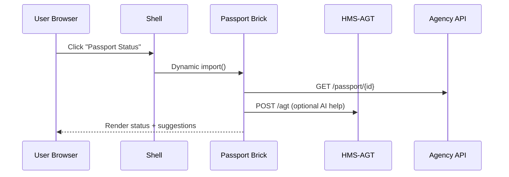

# Chapter 2: Micro-Frontend Interface (HMS-MFE)

*(continues from [AI Representative Agent (HMS-AGT)](01_ai_representative_agent__hms_agt__.md))*  

---

## 1. Why Do We Need HMS-MFE?

### A concrete story

Lucía is planning an overseas trip. In a single sitting she must:

1. Renew her passport (Bureau of Consular Affairs).  
2. Check the status of her tax refund.  
3. Book a vaccination appointment with her local health agency.

Without HMS-MFE she would hop across three unrelated websites, each with its own login screen, colors, and loading spinners. With HMS-MFE the experience feels like Lego bricks inside **one** seamless dashboard:

```
┌────────────────────────────────────┐
│  MyGov Portal (shell)              │
│ ┌── Passport Brick ──┐ ┌─ Tax Brick ─┐
│ │Renewal form here   │ │Status bar   │
│ └────────────────────┘ └────────────┘
│ ┌─ Health Brick ──┐
│ │Calendar picker  │
│ └─────────────────┘
└────────────────────────────────────┘
```

• Agencies keep control of their own code.  
• Citizens enjoy a unified, no-reload interface.  
• Our [HMS-AGT](01_ai_representative_agent__hms_agt__.md) “brain” can talk to any brick behind the scenes.

---

## 2. Key Concepts (Plain English)

| Term | What it really means |
|------|----------------------|
| Shell | The outer frame (header, side-nav) loaded once. |
| Micro-Frontend (Brick) | A small, self-contained web app: HTML + JS + CSS. |
| Design System | Shared fonts/colors so all bricks look related. |
| Message Bus | Tiny event pipe so bricks talk to each other & to HMS-AGT. |
| Lazy Loading | We only fetch a brick when the citizen opens that section. |

Picture the shell as a **city square** and each brick as a **booth**. Every agency owns its booth but abides by city rules (design system, security).

---

## 3. Quick Start — Your First Brick in 3 Files

Below we embed a **PassportStatusBrick** into the shell. The code uses modern browser `import()` so we need no heavy tooling.

### 3.1 `index.html` (the shell)

```html
<!DOCTYPE html>
<html>
<head>
  <title>MyGov Portal</title>
  <script type="module">
    /* routes -> brick URLs */
    const registry = {
      passport: '/bricks/passport.js',
    };
    /* load on click */
    document.addEventListener('click', e => {
      if (e.target.dataset.route) {
        import(registry[e.target.dataset.route])
          .then(mod => mod.mount('#content'));
      }
    });
  </script>
  <style>/* shared colors */ body{font:14px sans-serif} </style>
</head>
<body>
  <nav>
    <button data-route="passport">Passport Status</button>
  </nav>
  <main id="content"><!-- brick mounts here --></main>
</body>
</html>
```

Explanation  
1-4: A tiny **registry** maps route names to brick files.  
7-10: When a nav button is clicked we `import()` the brick and call its `mount` function.  
14: Shared CSS delivers the common look.

### 3.2 `/bricks/passport.js` (the brick)

```javascript
// exports one public function
export function mount(targetSel){
  const el = document.querySelector(targetSel);
  el.innerHTML = `
    <section class="panel">
      <h2>Check Passport Status</h2>
      <input id="appId" placeholder="Application ID">
      <button id="btn">Check</button>
      <pre id="out"></pre>
    </section>`;
  document.getElementById('btn').onclick = async () => {
      const id = document.getElementById('appId').value;
      const res = await fetch(`/api/passport/${id}`).then(r=>r.json());
      document.getElementById('out').textContent =
          res.status ?? 'No record found';
  };
}
```

What happens:  
• Renders a mini form.  
• On click it calls a simple REST endpoint (could be proxied to [HMS-AGT](01_ai_representative_agent__hms_agt__.md)).  
• Updates the `<pre>` block with the status. Entire brick is **16 lines**!

### 3.3 Shared Styles `/bricks/passport.css` (optional)

```css
.panel {border:1px solid #ccc;padding:1rem;border-radius:.3rem}
```

Link it inside the brick with `import './passport.css'`.

---

## 4. Talking to the Agent Brain

A brick can ask HMS-AGT to draft or verify content. Example:

```javascript
const draft = await fetch('/agt', {
  method:'POST',
  body:JSON.stringify({
    skill:'email_draft',
    data:{purpose:'Passport delay notification'}
  })
}).then(r=>r.text());
```

The brick need not know any AI details—*just an HTTP call*.

---

## 5. What Happens Under the Hood?



1. Shell loads once; bricks load **on demand**.  
2. Bricks fetch their own data but can also consult HMS-AGT for AI assistance.  
3. All network calls are traced by the [Observability & Metrics Stack (HMS-OPS)](14_observability___metrics_stack__hms_ops__.md).

---

## 6. A Peek Inside HMS-MFE Codebase

Project folders (simplified):

```
hms-mfe/
 ├─ shell/
 │   └─ index.html
 ├─ bricks/
 │   ├─ passport.js
 │   └─ tax-status.js
 └─ bus.js
```

### 6.1 The Message Bus (`bus.js`)

```javascript
const listeners = {};
export function publish(topic,data){
  (listeners[topic]||[]).forEach(cb=>cb(data));
}
export function subscribe(topic,cb){
  (listeners[topic]=listeners[topic]||[]).push(cb);
}
```

Explanation  
• `publish` sends an event; `subscribe` listens.  
• Bricks import this to talk without tight coupling.

Example usage inside two bricks:

```javascript
import {publish,subscribe} from '/bus.js';
publish('NAV_TITLE','Passport');          // tell shell to change title
subscribe('LOGOUT', ()=> window.location='/');
```

Under **10 lines** yet powerful!

---

## 7. Frequently Asked (Beginner) Questions

**Q: Do I need React, Vue, or Angular?**  
A: Use whatever you like. Bricks compile to plain JS modules; the shell only needs a `mount()` function.

**Q: Can two bricks share session info?**  
A: Yes, via the message bus or browser storage, but sensitive tokens are auto-scoped by the [Secure Infrastructure Core (HMS-SYS)](15_secure_infrastructure_core__hms_sys__.md).

**Q: How do we avoid version clashes (e.g., two bricks shipping different React versions)?**  
A: Bricks are sandboxed in iframes or `import()` scopes; shared libraries live in the shell’s *single* copy.

---

## 8. Wrap-Up

In this chapter you:

• Learned why **micro-frontends** matter for a digital government.  
• Registered and mounted a Passport brick in under 20 lines.  
• Saw how bricks can chat with the HMS-AGT brain and with each other.  
• Peeked at the minimal internals: shell, registry, and message bus.

Next, we will teach the portal to **understand what the citizen wants before they click**—an Intent-aware router. Continue to: [Intent-Driven Navigation Engine](03_intent_driven_navigation_engine_.md)

Welcome to the front lines!

---

Generated by [AI Codebase Knowledge Builder](https://github.com/The-Pocket/Tutorial-Codebase-Knowledge)