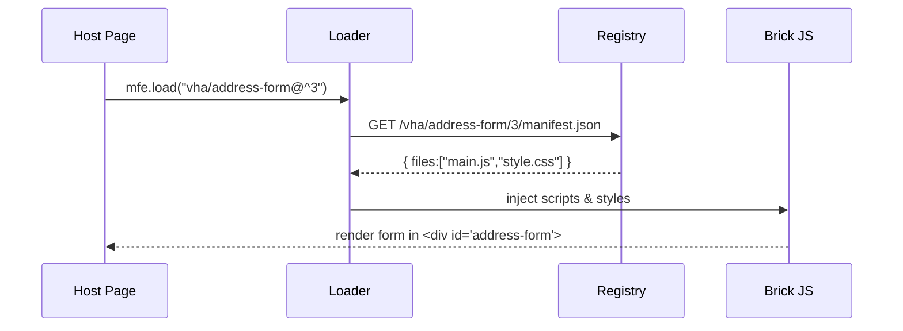

# Chapter 2: Micro-Frontend Library (HMS-MFE)

_(A box of Lego bricks for making government websites)_

[← Back to Chapter 1: Intent-Driven Navigation](01_intent_driven_navigation_.md)

---

## 1. Why do we need another UI library?

Imagine the Department of Veterans Affairs wants to add a **“One-Click Telehealth”** button on every Veterans Health page **by Monday**.  
Traditionally they would:

1. Ask each web team (benefits, pharmacy, billing…) to copy-paste new HTML.  
2. Test 30 separate deployments.  
3. Hope no one accidentally breaks the ADA-compliant color theme.

With HMS-MFE, a designer publishes a new **`<va-telehealth-button>`** micro-frontend once.  
Every VA site that uses the library updates instantly—no mass redeploy, no broken pages.

> **Micro-frontends = Lego bricks**: Swap one brick without rebuilding the castle.

---

## 2. Key ideas in plain English

| Term | Think of it as… |
| --- | --- |
| **Brick / Micro-frontend** | A reusable widget (button, chart, entire form). |
| **Shell** | The Lego base plate—loads bricks and gives them data. |
| **Registry** | The toy box—where all versioned bricks live. |
| **Loader** | The child’s hand—plucks the brick and snaps it onto the page. |
| **Scoped Styles** | Paint that never spills onto neighboring bricks. |

---

## 3. Quick start (5 lines of code)

Below we embed a **Veteran Address Update Form** in any agency site.

```html
<!-- index.html -->
<script src="https://cdn.hms.gov/mfe-loader.js"></script>
<div id="address-form"></div>
<script>
  mfe.load("vha/address-form@^3", { target: "#address-form", vetId: "12345" });
</script>
```

Explanation:

1. Load the lightweight **loader script** (≈3 KB).  
2. Reserve a spot with `<div id="address-form">`.  
3. `mfe.load()` fetches version 3 of `vha/address-form` from the Registry and passes props (`vetId`).  
4. The brick renders, isolated from host CSS/JS.

Result: the page shows a fully styled, ADA-compliant form that auto-saves to VHA APIs.

---

## 4. Under the hood (no prior experience needed)



1. **Host Page** calls `mfe.load`.  
2. **Loader** queries the **Registry** for the right version.  
3. Files are injected with **scoped styles**.  
4. **Brick** boots and draws itself.

No global variables are polluted; multiple bricks—even different versions—coexist.

---

## 5. Creating your first brick

### 5.1 Boilerplate (only 18 lines!)

```js
// file: bricks/va-hello.js
class VaHello extends HTMLElement {
  connectedCallback() {
    const user = this.getAttribute("vet-name") || "Veteran";
    this.innerHTML = `<button class="va-btn">Hello, ${user}!</button>`;
  }
}
customElements.define("va-hello", VaHello);

// self-register for the loader
mfe.register("vha/hello@1.0.0", VaHello);
```

What happens:

• Defines a [Web Component](https://developer.mozilla.org/en-US/docs/Web/Web_Components).  
• Registers it under the name `vha/hello@1.0.0`.  
• On publish, HMS-MFE zips JS/CSS into the Registry.

### 5.2 Publishing (CLI)

```bash
$ npx hms-mfe publish ./bricks/va-hello.js
✓ Uploaded vha/hello@1.0.0
```

That’s it. Any agency page can now:

```js
mfe.load("vha/hello", { target: "#greet", "vet-name": "Maria" });
```

---

## 6. Integrating with Intent-Driven Navigation

In [Chapter 1](01_intent_driven_navigation_.md) we built a **plan** for Maria’s food-truck permits.  
Now we can visualize each step with bricks:

```js
services.forEach(svc => {
  mfe.load("common/service-card", {
    target: "#plan",
    title: svc.name,
    status: svc.status
  });
});
```

Because bricks update independently, a new **“Upload PDF”** widget can roll out instantly across all service cards when policy changes.

---

## 7. Simple internal API (for the curious)

```ts
// file: hms-mfe/core.ts
export function load(id: string, opts: { target: string, [k: string]: any }) {
  const [pkg, range] = id.split("@");
  const url = resolve(pkg, range);    // picks correct version
  fetch(url).then(inject).then(() => {
    const host = document.querySelector(opts.target);
    const tag = pkg.split("/")[1].replace(/-/g, "-");
    host.innerHTML = `<${tag}></${tag}>`;
    Object.entries(opts).forEach(([k,v]) => {
      if (k !== "target") host.firstChild.setAttribute(k, v);
    });
  });
}
```

Key points:

• `resolve()` hits the Registry.  
• `inject()` appends JS/CSS once per page (deduped).  
• Attributes are forwarded as props.

Real HMS-MFE adds caching, sandboxed iframes for untrusted code, and analytics hooks.

---

## 8. FAQ

**Q: Is this like React components?**  
A: Similar idea, but framework-agnostic. Bricks can be built with React, Vue, Lit, or plain JS; they ship as web components.

**Q: What about accessibility?**  
A: Every brick must pass WCAG 2.1 AA tests in CI. The Registry rejects non-compliant uploads.

**Q: Can two agencies share bricks?**  
A: Yes. Prefixes (`vha/`, `ocwr/`, `gsa/`) avoid name collisions, and permission groups restrict who can publish/upgrade.

**Q: How big is the runtime?**  
A: Loader ≈3 KB gzipped. Each brick loads only its own code.

---

## 9. What you learned

• Micro-frontends are Lego bricks for government UIs.  
• You loaded a brick in 5 lines and created one in <20 lines.  
• The Loader, Registry, and Shell cooperate to keep pages small and safe.  
• HMS-MFE plugs directly into Intent-Driven Navigation plans.

Ready to see how AI agents fill these bricks with data and talk to officials?  
Continue to [Chapter 3: AI Representative Agent (Gov/Admin)](03_ai_representative_agent__gov_admin__.md)

---

Generated by [AI Codebase Knowledge Builder](https://github.com/The-Pocket/Tutorial-Codebase-Knowledge)