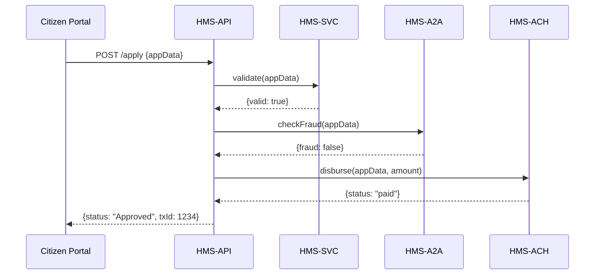

# Chapter 2: Microservices Infrastructure

Welcome back! In [Chapter 1: Three-Layer Architecture](01_three_layer_architecture_.md), we saw how HMS-GOV splits into Governance, Management, and Interface layers… like lawmakers, enforcers, and communicators. Now we’ll zoom into the **Management Layer** and see how we break it down further into **microservices**—independent “departments” that each do one job really well.

---

## 2.1 Why Microservices?

Imagine a large federal agency with separate divisions for:

- Finance (paying grants)  
- AI-powered fraud checks  
- Core policy enforcement  

If all code lived in one big program, a bug in payments could bring down fraud checks. Instead, we create small, focused services:

- **HMS-SVC**: core policy and application logic  
- **HMS-ACH**: handles payments (Automated Clearing House)  
- **HMS-A2A**: runs AI agents for data analysis  

Each service runs on its own, communicates over clear APIs, and can scale independently—just like separate government branches.

---

## 2.2 Central Use Case

**Scenario:** A citizen applies for a small business grant.

1. **HMS-API** (our gateway) receives the application.  
2. It calls **HMS-SVC** to validate rules (age, residency, business type).  
3. If valid, it calls **HMS-A2A** to run a quick fraud check.  
4. If clean, it calls **HMS-ACH** to disburse funds.  
5. Each service replies with success or error, and HMS-API reports back to the citizen portal.

This division keeps each concern isolated:
- Policy changes 👉 update HMS-SVC  
- Payment flows 👉 update HMS-ACH  
- AI logic 👉 update HMS-A2A  

---

## 2.3 High-Level Flow



---

## 2.4 Key Concepts

1. **Service Boundary**  
   Each microservice has its own codebase and database.  
2. **API Contracts**  
   We use simple HTTP/JSON endpoints—clear inputs and outputs.  
3. **Independent Deployment**  
   Services can be deployed, scaled, or restarted without affecting others.

---

## 2.5 Calling Another Service

In HMS-API (an Express.js app), we call HMS-SVC to validate:

```javascript
// file: api/routes/apply.js
import express from 'express'
import fetch from 'node-fetch'
const router = express.Router()

router.post('/apply', async (req, res) => {
  const appData = req.body
  const svcResp = await fetch('http://hms-svc/validate', {
    method: 'POST', body: JSON.stringify(appData), headers:{'Content-Type':'application/json'}
  })
  const { valid, reason } = await svcResp.json()
  if (!valid) return res.status(400).json({ status:'Denied', reason })
  // …call A2A and ACH next…
})
export default router
```

This snippet shows:

- We send the applicant’s data to HMS-SVC.  
- We check its JSON response (`valid` or not).  
- If invalid, we stop early.

---

## 2.6 Internal Layout

Example folder structure:

```
/services
  /hms-svc      # Core logic
  /hms-ach      # Payment handling
  /hms-a2a      # AI checks
/api            # Gateway that orchestrates calls
```

Inside each service you might find:

- `index.js` or `app.py` (entry point)  
- `routes/` (HTTP endpoints)  
- `logic/` (business functions)  

---

## 2.7 Inside HMS-SVC

A simple Express endpoint to validate rules:

```javascript
// services/hms-svc/routes/validate.js
import express from 'express'
const router = express.Router()

router.post('/', (req, res) => {
  const { age, state } = req.body
  if (age < 18) return res.json({ valid:false, reason:'Must be 18+' })
  if (state !== 'NY') return res.json({ valid:false, reason:'NY only' })
  return res.json({ valid:true })
})

export default router
```

Explanation:
- We check two simple rules.  
- We return `{valid:true}` or `{valid:false, reason}`.  
- Down the road you could add more checks without touching other services.

---

## 2.8 Putting It All Together

1. **Citizen Portal** calls **HMS-API**  
2. **HMS-API** calls **HMS-SVC** → **HMS-A2A** → **HMS-ACH**  
3. Each service returns JSON.  
4. **HMS-API** aggregates results and responds.

By organizing into microservices, each “department” stays focused, you avoid one bug knocking everything offline, and teams can work in parallel.

---

## Conclusion

You’ve seen how HMS-GOV’s backend is a collection of small, specialized services—each with clear APIs and responsibilities. Like an agency with separate divisions for policy, payments, and AI, microservices help us build resilient, scalable systems.

Next up, we’ll explore how the gateway API stitches these services together in [Chapter 3: Backend API (HMS-API)](03_backend_api__hms_api__.md).

---

Generated by [AI Codebase Knowledge Builder](https://github.com/The-Pocket/Tutorial-Codebase-Knowledge)