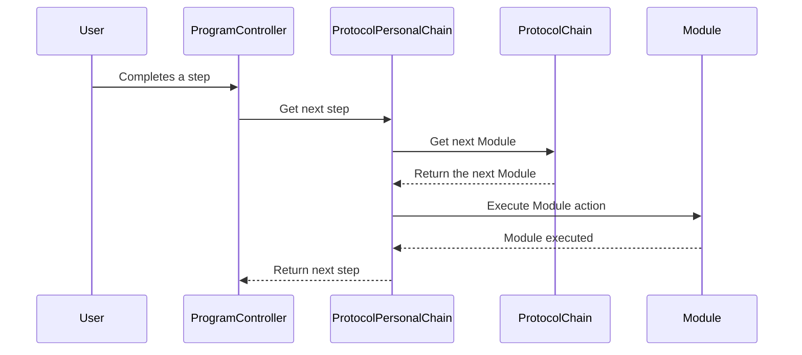

# Chapter 2: Modules

In the previous chapter, [Protocols and Programs](01_protocols_and_programs.md), we learned how to create reusable templates (Protocols) and specific training plans (Programs).  This chapter will explore the building blocks of Protocols: **Modules**.

## What are Modules and why do we need them?

Imagine you're building a house. You wouldn't build the entire thing at once, right? You'd break it down into smaller parts: laying the foundation, building the walls, installing the roof, etc.  Modules are like these individual parts of your Protocol. They define specific actions or interactions within a program.

Let's say you have a "Weight Loss" Protocol.  You might want to include Modules like:

* **Nudge:** A reminder to drink water.
* **Challenge:** A daily exercise routine.
* **Assessment:** Questions about their diet.

Each of these Modules represents a specific step within the overall weight loss program.

## Types of Modules

Our app supports several types of Modules:

* **Nudges:** Gentle reminders or prompts to encourage specific behaviors.
* **Challenges:** Activities or tasks for the user to complete.
* **Assessments:** Questions or quizzes to gauge progress or understanding.
* **Orders:**  Allowing users to purchase products or services.
* **Services:**  Providing access to specific services or resources.
* **KPIs (Key Performance Indicators):** Track and measure progress towards goals.
* **Follow-ups:** Schedule meetings or consultations.
* **Jumps:** Control the flow of the program by skipping to different steps based on conditions.
* **Wait:** Introduce pauses or delays in the program.
* **Finish:** Mark the successful completion of a program.
* **Fail:** Indicate the unsuccessful completion of a program.


## Using Modules in a Protocol

Modules are added to a Protocol to define its steps.  When you create a Program from a Protocol, these Modules are copied over and can be customized.

Let's add a "Nudge" Module to our "Weight Loss" Protocol:

```php
// Models/Core/Protocol/ProtocolChain.php (simplified)
$moduleData = [
    'protocol_id' => 1, // ID of the "Weight Loss" Protocol
    'module_id' => 1,  // ID of the "Nudge" Module type
    'content' => 'Remember to drink water!', // The actual nudge message
    // ... other module details
];

$module = ProtocolChain::create($moduleData);
```

This code snippet (simplified) creates a new Module instance within the Protocol.  The `content` field stores the specific details of the Module, in this case, the reminder message.

## Internal Implementation

When a user progresses through a Program, the system checks the next Module in the `ProtocolChain`.  The appropriate action is then performed based on the Module type.



The `ProtocolChain` model (in `Models/Core/Protocol/ProtocolChain.php`) stores the sequence of Modules within a Protocol.  The `ProtocolPersonalChain` model (in `Models/Core/Protocol/ProtocolPersonalChain.php`) tracks the user's progress through the Program.

## Conclusion

In this chapter, we learned about Modules, the individual building blocks of Protocols. We saw how different types of Modules can be used to create engaging and interactive programs. We also explored how the system handles Module execution within a Program.

Next, we'll learn about the [Wizard](03_wizard.md), a tool that helps you create Protocols and Programs easily.


---

Generated by [AI Codebase Knowledge Builder](https://github.com/The-Pocket/Tutorial-Codebase-Knowledge)