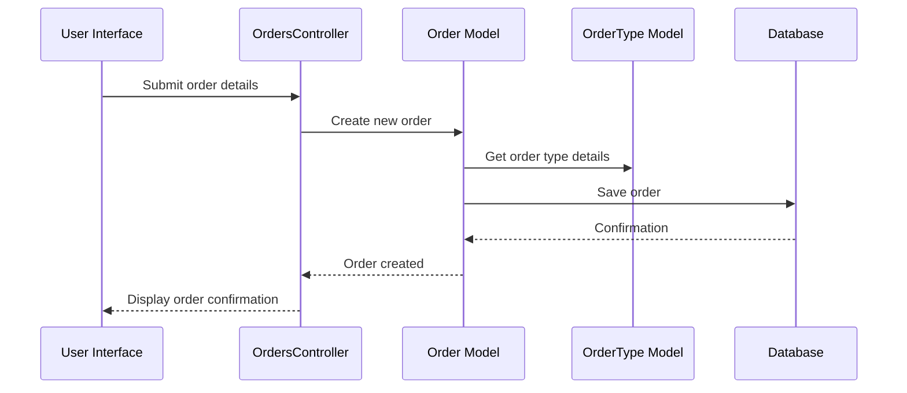

# Chapter 2: Order

Coming from learning about [User](01_user.md)s, let's now explore how those users interact with our system. Imagine Alice, our user from the previous chapter, wants to order a pizza from our online store.  How do we represent that order in our system? That's where the `Order` concept comes in.

## What is an Order?

An `Order` represents a request made by a [User](01_user.md). Think of it like a restaurant order. It contains all the important details, like what's being ordered (a pizza in Alice's case), who ordered it (Alice), the current status of the order (e.g., preparing, delivering, delivered), and any specific requests (e.g., extra cheese, pepperoni).

## Key Concepts

* **Order Type:**  What kind of order is it?  Is it a pizza order, a support request, or something else? This is defined by the [Order Type](03_order_type.md) concept.
* **User:** Who placed the order? This links back to the [User](01_user.md) who made the request.
* **Status:** What's the current stage of the order?  Is it `to_execute`, `in_progress`, or `done`?
* **Custom Data:**  This is where specific details about the order are stored. For a pizza order, this might include toppings, crust type, and delivery address. For a support request, it might be the problem description.  You'll learn more about this in the [Custom Fields](07_custom_fields.md) chapter.

## Placing an Order (Alice's Pizza)

Let's see how Alice's pizza order is represented as an `Order` in the system.

```ruby
# app/controllers/orders_controller.rb (simplified)
def create
  @order = Order.new(order_type_id: 1, # Assuming 1 represents "Pizza Order"
                     user_id: current_user.id, # Alice's User ID
                     data: { toppings: "pepperoni, mushrooms", crust: "thin" },
                     state: "to_execute") 

  @order.save
end
```

This code creates a new `Order`.  `order_type_id` links it to the "Pizza Order" type. `user_id` connects it to Alice. `data` stores her pizza preferences.  `state` is initially set to `to_execute`.  `@order.save` stores the order in the database.

## Under the Hood

When an order is placed, the application interacts with the `Order` model. Here's a simplified sequence diagram:



The `Order` model, defined in `app/models/order.rb`, handles database interactions related to orders.

```ruby
# app/models/order.rb (simplified)
order = Order.find_by(code: "ORDER-123") # Find an order by its code
```

This code retrieves a specific order from the database based on its unique code.

## Custom Data and Order Types

The `data` attribute stores order-specific information. Its structure is defined by the associated [Order Type](03_order_type.md). You'll learn more about how this works in the [Custom Fields](07_custom_fields.md) chapter.

## Conclusion

You've learned about the `Order` concept, how it represents customer requests, and how it relates to [User](01_user.md)s and [Order Type](03_order_type.md)s.  Next, let's dive deeper into the different kinds of orders your system can handle by exploring [Order Type](03_order_type.md)s. [Next: Order Type](03_order_type.md)


---

Generated by [AI Codebase Knowledge Builder](https://github.com/The-Pocket/Tutorial-Codebase-Knowledge)