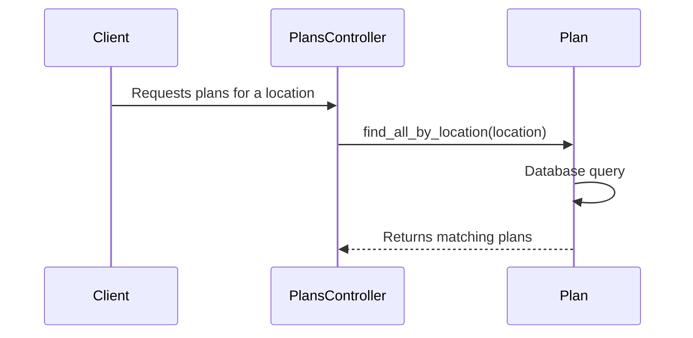

# Chapter 2: Plan

In the previous chapter, [Person/Family/FamilyMember](01_person_family_familymember_.md), we learned how our system represents individuals and their families. Now, let's explore the concept of a `Plan`.

## Why do we need the `Plan` concept?

Imagine a family wants to enroll in health insurance. They need to choose a specific plan that meets their needs and budget.  The `Plan` concept represents these health insurance plans available on the exchange.

## Key Concepts

* **Plan:**  A `Plan` is like a product you can buy on the exchange. It has specific details about what's covered (e.g., doctor visits, hospital stays, prescriptions), how much it costs (premiums, deductibles, copays), and which doctors and hospitals you can use (the network).

## Solving the Use Case: Choosing a Plan

Let's see how the `Plan` concept helps the Doe family choose a health plan.

1. **Retrieve Available Plans:**  First, we need to find all the plans available to the Doe family based on their location and other criteria.

2. **Display Plan Details:**  Next, we display the details of each `Plan` to the family. This includes costs, coverage, and network information.

3. **Select a Plan:** The Doe family reviews the plans and selects the one that best suits their needs.

```ruby
# Simplified example (actual implementation is more complex)

available_plans = Plan.find_all_by_location(doe_family.location)

available_plans.each do |plan|
  puts plan.name
  puts plan.premium
  # ... display other plan details
end

selected_plan = available_plans.find { |plan| plan.name == "Silver Saver Plan" } # Example selection
```

This code retrieves available plans, displays their details, and allows the family to select a plan.  (The actual selection and enrollment process involves other concepts like [HbxEnrollment](04_hbxenrollment_.md), which we'll cover later).

## Internal Implementation

When we call `Plan.find_all_by_location`, the system searches the database for plans that match the given location.



1. The `plans_controller.rb` (or a similar controller) receives the request for plans.

2. The `Plan` model's `find_all_by_location` method is called.

3. This method performs a database query to find matching plans.

4. The matching `Plan` objects are returned.

The relevant code for finding plans can be found in the `Plan` model and the associated controller (e.g., `products/qhp_controller.rb` or `exchanges/products_controller.rb`).

```ruby
# Plan model (simplified)
class Plan
  def self.find_all_by_location(location)
    # ... database query logic ...
  end
end
```

## Conclusion

This chapter introduced the `Plan` concept, explaining how it represents health insurance plans. We used the example of a family choosing a plan to illustrate how this concept works. We also looked at the internal implementation to understand the process of retrieving plans.

Next, we'll explore [EmployerProfile/BenefitSponsorship/BenefitApplication](03_employerprofile_benefitsponsorship_benefitapplication_.md).


---

Generated by [AI Codebase Knowledge Builder](https://github.com/The-Pocket/Tutorial-Codebase-Knowledge)