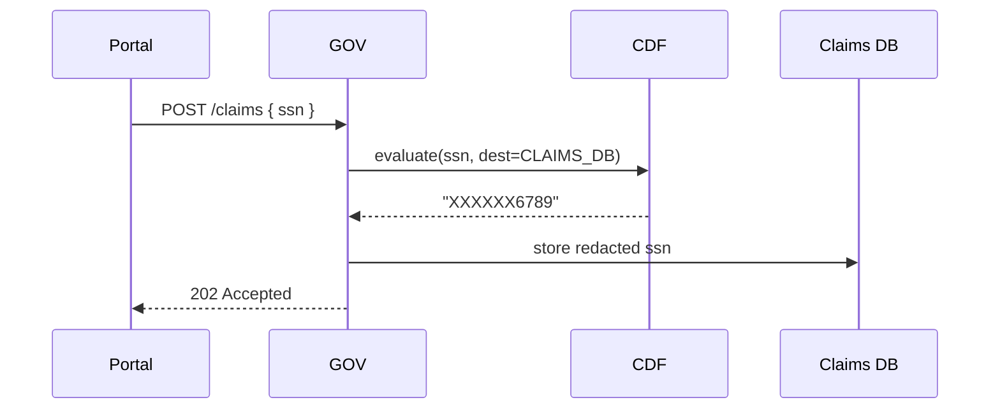

# Chapter 2: Policy Codification Engine (HMS-CDF)

> “Turning paragraphs of law into lines of code.”

[← Back to Chapter 1: Governance Layer](01_governance_layer__hms_gov__.md)

---

## 1. Why Do We Need HMS-CDF?

In Chapter 1 our **Governance Layer (HMS-GOV)** worked like City Hall’s front desk—screening and routing every request.  
But **who actually decides** whether a request is legal?

Traditionally:  
1. Congress passes a bill ➜  
2. Lawyers write memos ➜  
3. Developers read PDFs ➜  
4. Months later a new release appears.

With HMS-CDF the chain becomes:

Law → _compile_ → instant machine rule.

Think of it as a “constitutional compiler.” A newly-signed privacy amendment can automatically inject guardrails into every data API before lunch.

---

### Starter Use-Case: Masking Social Security Numbers (SSNs)

Congress adds one sentence to a federal law:

> “Only the last four digits of a Social Security Number may be stored outside the HRSA secure enclave.”

We’ll see how CDF lets us:

1. Express that rule in a tiny policy file.  
2. Compile it to a deterministic workflow.  
3. Enforce it the moment a veteran submits **Form 22-1990**.

---

## 2. Key Concepts (Beginner Friendly)

| Term | “Plain English” Explanation |
|------|-----------------------------|
| Policy File | A short, spreadsheet-like list of rules written by policy analysts. |
| CDF Compiler | Rust program that checks the file for errors and turns it into executable code. |
| Policy Pack | A versioned bundle of compiled rules, signed like a software release. |
| Runtime Evaluator | A lightweight service (WebAssembly sandbox) that answers “Allow or Deny?” in <10 ms. |
| Propagation | Automatic distribution of the new Policy Pack to any micro-service that needs it. |

---

## 3. Writing Your First Policy

Below is a **14-line** example in a YAML-flavored DSL. Save it as `mask_ssn.rule.yml`.

```yaml
# mask_ssn.rule.yml
meta:
  id: ssn_masking_v1
  description: "Allow only last 4 digits of SSN outside HRSA enclave."
  effective_date: 2024-10-01

scope:
  api: /claims/*          # Applies to every claims endpoint
  field: ssn

rule:
  if destination != "HRSA_ENCLAVE":
    transform: "XXXXXX{last4}"
```

Explanation (line-by-line):

1-4: metadata for auditing & versioning.  
6-8: “Where does the rule apply?”—any `/claims` call touching the `ssn` field.  
10-11: The actual logic. If the data is headed anywhere **except** the HRSA enclave, the engine replaces the first six digits with `X`.

---

### Compiling the Policy

```bash
hms-cdf compile mask_ssn.rule.yml -o pack_ssn_v1.cdf
```

What happens?

* Syntax is validated (e.g., no typos in `destination`).  
* Formal methods check for conflicting rules.  
* A signed `pack_ssn_v1.cdf` file is produced (WASM + manifest).

Output (truncated):

```
✔ Parsed 1 rule
✔ Formal verification passed
✔ Pack signed: pack_ssn_v1.cdf (sha256: 83ae…)
```

---

### Hot-Deploying the Pack

```bash
hms-cdf deploy pack_ssn_v1.cdf
```

Behind the scenes the pack is shipped to:

* Governance Layer (so it can call into the evaluator).  
* Data Hub (to redact stored SSNs).  
* Any micro-services that touch `ssn`.

Deployment generally finishes in <60 seconds on staging.

---

## 4. Using the Policy at Runtime

A simplified **Node.js** snippet in HMS-GOV (18 lines) shows the call:

```js
// gov_ssn_middleware.js
const axios = require('axios');

module.exports = async function ssnPolicy(req, res, next) {
  const { ssn } = req.body;
  if (!ssn) return next();

  // Ask HMS-CDF what to do with this SSN
  const decision = await axios.post('http://cdf/evaluate', {
    policyPackId: 'ssn_masking_v1',
    field: 'ssn',
    value: ssn,
    destination: 'CLAIMS_DB'
  });

  req.body.ssn = decision.data.transformedValue;
  next();
};
```

What will happen for `123-45-6789`?

1. Middleware sends the value to `/evaluate`.  
2. CDF sees _destination not HRSA_ ➜ applies transform.  
3. `req.body.ssn` becomes `XXXXXX6789`.  
4. Downstream services never see the full SSN—law obeyed!

---

## 5. Under the Hood (High-Level Flow)



---

## 6. Peeking Inside HMS-CDF

Folder layout (simplified):

```
/hms-cdf
 ├─ compiler/
 │    └─ main.rs
 ├─ runtime/
 │    ├─ evaluator.rs
 │    └─ wasm_sandbox.rs
 └─ packs/
      └─ pack_ssn_v1.cdf
```

Tiny slice of `evaluator.rs` (17 lines):

```rust
// evaluator.rs
use crate::wasm_sandbox::execute;

pub fn evaluate(input: Value) -> Result<Value, String> {
    let pack = load_pack(&input.policy_pack_id)?;
    let wasm = pack.wasm_bytes();
    // Deterministic execution (no syscalls)
    let output = execute(wasm, &input)?;
    Ok(output)
}

fn load_pack(id: &str) -> Result<Pack, String> {
    // In-memory cache → disk → remote registry fallback
    PACK_CACHE.get(id).cloned().ok_or("Pack not found")
}
```

Explanation:

1-3: Fetch the requested Policy Pack.  
4-6: Run it in a sandbox to avoid side effects.  
8-10: Return the transformed or approved value.

Even if you don’t know Rust, the key idea is obvious: **load → run → return**.

---

## 7. Common Questions

**Q: Is HMS-CDF just a rules engine?**  
A: More. It’s a full compiler + verifier + deployment pipeline, built for legal code.

**Q: What if two rules conflict?**  
A: Compilation fails. Analysts must resolve ambiguities before shipment—no undefined runtime behavior.

**Q: Do I need to know Rust to write policies?**  
A: No. Analysts use the DSL; Rust lives under the hood for safety and speed.

---

## 8. Key Takeaways

• HMS-CDF translates human law into executable, formally-verified code.  
• A 14-line policy file can reshape system behavior in minutes.  
• Runtime evaluation is deterministic, fast, and auditable.

---

### Up Next

Legal text is messy—what about ambiguous phrases like “reasonable effort” or “undue burden”?  
Enter natural-language parsing and expert systems, covered in [Chapter 3: Legal Reasoning Service (HMS-ESQ)](03_legal_reasoning_service__hms_esq__.md).

---

Generated by [AI Codebase Knowledge Builder](https://github.com/The-Pocket/Tutorial-Codebase-Knowledge)