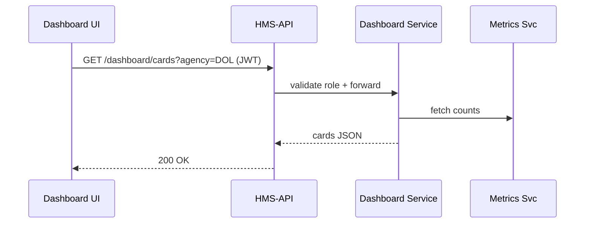

# Chapter 2: Policy Dashboard (Admin HQ)

*(If you missed the clearance rules we rely on, jump back to  
[Role-Based Access & Authorization Model](01_role_based_access___authorization_model_.md).)*

---

## 1 . Why a “Dashboard” at all?

Picture **Emma**, Director of Regulations at the **Department of Labor**.  
Before walking into a Senate hearing she wants two answers:

1. “Which overtime rules are about to change this week?”  
2. “Did the AI agent auto-update any wording without human sign-off?”

Without a single “mission-control” view, Emma would have to:

* Dig through email threads 🤯  
* Ping five different teams on chat 💬  
* Hope nothing slipped through the cracks 🤞

The **Policy Dashboard (Admin HQ)** solves this: one screen, live data, zero guesswork.

---

## 2 . Key ideas (in plain English)

| Idea | Think of it as… |
|------|-----------------|
| **Status Card** | A sticky note on a whiteboard (“Policy #123 – Draft”) |
| **Conflict Alert** | A red flashing light in an air-traffic tower |
| **Version Timeline** | The CCTV timestamp reel of every edit |
| **Filter Bar** | Your radio dial to zoom in on one agency or date |
| **Metrics Widget** | Speedometer showing “avg. days to publish” |

---

## 3 . A 30-second tour

```text
╔══════════════════════════════════════════╗
║ ▸ Pending HITL Review   (4)              ║ <- Status Cards
║ ▸ Auto-published last 24h (1)            ║
╠══════════════════════════════════════════╣
║ ⛔ Conflict: Title 29 vs IRS Reg 915     ║ <- Conflict Alert
╠══════════════════════════════════════════╣
║ Version History – Overtime Rule          ║ <- Timeline
║  v1.3  ✓ published by Emma  | 2 h ago    ║
║  v1.2  ✎ edited by AI-Rep   | 6 h ago    ║
╚══════════════════════════════════════════╝
```

Everything critical fits “above the fold” so an agency head can scan it in under a minute.

---

## 4 . Hands-on: building a tiny Dashboard

We’ll start with a **very** small Vue component that fetches and displays status cards.

```vue
<!-- src/pages/PolicyDashboard.vue -->
<template>
  <section>
    <h1>Admin HQ</h1>

    <ul>
      <li v-for="c in cards" :key="c.id">
        {{ c.title }} – {{ c.count }}
      </li>
    </ul>
  </section>
</template>

<script setup>
import { ref, onMounted } from 'vue'
const cards = ref([])

onMounted(async () => {
  const res = await fetch('/api/dashboard/cards')
  cards.value = await res.json()
})
</script>
```

What happens?

1. When the page mounts, we call **`/api/dashboard/cards`**.  
2. The API returns something like:

```json
[
  { "id": "hitl_pending", "title": "Pending HITL Review", "count": 4 },
  { "id": "auto_published", "title": "Auto-published (24h)", "count": 1 }
]
```

3. `<ul>` loops through and prints each line.

That’s it—mission-control in 18 lines!

---

## 5 . Filtering by agency

Need to drill into just the **Army Corps of Engineers**?  
Add a query param and a quick dropdown.

```vue
<select v-model="agency" @change="load">
  <option>All Agencies</option>
  <option>Army Corps of Engineers</option>
</select>
```

```js
const agency = ref('All Agencies')

async function load() {
  const q = agency.value === 'All Agencies' ? '' : '?agency=' + encodeURIComponent(agency.value)
  const res = await fetch('/api/dashboard/cards' + q)
  cards.value = await res.json()
}
```

Whenever the select changes, `load()` re-fetches filtered cards.  
Under the hood the same RBAC guard from Chapter 1 ensures Emma only sees agencies she’s authorized for.

---

## 6 . What’s happening behind the curtain?



1. UI sends request with Emma’s JWT.  
2. API Gateway checks she’s an **Agency Admin** (see Chapter 1).  
3. Dashboard Service aggregates live counts from Metrics Service.  
4. Data flows back in milliseconds.

---

## 7 . Peek inside the Dashboard Service

```js
// services/dashboard/getCards.js
module.exports = async ({ agency }) => {
  // 1. Parallel queries (promises shortened for clarity)
  const [pendingHitl, autoPub] = await Promise.all([
    countPendingHitl(agency),
    countAutoPublished(agency)
  ])

  // 2. Shape result for the UI
  return [
    { id: 'hitl_pending', title: 'Pending HITL Review', count: pendingHitl },
    { id: 'auto_published', title: 'Auto-published (24h)', count: autoPub }
  ]
}
```

Explanation:

* **countPendingHitl** checks the [Human-in-the-Loop Oversight Workflow](07_human_in_the_loop_oversight_workflow_.md) collection.  
* **countAutoPublished** inspects yesterday’s [Process Proposal Pipeline](06_process_proposal_pipeline_.md) logs.  
* The function simply bundles numbers into an array—easy to extend later.

---

## 8 . Surfacing conflict alerts

Conflicts occur when two agencies edit the same CFR section simultaneously.  
Backend code (trimmed):

```js
// services/dashboard/getConflicts.js
async function getConflicts() {
  const rows = await db('edits')
    .where('status', 'CONFLICT')
    .select('section', 'agencyA', 'agencyB')

  return rows.map(r => ({
    message: `Conflict: ${r.section} – ${r.agencyA} vs ${r.agencyB}`
  }))
}
```

Front-end renders a red banner whenever the array is non-empty.

---

## 9 . Mini exercise 🏋️‍♀️

1. Add a **“Median Days to Publish”** metric card.  
2. Backend hint: `SELECT percentile_cont(0.5) …` over the `published_at-created_at` delta.  
3. Make the card turn **orange** if median > 10 days.

*(Solution lives in `exercises/02`.)*

---

## 10 . Common questions

**Q: Does the Dashboard auto-refresh?**  
A: Yes. A tiny `setInterval(load, 60000)` keeps data fresh every minute; WebSockets come later.

**Q: Where are roles changed?**  
A: In this same screen under “Access Control” tab—re-using logic from [Role-Based Access & Authorization Model](01_role_based_access___authorization_model_.md).

**Q: Can citizens see the Dashboard?**  
A: No. Their role lacks the permission `VIEW_ADMIN_HQ`, so the API returns **403 Forbidden**.

---

## 11 . Recap & what’s next

In this chapter you:

* Saw how **Status Cards**, **Conflict Alerts**, and **Version Timelines** give leaders instant situational awareness.  
* Built a micro-Vue component that talks to the Dashboard Service.  
* Learned how RBAC, metrics, and conflict detection plug together under the hood.

Up next you’ll discover how users jump straight to the screen that answers their intent without hunting through menus:  
[Intent-Driven Navigation & Guided Journeys](03_intent_driven_navigation___guided_journeys_.md)

Happy policy watching!

---

Generated by [AI Codebase Knowledge Builder](https://github.com/The-Pocket/Tutorial-Codebase-Knowledge)