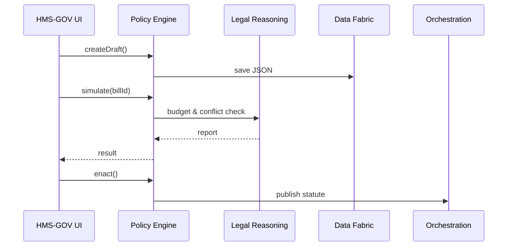

# Chapter 2: Policy & Legislation Engine (HMS-CDF)

*(If you skipped Chapter 1, catch up here → [Government/Admin Portal (HMS-GOV)](01_government_admin_portal__hms_gov__.md))*  

---

## 1. Why Do We Need HMS-CDF?

Picture the Senate Committee on Small Business.  
Senator Rivera wants to **extend loan-forgiveness to rural minority-owned clean-tech firms**. Today she must:

1. Draft bill text in Word.
2. Email versions back-and-forth for edits.
3. Ask staff to run budget models in Excel.
4. Wait weeks while lawyers convert “Section 102(b)” into the U.S. Code.

HMS-CDF turns that month-long relay race into a **single, versioned workspace**:

* Live co-authoring like Google Docs.
* Built-in parliamentary motions (“move to amend §2, line 14…”).
* One-click **budget impact** & **conflict checks**.
* Automatic “statute-as-code” output that downstream systems (e.g., [HMS-ACT](07_action_orchestration_service__hms_act__.md)) can enforce the moment the bill is enacted.

In short, HMS-CDF is “Capitol Hill in Rust.”

---

## 2. A 30-Second Use-Case Sneak Peek

```ts
// use_case_demo.ts  (15 lines)
import { createDraft, proposeAmendment, simulate } from "hms-cdf-sdk";

// 1. Senator starts a bill draft
const billId = await createDraft({
  title: "Rural Clean-Tech Loan Forgiveness Act",
  sponsor: "Sen. Rivera"
});

// 2. A colleague proposes an amendment
await proposeAmendment(billId, {
  section: "§2",
  change: "Include solar-manufacturing co-ops"
});

// 3. Run instant budget & conflict check
const report = await simulate(billId);
console.log("Projected 10-yr cost:", report.cost);
```

What you see:

* 3 function calls = **draft ➜ amend ➜ analyze**.  
* Output comes in seconds, not Congressional recesses.

---

## 3. Key Concepts (Plain English)

| Concept | Think of it as | Why it matters |
|---------|---------------|----------------|
| Draft | A shared Google Doc | The starting text of a bill or rule. |
| Debate Thread | Comment section with motions | Tracks “yea / nay,” captures rationale. |
| Amendment Slot | Suggested edit w/ lineage | Preserves every “red-line” change. |
| Impact Simulator | Built-in CBO | Runs budget, legal-conflict, & equity tests. |
| Statute Compiler | PDF printer **+ API** | Emits human-readable PDF **and** machine-readable JSON. |

Beginners only need the first three; experts live in the last two.

---

## 4. Hands-On Walk-Through

### 4.1 Start a Draft

```ts
// 10 lines
import { createDraft } from "hms-cdf-sdk";

const billId = await createDraft({
  title: "Public Health Data Modernization Act",
  sponsor: "Sen. Li",
  summary: "Funds FHIR-based upgrades at NIH and FCSC."
});
```

Explanation: `createDraft` stores a minimal JSON object inside the policy repository. You get back `billId` (e.g., `D-2024-0412-001`).

---

### 4.2 Invite Debate & Amend

```ts
// 12 lines
import { openDebate, proposeAmendment } from "hms-cdf-sdk";

await openDebate(billId, {
  chair: "Sen. Li",
  deadline: "2024-05-30T17:00Z"
});

await proposeAmendment(billId, {
  author: "Sen. White",
  text: "Increase NIH grant cap from $2M ➜ $3M",
  rationale: "Keep pace with inflation"
});
```

Explanation:  
• `openDebate` timestamps the review window.  
• Each `proposeAmendment` is version-tracked, votes to accept/reject come later.

---

### 4.3 Simulate Impact

```ts
// 14 lines
import { simulate } from "hms-cdf-sdk";

const result = await simulate(billId);
/*
result = {
  cost: "$175M over 10 yrs",
  conflicts: ["42 U.S.C. 300jj-11(f)"],
  equityScore: "+8.4 (benefits rural clinics)"
}
*/
```

Beginners care about the printed numbers; policy analysts can click into the UI for deeper tables.

---

### 4.4 Enact & Publish

```ts
// 8 lines
import { enact } from "hms-cdf-sdk";

await enact(billId, { voteResult: "passed 12-3" });
// HMS-CDF now emits:
// • PDF of the final bill
// • JSON Statute for [HMS-ACT](07_action_orchestration_service__hms_act__.md)
// • Immutable log entry for auditors
```

Within seconds, [HMS-GOV](01_government_admin_portal__hms_gov__.md) dashboards update, and agencies like FDIC or NIH can begin implementing.

---

## 5. What Happens Behind the Scenes?



Five players, <10 hops—far less bureaucracy than a paper trail.

---

## 6. Peeking Inside the Engine

### 6.1 Policy DSL Snippet

```yaml
# drafts/D-2024-0412-001.yml  (≈10 lines)
title: Rural Clean-Tech Loan Forgiveness Act
sections:
  - id: 1
    text: >
      The SBA shall forgive loans issued to rural minority-owned
      clean-tech firms up to $500,000.
  - id: 2
    text: >
      Appropriations: $75,000,000 each fiscal year 2025-2027.
```

HMS-CDF stores each draft as YAML, easy for humans **and** parsers.

### 6.2 Tiny Compiler Function

```rs
// src/compiler.rs  (15 lines)
pub fn compile_to_statute(draft: Draft) -> Statute {
    // 1. Flatten amendments (resolver)
    let merged = merge_amendments(&draft);
    // 2. Validate references & citations
    validator::check(&merged)?;
    // 3. Convert to JSON schema
    let json = serde_json::to_value(&merged)?;
    // 4. Wrap in PDF for humans
    let pdf = pdf_gen::render(&merged);
    Statute { json, pdf }
}
```

Rust behind the curtain; users never see the 3rd-party crates.

---

## 7. Mini-FAQ

**Q: Do I need to know Rust to use HMS-CDF?**  
A: No. SDKs exist for TypeScript, Python, and even a low-code UI.

**Q: What if my amendment clashes with existing law?**  
A: The simulator flags conflicts and suggests fixes, powered by [Compliance & Legal Reasoning Module (HMS-ESQ)](03_compliance___legal_reasoning_module__hms_esq__.md).

**Q: Can citizens see the debate?**  
A: Public transparency mode exposes read-only views—perfect for open-government portals.

---

## 8. Summary & What’s Next

You just:

• Drafted a bill, proposed an amendment, ran impact checks, and enacted the law—all in under 40 lines of beginner-friendly code.  
• Learned the building blocks: Drafts, Debate Threads, Amendments, Simulators, and the Statute Compiler.  
• Peeked into the Rust heart of HMS-CDF.

Up next, we dive deeper into how legal reasoning and compliance checks actually work. Continue to [Compliance & Legal Reasoning Module (HMS-ESQ)](03_compliance___legal_reasoning_module__hms_esq__.md).

---

Generated by [AI Codebase Knowledge Builder](https://github.com/The-Pocket/Tutorial-Codebase-Knowledge)