# Chapter 2: Policy & Legislative Engine (HMS-CDF)

*(A friendly sequel to [Governance Interface Layer (HMS-GOV)](01_governance_interface_layer__hms_gov__.md))*  

---

## 1. Why Do We Need HMS-CDF?

Picture the U.S. Department of Transportation (DOT).  
An AI assistant just drafted a **“Electric-Bus Safety Inspection”** rule. Good idea—but only if:

1. The text does **not** conflict with last year’s “Autonomous Vehicle Act.” 
2. We can trace every tweak made by lawyers, engineers, and Congress.  
3. The final rule is immutable, test-able, and can be executed by live systems tomorrow morning.

HMS-CDF is our **digital Capitol Hill**—it turns any draft (from a person *or* an AI agent) into an **executable, versioned policy artifact** that downstream services can trust.

---

## 2. Key Ideas in Plain English

| Concept | Friendly Analogy |
| ------- | ---------------- |
| Draft Policy | A bill introduced on the House floor |
| Conflict Check | A librarian yelling “You already have a law that says the opposite!” |
| Versioning | Git history, but for laws |
| Amendment Chain | Track-changes in a Google Doc |
| Executable Policy | Law published in the Federal Register **plus** machine-readable code |

---

## 3. The 3-Step Journey From Draft → Law

1. **Submit** a draft (Markdown, YAML, or plain text).  
2. **Legislate** – HMS-CDF runs conflict checks, applies amendments, and freezes the text.  
3. **Compile** → an immutable WASM* blob that services can execute.

\*WASM (WebAssembly) makes the policy portable across JavaScript, Rust, Go, etc.

---

## 4. A Tiny End-to-End Demo

### 4.1 Submitting a Draft

```bash
hms-cdf submit electric_bus.md --author "DOT Safety Bot"
```

*Output (shortened)*  
```
✅ Draft 182 received – status: pending_review
```

### 4.2 Adding a Human Amendment

```rust
// amendments/limit_speed.rs (≤ 20 lines)
amend_draft!(182, "§2 Vehicle Specs", {
    max_speed_kmh: 75    // Lowered from 80 km/h
});
```

Explanation:  
`amend_draft!` is a helper macro; we target draft **182**, section “Vehicle Specs,” and tweak one field.

### 4.3 Ratifying the Policy

```bash
hms-cdf ratify 182 --sign "Chief Counsel DOT"
```

```
🎉 Policy 182-v1 ratified
Hash: 0x8faa…e2
WASM: build/policies/182_v1.wasm
```

The policy is now **immutable**; any new change must create *v2*.

---

## 5. Under the Hood – What Really Happens?

```mermaid
sequenceDiagram
    participant AG as AI Agent
    participant CDF as HMS-CDF
    participant GOV as HMS-GOV
    participant TST as Test Runner
    AG->>CDF: submit(draft)
    CDF->>GOV: record pending_review
    GOV->>CDF: apply amendments & approve
    CDF->>TST: run unit tests
    TST-->>CDF: ✅ pass
    CDF->>GOV: publish policy v1
```



1. **AI Agent** submits a draft.  
2. **HMS-GOV** (Chapter 1) displays it to humans.  
3. After approval, **HMS-CDF** compiles the final text, runs automated tests, and stores a hashed artifact.

---

## 6. Peeking at the Codebase

### 6.1 Policy Definition Struct

```rust
// src/models/policy.rs
#[derive(Serialize, Deserialize)]
pub struct Policy {
    pub id: u32,
    pub title: String,
    pub sections: Vec<Section>,
    pub version: u8,
}
```

Simple: an `id`, a `title`, multiple `sections`, and a `version` number.

### 6.2 Conflict Detection (super-simplified)

```rust
// src/engine/conflict.rs
pub fn has_conflict(new_pol: &Policy, repo: &PolicyRepo) -> bool {
    repo.iter().any(|p| p.title == new_pol.title && p.version != new_pol.version)
}
```

Explanation: we naïvely flag any policy with the same title but different version.  
Real code checks statutes, effective dates, and hierarchies.

### 6.3 Compiling to WASM

```rust
// src/engine/compile.rs
pub fn compile(policy: &Policy) -> Vec<u8> {
    wasmer::compile(&serde_json::to_vec(policy).unwrap())
}
```

We serialize the policy JSON and feed it to a WASM compiler. The resulting bytes are what live systems will load.

---

## 7. Using HMS-CDF From JavaScript

Even though HMS-CDF is written in Rust, you can call it from any language.

```js
// dot-policy-service.js
import fetch from 'node-fetch'

// Create a new draft
export async function newDraft(text) {
  const res = await fetch('http://cdf/api/drafts', {
    method: 'POST',
    body: text
  })
  return res.json()          // -> { id: 182, status: 'pending_review' }
}
```

Works just like any REST service—no Rust knowledge required.

---

## 8. Frequently Asked Questions

**Q: Can I change a ratified policy?**  
No—but you can create **version 2** that supersedes version 1. The entire history remains searchable.

**Q: How are automated tests written?**  
Each policy folder may include `tests/*.rs`. HMS-CDF runs them in a sandbox and blocks ratification if any test fails.

**Q: Does HMS-CDF only handle U.S. federal law?**  
It is jurisdiction-agnostic. States, cities, and even university committees can use the same pipeline.

---

## 9. What You Learned

• HMS-CDF is a **digital legislature** that turns drafts into immutable, executable law.  
• It checks conflicts, records amendments, versions every change, and emits WASM blobs.  
• A short CLI or REST call is enough to submit, amend, and ratify a policy.  
• Under the hood, Rust code keeps the chain-of-custody and runs automated tests.

Ready to design policies visually? Jump to [Protocol Builder Page](03_protocol_builder_page_.md) to see how non-developers can craft these rules with drag-and-drop blocks.

---

Generated by [AI Codebase Knowledge Builder](https://github.com/The-Pocket/Tutorial-Codebase-Knowledge)