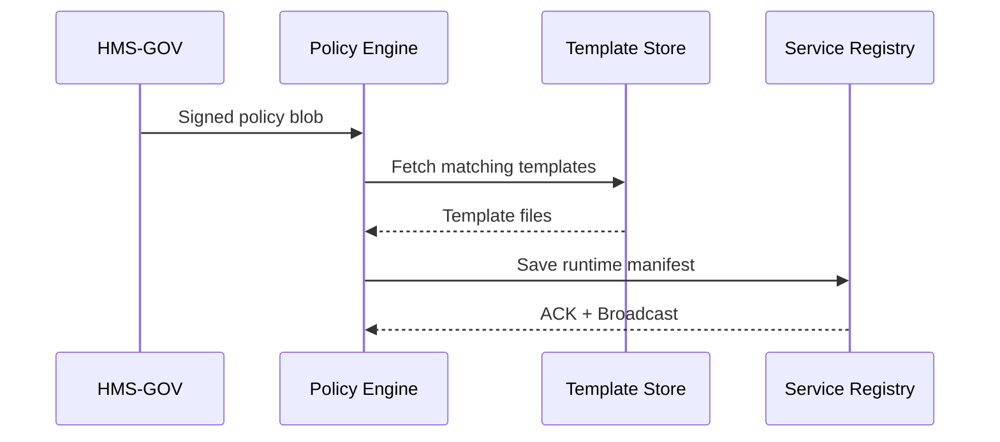

# Chapter 2: Policy & Process Engine (Backend API)

*[Jump back to Chapter 1: Governance Layer (HMS-GOV)](01_governance_layer__hms_gov__.md)*  

---

## 1. Why Does This Engine Exist?

In Chapter 1 our **“Visitor Pass”** policy was approved and published.  
Great! …but micro-services still speak JSON, not legalese.

Imagine the **Defense Intelligence Agency (DIA)** wants to auto-issue temporary building badges:

1. A policy says *“Only holders of Level 2 clearance may enter the SCIF between 06:00–18:00.”*
2. Badge-printing micro-services need:
   • a `/check-clearance` endpoint  
   • a cron job that revokes expired badges every night  
   • a JSON schema to validate incoming badge requests  

The **Policy & Process Engine** is the translator that turns human/AI-approved policy into those machine-readable, always-up-to-date instructions.

---

## 2. Key Concepts (Plain-English Cheatsheet)

| Engine Term           | Think of…                                  |
|-----------------------|--------------------------------------------|
| Policy Artifact       | The PDF law that just got signed           |
| Translation Template  | A Mail-Merge letter with blanks to fill    |
| Runtime Contract      | The REST path `/check-clearance` + verbs   |
| Job Schedule          | A nightly alarm clock for background jobs  |
| Validation Schema     | A TSA checkpoint queue: “bags must fit here” |

---

## 3. End-to-End Walk-Through

### 3.1 From Policy to “Runtime Manifest”

```bash
# 1) Ask the engine to compile the approved policy
$ hms-api compile visitor-pass-policy@1 --output manifest.json
✔ Policy parsed
✔ Templates applied
✔ Manifest generated   ➜ manifest.json
```

`manifest.json` (trimmed to <20 lines):

```jsonc
{
  "service": "visitor-pass",
  "routes": [
    { "path": "/check-clearance", "method": "POST", "auth": "jwt" }
  ],
  "jobs": [
    { "task": "revokeExpiredBadges", "cron": "0 2 * * *" }
  ],
  "schemas": {
    "BadgeRequest": {
      "visitorId": "uuid",
      "requestedZone": "string",
      "visitDate": "date"
    }
  }
}
```

What just happened?

1. `compile` reads the signed policy from [HMS-GOV](01_governance_layer__hms_gov__.md).  
2. Templates convert rules → routes/jobs/schemas.  
3. An executable “Runtime Manifest” is produced.

### 3.2 Making It Live

```bash
# 2) Deploy the manifest
$ hms-api publish manifest.json
✔ Stored in Service Registry
✔ Broadcasted to micro-services mesh
```

Badge-printing services instantly reload the new contract—no code redeploy needed!

---

## 4. Under the Hood

### 4.1 High-Level Flow



### 4.2 Tiny Peek at the Compile Endpoint

_File: `engine/compile.js` (Node.js, stripped down)_

```js
// POST /compile
export async function compile(req, res) {
  const { policyId } = req.body;           // 1) identify policy
  const policy = await gov.fetch(policyId); // grab from HMS-GOV

  const tpl = await templates.load(policy.type);   // 2) choose template
  const manifest = tpl.render(policy.rules);       // 3) merge!

  await registry.save(manifest); // 4) make it discoverable
  res.json({ status: "OK", manifest });
}
```

Line-by-line (beginner edition):

1. Accept a policy id sent by a Dev-Ops script or another service.  
2. Ask **HMS-GOV** for the frozen, approved version (no cheating!).  
3. Pick a translation template (`visitor-pass.tpl` for our example).  
4. Merge rules into the template → get the manifest.  
5. Store it in the [Microservices Mesh & Service Registry](04_microservices_mesh___service_registry_.md) so every service can subscribe.

---

## 5. Hands-On Mini-Lab (5 Minutes)

1. Install CLI (if you haven’t):  
   ```bash
   npm i -g @hms/api-cli
   ```
2. Compile policy **and** immediately publish:  
   ```bash
   hms-api quick-publish visitor-pass-policy@1
   ```
3. Verify from any pod/service:  
   ```bash
   curl $SERVICE_URL/healthz | jq .activePolicy
   # → "visitor-pass-policy@1"
   ```

If you see the policy id, congrats—your micro-service mesh is now governed by real-time rules!

---

## 6. FAQ Corner

**Q: Can I override a route name?**  
A: Yes—add a `routeOverride` block to your policy draft before approval.

**Q: What if a template is missing?**  
A: The engine returns `ERROR_TEMPLATE_NOT_FOUND`. Add the new template and retry.

**Q: Do I have to restart services?**  
A: No. The mesh pushes hot-reload messages. See [Metrics & Monitoring Telemetry](14_metrics___monitoring_telemetry_.md) for status dashboards.

---

## 7. What You Learned

• Policies aren’t useful until machines can execute them.  
• The Policy & Process Engine translates an approved policy into a **Runtime Manifest** of routes, jobs, and schemas.  
• Publishing the manifest wires every downstream micro-service automatically.

Ready to see how those micro-services actually act on these manifests?  
Jump ahead to [Chapter 3: Management Layer (HMS-SVC & HMS-ACH)](03_management_layer__hms_svc___hms_ach__.md).

---

Generated by [AI Codebase Knowledge Builder](https://github.com/The-Pocket/Tutorial-Codebase-Knowledge)