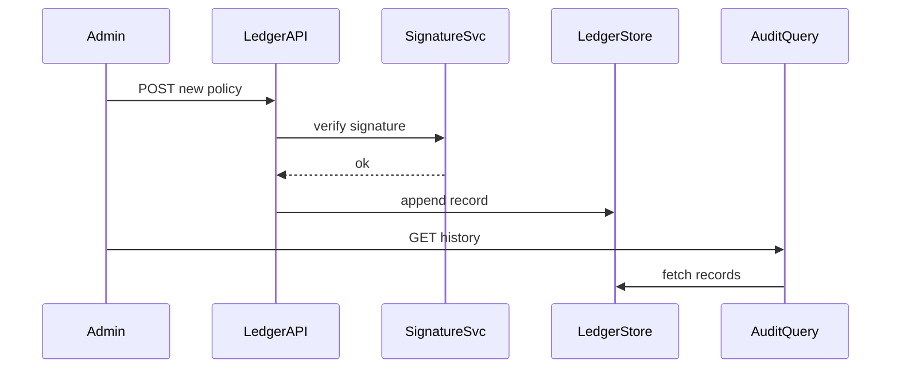

# Chapter 2: Policy Versioning & Audit Ledger  

*(A friendly continuation from [Chapter 1: Governance Layer (HMS-GOV)](01_governance_layer__hms_gov__.md))*  

---

## 1. Why Keep a “Diary” of Every Rule?

Imagine the Department of Transportation (DOT) updates its **bridge-inspection policy**:

*“Bridges over 200 ft must now be inspected every 18 months (was 24).”*

Six months later a bridge collapses.  
Congress, journalists, and inspectors all ask the same question:

> “Exactly which policy version was in force when that inspection was skipped?”

With HMS-UTL’s **Policy Versioning & Audit Ledger**, we can answer in seconds—no spreadsheets, no guesswork, and no chance of tampering.

---

## 2. Big Ideas in Plain English

| Term | Think of it as… | Why you care |
|------|-----------------|--------------|
| Immutable Ledger | A bound notebook written in ink | No one can erase or reorder entries. |
| Version Tag | Page number in the notebook | Lets you jump to the exact rule set used on any date. |
| Rollback | “Go back to page 42” | Instantly restore a previous rule if the new one misbehaves. |
| Audit Query | Freedom-of-Information search box | Pulls every change about a policy in one click. |
| Digital Seal | Clerk’s embossed stamp | Proves the entry was added by an authorized system. |

---

## 3. A Quick Walk-Through: Publishing, Updating, Querying

### 3.1 Publish the First Version

```bash
curl -X POST https://hms-ledger.api/policies \
  -H "Content-Type: application/yaml" \
  --data-binary @bridge_inspection_v1.yaml
```

Behind the scenes the ledger records something like:

```json
{
  "tx_id": "f7c1",
  "policy_id": "dot-bridge-inspection",
  "version": "1.0.0",
  "timestamp": "2024-06-01T09:12:33Z",
  "author": "alice@dot.gov"
}
```

*Explanation*: Each “tx” (transaction) is permanent, time-stamped, and signed. Think **notary public** for code.

---

### 3.2 Publish an Update

```bash
curl -X POST https://hms-ledger.api/policies \
  -H "Content-Type: application/yaml" \
  --data-binary @bridge_inspection_v2.yaml
```

Ledger appends a second record—never overwriting the first.

---

### 3.3 Query History (for FOIA or IG audit)

```bash
curl https://hms-ledger.api/history?policy_id=dot-bridge-inspection
```

Sample response:

```json
[
  { "version": "1.0.0", "timestamp": "2024-06-01", "summary": "Initial rule" },
  { "version": "1.1.0", "timestamp": "2024-10-15", "summary": "18-month cadence" }
]
```

Auditors can now prove *when* each rule became active.

---

### 3.4 Fast Rollback

Suppose version 1.1.0 triggers unexpected costs.  
One line reverts every service back to the last good state:

```bash
curl -X POST https://hms-ledger.api/rollback \
  -d '{"policy_id":"dot-bridge-inspection","target_version":"1.0.0"}'
```

All dependent microservices will start validating against v1.0.0 again—automatically.

---

## 4. How Does the Ledger Work Internally?

### 4.1 Bird’s-Eye Flow



• Only **append** operations are allowed.  
• Each record contains a hash of the previous one—like blockchain-lite—so any tampering breaks the chain.

---

### 4.2 Tiny Implementation Peek

_File: `ledger/append.py`_

```python
def append_record(record):
    last = db.tail()                 # 1. fetch last entry
    record["prev_hash"] = hash(last)
    record["hash"] = hash(record)    # 2. create new hash
    db.write(record)                 # 3. append (never update)
```

1. Grab the most recent entry.  
2. Chain the new entry to the old via hashes.  
3. Physically write the line; storage backend could be S3, Git, or an immutable database like Datomic.

*Important*: There is **no** function called `update_record`.

---

## 5. Hands-On Lab (5 min)

1. Clone the sample repo:

```bash
git clone https://github.com/hms-utl/examples.git
cd examples/ledger-lab
```

2. Launch the in-memory ledger (Python 3.11):

```bash
python main.py       # starts localhost:7000
```

3. Use the cURL commands above.  
4. Stop the service and reopen `ledger.log`—notice every entry is still there.

---

## 6. FAQ

**Q: Is this a full blockchain?**  
A: No. We borrow the **append-only + hash-chain** ideas but avoid mining/consensus complexity—perfect for single-agency deployments.

**Q: Can malicious admins fake history?**  
A: Each record’s hash includes the previous record’s hash, forming an unbreakable chain. Tampering one entry invalidates all following hashes.

**Q: How long are records kept?**  
A: By default, forever—meeting federal record-retention requirements.*

**Q: Does rollback violate the ledger’s immutability?**  
A: Rollback adds a *new* entry that points services to an earlier version; the old (bad) version still exists for audit purposes.

---

## 7. What You Learned

• Every policy change is written once, never altered.  
• Hash-chaining makes the ledger tamper-evident.  
• A simple API lets you publish, query, and roll back policies in seconds.  
• This audit trail satisfies IG audits, FOIA requests, and even court subpoenas.

Ready to see how citizens and case workers *consume* these policies?  
Jump to [User Portal (HMS-MFE Public Interface)](03_user_portal__hms_mfe_public_interface__.md).

---

Generated by [AI Codebase Knowledge Builder](https://github.com/The-Pocket/Tutorial-Codebase-Knowledge)