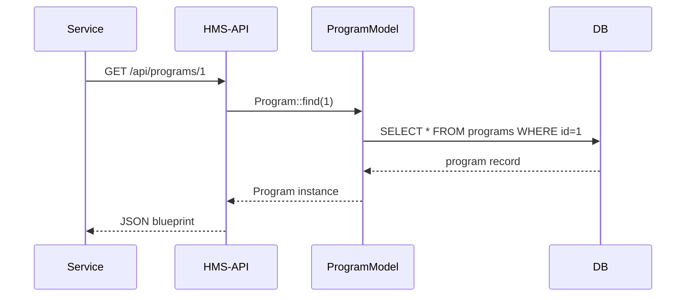
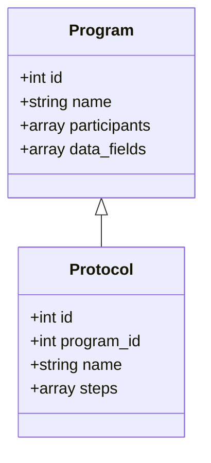

# Chapter 2: Program / Protocol Models

Welcome back! In [Chapter 1: Domain Structure](01_domain_structure_.md) we saw how HMS-AGX routes URLs like postal addresses. Now let’s learn how we define the *blueprints*—**Program** and **Protocol** models—that power each service.

---

## 1. Motivation: Why “Blueprint” Models Matter

Imagine a new government initiative, **Emergency Food Assistance**:

- **Who’s involved?** Case Workers, Supervisors  
- **What data is needed?** Applicant name, household size, income  
- **What steps happen?** Submit application → Supervisor review → Approval

Before any citizen-facing form or admin screen exists, we need a **blueprint** that spells out participants, data fields, rules, and approval steps. That’s exactly what **Program** and **Protocol** models are for—they’re our *architectural plans* for public-sector workflows.

---

## 2. Key Concepts

1. **Program Model**  
   - The high-level policy definition  
   - Fields: `name`, `participants`, `data_fields`  
   - Stored in `app/Models/Core/Program/Program.php`

2. **Protocol Model**  
   - The step-by-step workflow under a Program  
   - Fields: `program_id`, `name`, `steps`  
   - Stored in `app/Models/Core/Protocol/Protocol.php`

3. **Admin vs. Developer**  
   - **Admins** use HMS-GOV to configure new Programs/Protocols.  
   - **Developers** fetch these blueprints in citizen-facing services to build forms, steppers, approval screens, etc.

---

## 3. Creating a Program (Use Case)

A policy admin wants to create our **Emergency Food Assistance** blueprint via API:

```bash
curl -X POST https://hhs.us.gov-ai.co/api/programs \
  -H "Content-Type: application/json" \
  -d '{
    "name": "Emergency Food Assistance",
    "participants": ["CaseWorker","Supervisor"],
    "data_fields": ["applicantName","householdSize","income"]
  }'
```

This will:

1. Hit the HMS-API endpoint `/api/programs`
2. Call the **Program** model to validate and save
3. Return the newly created blueprint as JSON

---

## 4. Program Model Code

File: `app/Models/Core/Program/Program.php`

```php
namespace App\Models\Core\Program;

use Illuminate\Database\Eloquent\Model;

class Program extends Model
{
  protected $table = 'programs';
  protected $fillable = ['name','participants','data_fields'];
  protected $casts = [
    'participants' => 'array',
    'data_fields'  => 'array'
  ];
}
```

- `fillable`: which fields we allow to be mass-assigned  
- `casts`: automatically convert JSON columns into PHP arrays  

---

## 5. Protocol Model Code

File: `app/Models/Core/Protocol/Protocol.php`

```php
namespace App\Models\Core\Protocol;

use Illuminate\Database\Eloquent\Model;

class Protocol extends Model
{
  protected $table = 'protocols';
  protected $fillable = ['program_id','name','steps'];
  protected $casts = ['steps' => 'array'];

  // Link back to its Program
  public function program()
  {
    return $this->belongsTo(\App\Models\Core\Program\Program::class);
  }
}
```

- `program_id` ties this workflow to its parent Program  
- `steps` is a JSON array of approval stages  

---

## 6. Under the Hood: Fetching a Blueprint

Here’s what happens when a citizen-facing service loads our Program:



1. The service calls HMS-API.  
2. HMS-API uses the Program model to query the database.  
3. The JSON blueprint returns to the front-end, which renders forms.

---

## 7. Using the Blueprint in Your Code

A developer building a React or Vue form can fetch and inspect the blueprint:

```js
async function loadProgram(id) {
  let res = await fetch(`/api/programs/${id}`);
  let program = await res.json();
  console.log(program);
  // {
  //   id: 1,
  //   name: "Emergency Food Assistance",
  //   participants: ["CaseWorker","Supervisor"],
  //   data_fields: ["applicantName","householdSize","income"]
  // }
}
loadProgram(1);
```

With `program.data_fields`, you can dynamically render input fields. With `program.participants`, you control which UI roles get which buttons.

---

## 8. How Program & Protocol Relate



Each **Program** can have multiple **Protocols** (workflows) defining detailed approval steps or variants.

---

## 9. Conclusion

You’ve learned how HMS-AGX uses **Program** and **Protocol** models as the blueprints for every policy or service:

- Program = high-level policy plan  
- Protocol = detailed workflow steps  

Next, we’ll see how these blueprints power actual **Business Logic Modules** that run the day-to-day rules of each service.  
→ [Chapter 3: Business Logic Modules](03_business_logic_modules_.md)

---

Generated by [AI Codebase Knowledge Builder](https://github.com/The-Pocket/Tutorial-Codebase-Knowledge)