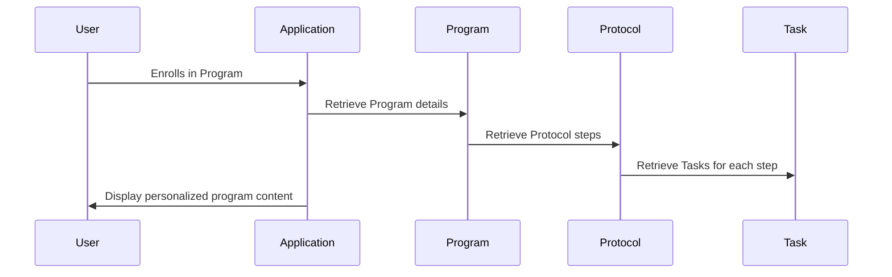

# Chapter 2: Program

In the previous chapter, [Tenant](01_tenant.md), we learned how our application keeps data separate for different businesses.  This chapter introduces the concept of a "Program," which is how a tenant delivers its services or courses to its users.

## What is a Program?

Imagine a cooking recipe.  A [Protocol](03_protocol.md) is like the basic recipe, outlining the general steps. A Program is a specific instance of that recipe, tailored for a particular group or purpose.  For example, you might have a general recipe for baking a cake (the Protocol), but then create specific programs for a "Chocolate Birthday Cake Program" or a "Vanilla Wedding Cake Program." Each program inherits the basic baking steps from the protocol but has its own specific ingredients, frosting, and decorations.  Users "enroll" in these programs to follow the specific instructions.

## Key Concepts

* **Inheritance:** A Program inherits the steps from its associated [Protocol](03_protocol.md). This avoids redundancy and ensures consistency.
* **Customization:** Each Program can have its own specific settings, like pricing, access type (public or private), and associated [Tasks](04_task.md).
* **Enrollment:** Users enroll in Programs to access the specific content and follow the tailored steps defined by the [Protocol](03_protocol.md).

## Using a Program

Let's say a tenant wants to offer a "Beginner's Photography Program."  They would first create a [Protocol](03_protocol.md) outlining the general photography lessons. Then, they would create a Program based on this Protocol:

```php
// Create a new program
$program = new Program();
$program->name = "Beginner's Photography Program";
$program->description = "Learn the basics of photography.";
$program->protocol_id = 1; // ID of the photography protocol
$program->access_type = 'public'; // Make it publicly accessible
$program->save();
```

This code creates a new Program, sets its name, description, links it to the photography [Protocol](03_protocol.md) (with ID 1), and makes it publicly accessible.

## Under the Hood

When a user enrolls in a program, the application retrieves the program's associated [Protocol](03_protocol.md) and its steps. It then creates a personalized instance of the protocol for the user, allowing them to track their progress through the program.



### Internal Implementation

The `Program` model (located in `app/Models/Tenant/Program/Program.php` and `app/Models/Core/Program/Program.php`) handles the relationship with the [Protocol](03_protocol.md) model:

```php
// Inside the Program model (simplified)
public function protocol()
{
    return $this->belongsTo(Protocol::class);
}
```

This code defines a relationship where a Program belongs to a [Protocol](03_protocol.md).

The `startProgramForUser` method (simplified example from `Unit/Models/Tenant/Program/ProgramTest.php`) demonstrates how a program is started for a user:

```php
// Inside the Program model (simplified)
public function startProgramForUser(Program $program, int $userId)
{
    // ... other code ...
    // Start the protocol chain for the user
    // ... other code ...
}
```

This simplified snippet shows how the `startProgramForUser` method initiates the program for a user.  The actual implementation involves creating a [Protocol](03_protocol.md) chain and handling notifications.

## Conclusion

In this chapter, we explored the concept of a Program, which is a customized instance of a [Protocol](03_protocol.md). We learned how programs inherit steps from protocols, allow for customization, and facilitate user enrollment.  In the next chapter, we'll delve into the details of a [Protocol](03_protocol.md).


---

Generated by [AI Codebase Knowledge Builder](https://github.com/The-Pocket/Tutorial-Codebase-Knowledge)