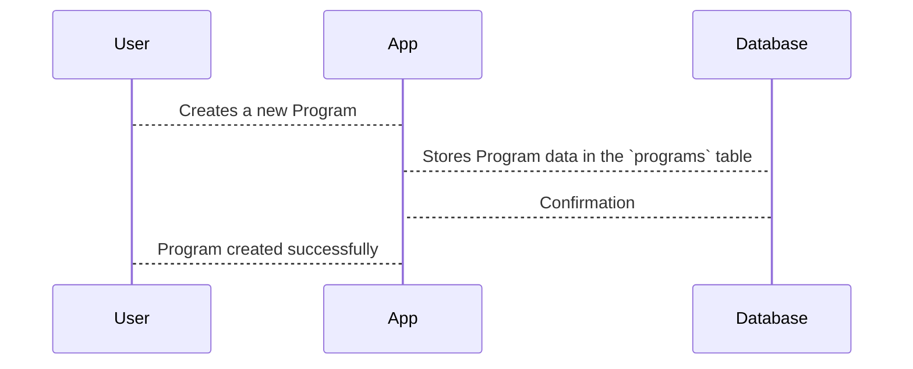

# Chapter 2: Programs

In the previous chapter, [Users](01_users.md), we learned about the individuals who use our app. Now, let's talk about what they actually *do* in the app: follow workout routines, which we call *Programs*.

Imagine Alice, our user from the last chapter, wants to start a new strength training routine.  She doesn't want to create one from scratch, so she looks for a pre-made routine. This pre-made routine is a *Program*.

## What is a Program?

A Program is a specific instance of a workout routine.  Think of it like baking a cake.  The recipe is the [Protocol](03_protocols.md) (we'll learn more about those later).  A Program is like the *actual cake* you bake. You can bake many cakes (Programs) from the same recipe (Protocol).  Each cake might be slightly different – maybe you add extra frosting or use a different type of pan – but they're all based on the same recipe.  Similarly, many users can follow the same Program, and each user will have their own progress and experience.

## Program Data

A Program stores information like its name, description, who created it (the [User](01_users.md)), and which [Protocol](03_protocols.md) it's based on.  Let's say Alice chooses a program called "Beginner Strength Training".  Here's some of the data associated with it:

* **name:** Beginner Strength Training
* **description:** A simple strength training program for beginners.
* **author_id:** (The ID of the User who created the Program)
* **protocol_id:** (The ID of the Protocol this Program is based on)

This information is stored in a database table called `programs`.

## Creating a Program

We can create a new Program using a factory, just like we did with Users.  Here's a simplified example:

```php
// File: factories/Core/Program/ProgramFactory.php

use App\Models\Core\Program\Program;

$program = Program::factory()->create([
    'name' => 'Advanced Yoga',
    'description' => 'A challenging yoga program for experienced yogis.',
    // ... other fields ...
]);
```

This code creates a new entry in the `programs` table with the given information.  We'll skip the other fields for now to keep things simple.

## Using a Program

Alice starts the "Beginner Strength Training" Program.  The app tracks her progress through the steps defined in the associated [Protocol](03_protocols.md).  For example, if the Protocol has steps like "Squats", "Push-ups", and "Lunges", the Program will track which steps Alice has completed and which ones she still needs to do.

## Under the Hood

When a Program is created, the code interacts with the database to store the program's information in the `programs` table.



The structure of the `programs` table is defined in the `CreateProgramsTable` migration file.

```php
// File: migrations/2022_06_22_094911_create_programs_table.php
// ... code to create the programs table ...
```

Other migration files, like `ExtendProgramsWithAdditionalFields`, add more columns to the `programs` table as needed.

```php
// File: migrations/2024_06_03_120735_extend_programs_with_additional_fields.php
// ... code to add fields like 'level', 'price_signs', etc. ...
```

## Conclusion

In this chapter, we learned about Programs, which are specific instances of workout routines that users can follow. We saw how program data is stored and how to create new programs. In the next chapter, we'll explore [Protocols](03_protocols.md), the templates that Programs are based on.


---

Generated by [AI Codebase Knowledge Builder](https://github.com/The-Pocket/Tutorial-Codebase-Knowledge)