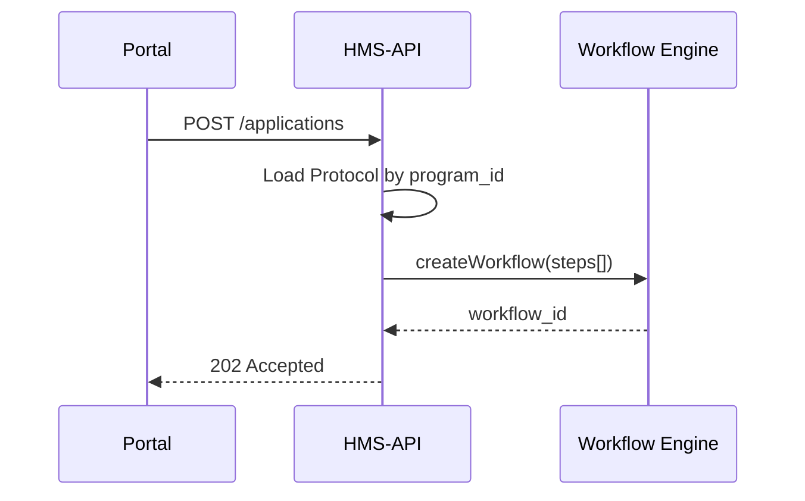

# Chapter 2: Protocol Blueprint (Protocol Model)


> “Great, we know *which* program a request belongs to…  
> but **what exactly should happen next?**”

In [Chapter&nbsp;1 – Program Registry](01_program_registry__program_model__.md) we created a single “master folder” for every government initiative.  
Inside each folder live one or more **Protocols**—the step-by-step rulebooks that turn a high-level policy into concrete, executable tasks.

---

## 1. A Story to Set the Stage

The Department of Energy announces a **“Home Solar Rebate”**:

1. Citizens submit Form‐HSR online.  
2. A human clerk must approve within **7 days**.  
3. An AI agent calls an external API to verify roof size.  
4. The Finance office triggers payment through Treasury.

When the Governor tweaks the deadline to **3 days**, we do **not** want to hunt through five micro-services; we only edit one Protocol file, and HMS-API enforces the new rule everywhere.

---

## 2. What Is a Protocol?

Think of a Protocol as the **recipe card** slipped inside the Program binder:

| In Plain English | In Code |
|------------------|---------|
| Title | `name` |
| Parent program | `program_id` |
| Ordered steps (“clerk approval”, “AI check”, …) | `steps` JSON |
| Deadlines & SLA | `due_in_days` |
| API endpoints to call | `webhooks` array |
| Version number | `revision` |

Whenever an AI agent “suggests a workflow change,” it is simply proposing a **new or updated Protocol record**.

---

## 3. Key Concepts (Bite-Sized)

1. **Step** – A single action (human or machine).  
2. **Approval Chain** – Ordered list of users or roles that must sign off.  
3. **Field Schema** – Definition of data you expect (e.g., `roof_area_m2:int`).  
4. **Deadline / SLA** – Maximum time allowed for the step.  
5. **Endpoint** – URL the Protocol will call to fetch or send data.

If you can read a cooking recipe, you already understand Protocols!

---

## 4. Creating Your First Protocol

Below is the tiniest usable Protocol that lives under our “Home Solar Rebate” Program.

```php
use App\Models\Core\Program\Program;
use App\Models\Core\Protocol\Protocol;

// 1. Fetch the parent Program
$program = Program::where('title', 'Home Solar Rebate')->first();

// 2. Create the Protocol
$protocol = $program->protocols()->create([
    'name'        => 'HSR v1 – Standard Workflow',
    'due_in_days' => 7,
    'steps'       => json_encode([
        ['type' => 'form',  'code' => 'FORM_HSR'],
        ['type' => 'human', 'role' => 'ClerkReview'],
        ['type' => 'api',   'url'  => 'https://roof-check.example.gov'],
        ['type' => 'human', 'role' => 'FinanceApproval'],
    ]),
]);
```

What just happened?

1. We looked up the Program by name.  
2. `protocols()->create()` automatically fills `program_id`.  
3. `steps` is stored as JSON so agents can loop through it later.

---

## 5. Using a Protocol at Runtime

Imagine a citizen submission object called `$application`.

```php
// Validate against the Protocol's field schema
$isValid = $protocol->validate($application->payload);

// Route the application through the defined steps
$workflow = $protocol->spawnWorkflow($application);
```

Explanation:

• `validate()` checks required fields and data types.  
• `spawnWorkflow()` returns a lightweight object the Activity Orchestrator will later execute (covered in [Activity Orchestrator (HMS-ACT)](08_activity_orchestrator__hms_act__.md)).

---

## 6. What Happens Under the Hood?



Key takeaways:

1. Protocol data lives in the HMS-API database.  
2. No service hard-codes deadlines; everything is read from the Protocol.

---

## 7. Inside `Protocol.php`

_Path: `app/Models/Core/Protocol/Protocol.php`_

```php
namespace App\Models\Core\Protocol;

class Protocol extends Model
{
    protected $fillable = [
        'program_id', 'name', 'steps',
        'due_in_days', 'revision',
    ];

    // Program ↔ Protocol (Many-to-One)
    public function program()
    {
        return $this->belongsTo(
            \App\Models\Core\Program\Program::class
        );
    }

    // Very bare-bones validator
    public function validate(array $payload): bool
    {
        /* Check required fields listed in steps[0]['code'] */
        return true; // pretend everything is fine
    }
}
```

Notice:

• Only ~15 lines define the core model.  
• Heavy lifting (detailed validation, SLA timers) is delegated to other layers so the model stays simple.

---

## 8. Hands-On Exercise

1. Clone HMS-API and run migrations.  
2. Seed one Program and one Protocol (use the code above).  
3. Hit `GET /programs/{id}?include=protocols` and confirm the JSON nests correctly.  
4. Change `due_in_days` from 7 → 3 and submit a new application—watch the deadline auto-update.

---

## 9. Government Analogy Cheatsheet

• Protocol = The **Standard Operating Procedure** binder page.  
• Step = Each bullet point in the SOP.  
• Revision = The “effective date” stamp when the policy officer signs an update.  
• Program ID = The binder’s barcode, linking every SOP page to the right binder.

---

## 10. Summary & What’s Next

You learned how Protocols:

• Attach detailed, versioned workflows to any Program.  
• Store deadlines, approval chains, and API calls in one place.  
• Let AI or human editors propose changes without touching application code.

In the next chapter we’ll expose these models through HTTP so other teams—or even other agencies—can read and update them securely.  
Continue to [HMS-API Gateway](03_hms_api_gateway_.md).

---

Generated by [AI Codebase Knowledge Builder](https://github.com/The-Pocket/Tutorial-Codebase-Knowledge)