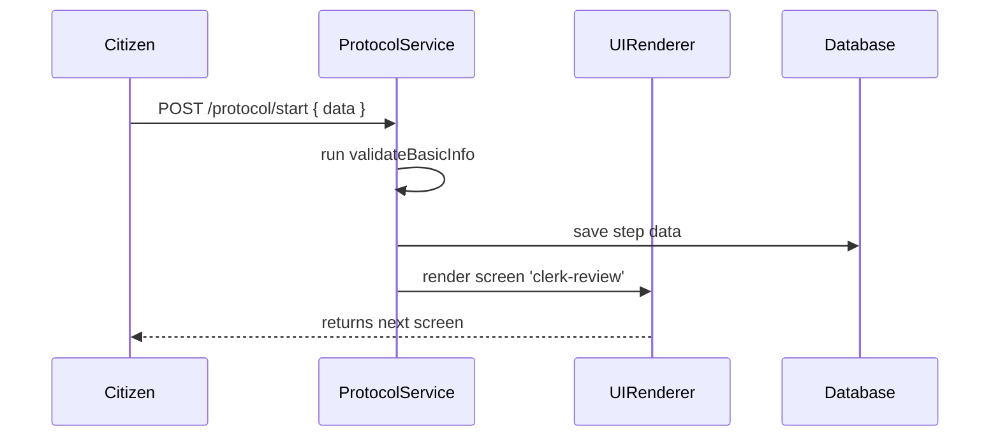

# Chapter 2: Protocol (Core/Protocol)

Welcome back! In [Chapter 1: Program (Core/Program)](01_program__core_program__.md), you learned how to define a **Program**—the blueprint for a government service. Now we’ll see how to turn that blueprint into a concrete, step-by-step **Protocol**, a “traffic plan” that guides users and agents through each screen, interaction, and validation rule.

---

## 2.1 Why “Protocol”? A Real-World Analogy

Think of a city council meeting:

1. **Petition Filed**  
2. **Committee Review**  
3. **Public Comment**  
4. **Council Vote**  
5. **Mayor Signs**

Each stage has its own rules, documents, and user interactions. A **Protocol** in HMS-CDF is like that parliamentary procedure: it codifies exactly which form appears, which buttons are shown, and what checks happen before moving on.

**Use Case**  
Imagine an online **Business License Application**:

- Citizen fills out the initial form.
- System checks residency and fees.
- Clerk reviews and requests corrections if needed.
- Citizen uploads missing documents.
- Clerk finalizes approval and issues license.

We’ll build a Protocol to automate this flow.

---

## 2.2 Key Concepts of a Protocol

1. **programId**  
   Links to a [Program (Core/Program)](01_program__core_program__.md) blueprint.

2. **steps**  
   Ordered list of stages (name, screen, validator, next).

3. **screens**  
   Define which UI component to render (e.g., form fields, buttons).

4. **validators**  
   Simple functions or JSON rules that must pass before moving on.

5. **transitions**  
   Which step comes next on success or error.

---

## 2.3 Defining a Simple Protocol

Below is a minimal example. We reference our `license-business` program.

```js
import { Protocol } from 'hms-cdf/core/protocol'

const businessLicenseProtocol = new Protocol({
  programId: 'license-business',
  steps: [
    {
      name: 'start',
      screen: 'license-apply-form',
      validator: 'validateBasicInfo',
      next: 'review'
    },
    {
      name: 'review',
      screen: 'clerk-review',
      validator: 'validateDocuments',
      next: 'finalize'
    },
    {
      name: 'finalize',
      screen: 'issue-license',
      next: null
    }
  ]
})

businessLicenseProtocol.initialize()
```

Explanation:
- We import and create a `Protocol` with a link to our Program.
- Each `step` names:
  - the UI **screen** to render,
  - a **validator** to run,
  - the **next** step on success.
- `initialize()` registers the flow so front-end and back-end know the order.

---

## 2.4 Runtime Walkthrough

What happens when a citizen clicks **Submit** on the first form?



Step by step:
1. **Citizen** calls `POST /protocol/start`.
2. **ProtocolService** runs the `validator`.
3. If OK, it saves data to **Database**.
4. It tells **UIRenderer** which next screen to show.
5. **Citizen** sees the clerk’s review page.

---

## 2.5 Under the Hood: core/protocol.ts

### 2.5.1 High-Level Flow

1. **Constructor**  
   - Validates the `config` shape.
2. **initialize()**  
   - Persists protocol steps.
   - Registers API endpoints for each step.
3. **handleStep()**  
   - Looks up screen, runs validator, transitions.

### 2.5.2 Simplified Code Snippets

File: `core/protocol.ts` (simplified)

```ts
export class Protocol {
  constructor(private config: ProtocolConfig) {
    // 1) ensure steps array is valid
  }

  initialize() {
    // 2a) save to DB
    Database.save('protocols', this.config)
    // 2b) create endpoints
    this.config.steps.forEach(step => {
      ApiRouter.post(
        `/protocol/${this.config.programId}/${step.name}`,
        (req, res) => this.handleStep(step, req, res)
      )
    })
  }

  private handleStep(step, req, res) {
    // run validator
    const ok = Validators[step.validator](req.body)
    if (!ok) return res.status(400).send('Validation failed')
    // save and transition
    Database.save('protocolData', { step: step.name, data: req.body })
    res.send({ next: step.next })
  }
}
```

Explanation:
- **initialize()** dynamically mounts endpoints.
- **handleStep()** runs a named validator, persists data, and returns the next step.

---

## 2.6 Summary and Next Steps

You’ve learned how a **Protocol**:

- Ties to a [Program](01_program__core_program__.md).
- Defines a clear sequence of **steps**, **screens**, and **validators**.
- Registers endpoints that enforce your “traffic plan.”

In the next chapter, we’ll see how to package these protocols into reusable **Modules** for larger workflows. Stay tuned for [Chapter 3: Module (Modules/)](03_module__modules___.md).

---

Generated by [AI Codebase Knowledge Builder](https://github.com/The-Pocket/Tutorial-Codebase-Knowledge)