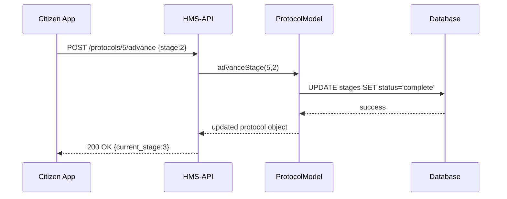

# Chapter 2: Protocol Model

Welcome back! In [Chapter 1: Program Model](01_program_model_.md), you learned how to define a high-level “charter” for your policy or service. Now, it’s time to zoom in on the **Protocol Model**—the step-by-step handbook that tells administrators and citizens exactly how to navigate a public-sector process.

---

## 1. Why Do We Need a Protocol Model?

Imagine the Department of City Planning offers an online **Building Permit** service. A citizen submits a plan, it goes through review, an inspection is scheduled, fees are collected, and finally the permit is issued. Without a clear Protocol Model:

- Developers would hard-code stages in many places  
- Citizens and admins wouldn’t see a consistent workflow  
- Changing even one step (e.g., adding a “fire-safety check”) would require code updates everywhere  

The **Protocol Model** centralizes all these stages, rules, and transitions so each part of HMS-API “knows” the exact sequence to follow.

---

## 2. Core Concepts of the Protocol Model

Let’s break down the main pieces:

1. **Name & Description**  
   A friendly title (e.g. “Building Permit Workflow”) and a brief summary.

2. **Stages**  
   Sequential steps like “Submit Plan,” “Technical Review,” and “Issue Permit.”

3. **Transitions (Rules)**  
   Conditions that move you from one stage to the next (e.g. “Review passes” or “Inspection OK”).

4. **Program Link**  
   Each Protocol belongs to one [Program Model](01_program_model_.md) (e.g., the “City Development” program).

5. **Metadata**  
   Things like estimated time, responsible agency, or form IDs.

---

## 3. Defining a Protocol: Code Example

Here’s a minimal Eloquent model for the Protocol:

```php
<?php
namespace App\Models\Core\Protocol;

use Illuminate\Database\Eloquent\Model;

class Protocol extends Model
{
  protected $fillable = ['name','description','program_id'];
  
  // Link back to Program
  public function program()
  {
    return $this->belongsTo(\App\Models\Core\Program\Program::class);
  }
  
  // A Protocol has many stages
  public function stages()
  {
    return $this->hasMany(Stage::class);
  }
}
```
This lets us create a new protocol tied to a program:

```php
// 1. Create Building Permit protocol
$protocol = Protocol::create([
  'name'       => 'Building Permit Workflow',
  'description'=> 'Steps to approve a building permit',
  'program_id' => 1               // e.g. “City Development” program
]);

// 2. Verify it has an ID
echo $protocol->id; // 5
```

---

## 4. Adding Workflow Stages

Next, define each stage in your process:

```php
<?php
namespace App\Models\Core\Protocol;

use Illuminate\Database\Eloquent\Model;

class Stage extends Model
{
  protected $fillable = ['protocol_id','name','order'];
}
```

```php
// Add three stages
$stages = ['Submit Plan','Review Plan','Issue Permit'];
foreach ($stages as $i => $name) {
  $protocol->stages()->create([
    'name'  => $name,
    'order' => $i + 1
  ]);
}
```

After this, `$protocol->stages` returns an ordered list of steps.

---

## 5. A Day in the Life: Sequence Diagram

Here’s what happens when someone advances the protocol:



1. The front-end calls `advanceStage`.
2. The model marks stage 2 complete.
3. The API returns the next stage.

---

## 6. Under the Hood: What’s Happening?

1. **Validation**: The API controller checks the request.  
2. **Model Logic**: `Protocol::advanceStage()` enforces rules (e.g. you can’t skip stages).  
3. **Database Update**: Changes the status of the old and new stage.  
4. **Notification**: Optionally, triggers emails or logs.  

This keeps your procedural logic in one place.

---

## 7. Visualizing with UI Components

To show stages in an admin panel, you might use:

```vue
<template>
  <v-flex-table-wrapper :items="stages">
    <tabs-slider-tsquare
      v-for="stage in stages"
      :key="stage.id"
      :label="stage.name"
      :active="stage.order === current"
    />
  </v-flex-table-wrapper>
  <v-button-colors-light @click="advance">Next Step</v-button-colors-light>
</template>
```

When you click **Next Step**, it calls `POST /protocols/:id/advance`.

---

## 8. Recap and What’s Next

You’ve learned how the **Protocol Model**:

- Structures a multi-step workflow  
- Links to a [Program](01_program_model_.md)  
- Stores stages and transition rules  
- Lets your front-end drive a clear, consistent process

In the next chapter, we’ll see how to package these protocols and programs into independent **[Module Layers](03_module_layer_.md)** for reuse across different government services. 

See you there!

---

Generated by [AI Codebase Knowledge Builder](https://github.com/The-Pocket/Tutorial-Codebase-Knowledge)