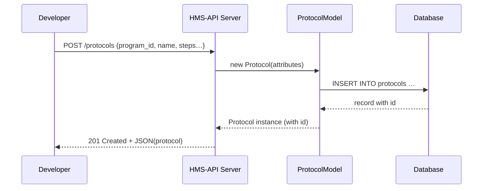

# Chapter 2: Protocol

Welcome back! In [Chapter 1: Program](01_program_.md), you learned how to create a **Program**—the top-level container for a government initiative. Now we’ll look at **Protocol**, which is how you define the detailed rules, steps, or workflows that live _inside_ a Program.

---

## Why Protocols Matter

Imagine the U.S. Department of the Interior (DOI) launches a new “Historic Site Preservation Grant” Program. The Program itself holds names, dates, and high-level metadata. But **how** do applications move from submission to final award? That’s where a **Protocol** comes in:

- It defines each **step** (e.g., eligibility check, technical review, budget approval).
- It enforces the **order** and **conditions** for each step.
- It links back to its **parent Program** so you always know _which_ grant process you’re running.

In short, a Protocol is like the instruction manual or recipe that guides your workflow.

---

## Key Concepts

1. **Attributes**  
   Every Protocol needs basic fields:
   - `program_id` – Which Program it belongs to  
   - `name` – A short title (e.g., “Preservation Grant Workflow”)  
   - `description` – Details of what this Protocol does  
   - `steps` – An ordered list of workflow steps (stored as JSON or an array)

2. **Workflow Steps**  
   Protocols often include multiple steps, for example:
   1. Citizen submits application  
   2. Agency reviewer checks eligibility  
   3. Finance office approves budget  
   4. Grant award issued  

3. **Relationships**  
   - **Protocol → Program**: In code, you’ll see a `program()` method that returns the parent Program.  
   - **Program → Protocols**: Recall from [Chapter 1: Program](01_program_.md) that a Program has a `protocols()` link.

---

## Creating a Protocol: Step by Step

Let’s attach a new Protocol to an existing Program:

```php
use App\Models\Core\Protocol\Protocol;

// 1. Build a new Protocol linked to our Program
$protocol = new Protocol([
  'program_id'  => $program->id,
  'name'        => 'Historic Site Review Workflow',
  'description' => 'Steps to review and approve preservation grants',
  'steps'       => ['submit', 'eligibility', 'technical_review', 'budget_approval']
]);

// 2. Save it to the database
$protocol->save();

// 3. Inspect the parent Program
$parent = $protocol->program();
```

Explanation:
- We pass an array of attributes, including the `program_id` to link back.
- Calling `save()` persists the Protocol.
- `program()` returns the Program instance we created in Chapter 1.

---

## What Happens Under the Hood?

Here’s a simplified flow when you create a Protocol via the HMS-API:



1. **API receives** your POST request.  
2. **ProtocolModel** wraps your data.  
3. **Database** stores the record and returns an `id`.  
4. **API returns** the new Protocol object to you.

---

## Inside `Protocol.php`

File: `app/Models/Core/Protocol/Protocol.php`

```php
<?php
namespace App\Models\Core\Protocol;

class Protocol {
  protected $attributes = [];

  public function __construct(array $attrs = [])
  {
    $this->attributes = $attrs;
  }

  // Link back to the parent Program
  public function program()
  {
    // Pseudo: fetch Program where id = $this->attributes['program_id']
  }

  public function save()
  {
    // Pseudo: write $this->attributes to the database
  }
}
```

- **`$attributes`** holds your fields (`name`, `steps`, etc.).  
- **`program()`** wires the relationship to the Program model.  
- **`save()`** persists the Protocol.

---

## Real-World Analogy

Think of a Protocol as the step-by-step guide in a board game:

- The **Program** is the box with the game’s title and overview.  
- The **Protocol** is the rulebook telling you how to set up, take turns, and win.  

Just like you follow the rulebook to play correctly, HMS-API uses Protocols to run workflows consistently.

---

## Summary

In this chapter, you learned:

- What a **Protocol** is and why it’s essential for running workflows.  
- Key concepts: attributes (`name`, `steps`), workflow steps, and relationships back to a Program.  
- How to create and save a Protocol in code.  
- What happens internally when the API processes a Protocol request.

Up next, we’ll expose these Protocols over the network. In [Chapter 3: Backend API Service](03_backend_api_service_.md), you’ll see how to build the HTTP endpoints that let clients create and manage Protocols.

---

Generated by [AI Codebase Knowledge Builder](https://github.com/The-Pocket/Tutorial-Codebase-Knowledge)