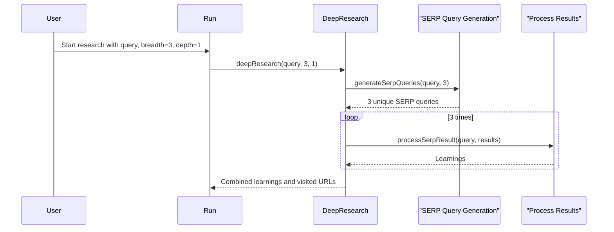

# Chapter 2: Research Breadth

In the previous chapter, [Deep Research Agent](01_deep_research_agent_.md), we learned how HMS-AGX can act like a tireless research assistant. Now, let's explore how to control the "width" of its research using a concept called *Research Breadth*.

Imagine you're researching the benefits of exercise.  You could focus narrowly on just physical benefits, or you could explore a wider range of benefits, including mental and social aspects.  Research breadth lets you control this focus.

## What is Research Breadth?

Research breadth determines how many different "angles" the Deep Research Agent explores at each level of its research. Think of it like casting a fishing net:

- **Narrow Breadth (e.g., 1-2):** Like casting a small net, you'll get very focused results, exploring only a few key aspects.
- **Wide Breadth (e.g., 3-5 or more):** Like casting a large net, you'll get more diverse results, exploring many different facets of the topic.

Higher breadth means more comprehensive results but also more information to process.

## Using Research Breadth

Let's go back to our exercise example.  If your research question is "What are the benefits of exercise?", here's how different breadth values would affect the research:

- **Breadth = 1:** The agent might focus solely on cardiovascular health.
- **Breadth = 3:** The agent might explore cardiovascular health, mental well-being, and improved sleep.
- **Breadth = 5:** The agent might explore the previous three, plus social benefits and weight management.

You control the breadth parameter when calling the `deepResearch` function:

```typescript
// src/run.ts
const { learnings, visitedUrls } = await deepResearch({
  query: "What are the benefits of exercise?",
  breadth: 3, // Exploring 3 different angles
  depth: 1,   // Exploring each angle at a single level (more on depth in the next chapter)
});

// ... (rest of the code remains the same)
```

This code snippet sets the breadth to 3, instructing the agent to explore three different aspects of exercise benefits.

## Inside the Deep Research Agent with Breadth

Here's a simplified sequence diagram showing how breadth affects the research process:



1. You provide the initial query and breadth (3 in this example).
2. The `deepResearch` function uses [SERP Query Generation](04_serp_query_generation_.md) to create three distinct search queries related to your topic.
3. For each query, it processes the search results, extracting learnings using [Learning Extraction](05_learning_extraction_.md).
4. Finally, it combines the learnings from all three searches and returns them.

Here's a simplified look at the `generateSerpQueries` function:

```typescript
// src/deep-research.ts
// ... (other code)
async function generateSerpQueries({ query, numQueries = 3 }) {
  // ... (Uses AI to generate numQueries unique queries related to the input query)
}
// ... (other code)
```

The `numQueries` parameter, which corresponds to the breadth, determines how many different search queries are generated.

## Conclusion

This chapter explained how Research Breadth controls the "width" of your research, allowing you to explore a topic from multiple angles.  In the next chapter, [Iterative Deepening](03_iterative_deepening_.md), we'll learn how to control the "depth" of your research, diving deeper into each aspect.


---

Generated by [AI Codebase Knowledge Builder](https://github.com/The-Pocket/Tutorial-Codebase-Knowledge)