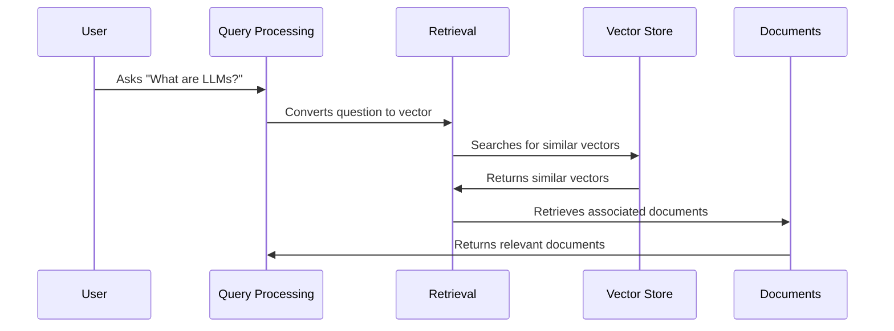

# Chapter 2: Retrieval

In the previous chapter, [LLM (Large Language Model)](01_llm__large_language_model__.md), we learned how LLMs are the "brains" of our chatbot, understanding questions and crafting answers.  But where does the LLM get the information it needs to answer those questions? That's where *Retrieval* comes in.

Imagine you're trying to answer a question about LangChain. You could search through the entire documentation website, but that would take a long time.  Retrieval is like having a smart search engine that quickly finds the most relevant information for the LLM.

## What is Retrieval?

Retrieval is like searching in our "meaning library". It takes your question, converts it into a meaning vector (more on this in the [Embeddings](04_embeddings_.md) chapter), and finds the most similar meaning vectors (and their associated documents) in the [Vector Store](03_vector_store_.md). Think of it like finding books in a library based on their topic.  Your question is the topic, and Retrieval finds the books (documents) that are closest to that topic.

## How Retrieval Works

Let's break down the process step-by-step using a simple example: "What are LLMs?".

1. **Question to Vector:** The question "What are LLMs?" is converted into a meaning vector.  This vector represents the core meaning of the question.
2. **Search the Vector Store:** This meaning vector is used to search the [Vector Store](03_vector_store_.md).  The Vector Store contains many meaning vectors, each associated with a piece of text from the LangChain documentation.
3. **Find Similar Vectors:** The Retrieval system finds the meaning vectors in the Vector Store that are most similar to the question's meaning vector.  These similar vectors represent the pieces of text that are most relevant to the question.
4. **Return Documents:** The documents associated with the most similar meaning vectors are returned.  These documents contain the information the LLM needs to answer the question.



## Retrieval in Code

Let's look at a simplified code snippet to see how Retrieval works in our chatbot:

```python
# backend/retrieval.py (simplified)
from langchain_weaviate import WeaviateVectorStore

# ... other code ...

with retrieval.make_retriever(config) as retriever:
    docs = retriever.get_relevant_documents(query)
    # docs now contains the relevant documents
```

This simplified code shows how we use a `retriever` object (in this case, using a [Vector Store](03_vector_store_.md) like Weaviate) to get relevant documents based on a `query`.

## Looking Under the Hood: `get_relevant_documents`

When `get_relevant_documents` is called, the following happens:

1. The `query` is converted into an embedding using an [Embeddings](04_embeddings_.md) model.
2. This embedding is used to search the [Vector Store](03_vector_store_.md).
3. The Vector Store returns the most similar document embeddings and their associated documents.
4. These documents are returned by the `get_relevant_documents` function.

```python
# backend/retrieval_graph/researcher_graph/graph.py (simplified)
async def retrieve_documents(state, config):
    with retrieval.make_retriever(config) as retriever:
        response = await retriever.ainvoke(state.query, config)
        return {"documents": response}
```

This simplified code snippet from the `researcher_graph` shows how the `retriever` is used to fetch relevant documents based on the `state.query`.

## Conclusion

Retrieval is a crucial component of our chatbot, allowing the LLM to access the information it needs to answer questions effectively. By converting questions into meaning vectors and searching the [Vector Store](03_vector_store_.md), Retrieval efficiently finds the most relevant documents.  Now that we understand how Retrieval works, let's explore the [Vector Store](03_vector_store_.md) itself in the next chapter.


---

Generated by [AI Codebase Knowledge Builder](https://github.com/The-Pocket/Tutorial-Codebase-Knowledge)