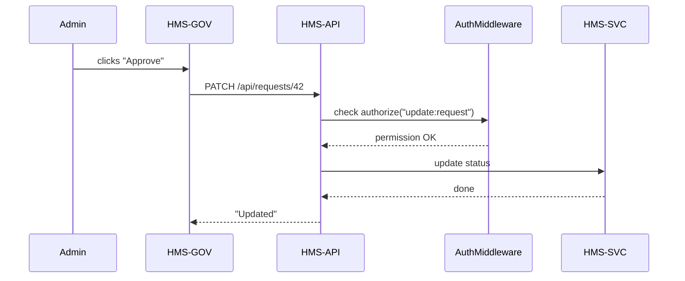

# Chapter 2: Role-Based Actors

Welcome back! In [Chapter 1: Interface Layer](01_interface_layer_.md) we built our citizen and admin portals. Now, we’ll learn how to control who can do what. This is **Role-Based Actors**—assigning each user a “job title” and an “access badge” so they can only perform the actions they’re allowed.

---

## 1. Why Role-Based Actors?

Imagine our government building again.  
- Citizens walk in with a visitor badge that lets them drop off forms.  
- Staff have an employee badge that lets them open offices and review files.  
- Behind the scenes, an AI assistant has a special badge to scan for missing information.

If everyone had the same badge, chaos would ensue! We use **roles** to keep permissions organized, secure, and easy to manage.

### Central Use Case

1. **Citizen** logs in and submits a building permit application.  
2. **Admin** logs in and sees _all_ applications, then marks one as “In Review” or “Approved.”  
3. **AI Agent** logs in and suggests missing fields or flags suspicious requests.

Each actor needs different permissions:
- Citizens can **create** and **view their own** requests.
- Admins can **view all**, **update status**, and **delete** if needed.
- AI Agents can **view all** and **annotate** or **optimize** workflows.

---

## 2. Key Concepts

1. **Role**  
   A named group (Citizen, Admin, AI Agent) describing a user’s function.

2. **Permission**  
   A specific action (e.g., `create:request`, `read:all:requests`, `optimize:workflow`).

3. **Authorization**  
   Checking if a user’s role includes the needed permission.

4. **Middleware**  
   Code that intercepts requests to enforce permissions before reaching business logic.

---

## 3. Defining Roles and Permissions

Below is a minimal JavaScript object mapping each role to its allowed permissions.

```js
// src/auth/roles.js
const roles = {
  Citizen: [
    "create:request",
    "read:own:request"
  ],
  Admin: [
    "read:all:requests",
    "update:request",
    "delete:request"
  ],
  "AI Agent": [
    "read:all:requests",
    "annotate:request",
    "optimize:workflow"
  ]
};

module.exports = roles;
```

Explanation:
- We list each role as a key.  
- The array holds strings matching actions in our API.

---

## 4. Enforcing Permissions with Middleware

Here’s a tiny Express middleware function. It checks if the logged-in user’s role includes the required permission.

```js
// src/auth/authorize.js
const roles = require("./roles");

function requirePermission(permission) {
  return (req, res, next) => {
    const role = req.user.role; // set by authentication
    if (roles[role]?.includes(permission)) {
      return next();         // permission granted
    }
    res.status(403).send("Forbidden: insufficient rights");
  };
}

module.exports = requirePermission;
```

How it works:
1. `req.user.role` comes from your login system.  
2. We look up the role in our `roles` map.  
3. If the permission is found, we call `next()`. Otherwise we block access.

---

## 5. Putting It All Together

Let’s secure our permit-request endpoints. Citizens can create, admins can update, AI agents can annotate.

```js
// src/server.js
const express = require("express");
const authorize = require("./auth/authorize");
const app = express();

app.use(express.json());
// Mock login: attach a user to every request
app.use((req, res, next) => {
  req.user = { id: 123, role: "Citizen" }; // change to Admin or "AI Agent"
  next();
});

// Citizen creates a request
app.post(
  "/api/requests",
  authorize("create:request"),
  (req, res) => {
    // ...save to DB...
    res.json({ requestId: 42 });
  }
);

// Admin updates a request
app.patch(
  "/api/requests/:id",
  authorize("update:request"),
  (req, res) => {
    // ...update status...
    res.send("Updated");
  }
);

// AI Agent annotates a request
app.post(
  "/api/requests/:id/annotate",
  authorize("annotate:request"),
  (req, res) => {
    // ...save annotation...
    res.send("Annotated");
  }
);

app.listen(8080, () => console.log("Server on :8080"));
```

Each route calls `authorize(...)` with the needed permission.

---

## 6. Under the Hood: Request Flow

Here’s what happens when an Admin tries to update a request:



1. The portal sends the request to our API.  
2. The authorization middleware checks `req.user.role`.  
3. If it passes, we go on to the service layer to update the database.

---

## 7. Why This Matters

- **Security:** Users can only do what their badge (role) allows.  
- **Clarity:** Adding a new role (e.g., Inspector) means just updating one map.  
- **Maintainability:** Middleware keeps permission logic in one place, not scattered across your code.

---

## 8. Next Steps

You now know how to assign badges and check permissions in HMS-AGX. Up next is guiding users through the app based on their intent:

[Chapter 3: Intent-Driven Navigation](03_intent_driven_navigation_.md)

---

Congratulations! You’ve mastered **Role-Based Actors**—our digital ID badges that keep the system safe and organized.

---

Generated by [AI Codebase Knowledge Builder](https://github.com/The-Pocket/Tutorial-Codebase-Knowledge)