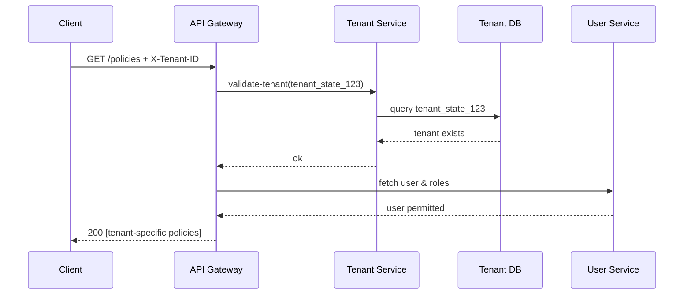

# Chapter 2: Tenant Management

Welcome back! In [Chapter 1: User Model](01_user_model_.md), we learned how HMS-API identifies **who** is using the system. Now we’ll see **where** they belong. Enter **Tenant Management**: our way to isolate data by agency, state, county—or any branch—while sharing the same HMS-API engine.

---

## 2.1 Why Tenant Management?

Imagine a skyscraper with many suites. Each tenant (agency or region) gets its own suite—walls, doors, and furniture—so nobody mixes up files or steps on each other’s toes. But the building’s foundation, elevator, and security system are shared. That’s Tenant Management in a nutshell.

**Use Case**  
A federal homeland security API hosts:  
- A **FEMA** tenant for disaster response.  
- A **State Health Dept** tenant for COVID vaccination records.  
- A **County Sheriff’s Office** tenant for incident reports.  

Each tenant has its own users, policies, and data. When an FHP officer logs in, they only see FEMA resources—not county crime logs.

---

## 2.2 Key Concepts

1. **Tenant**  
   A logical container (e.g., “FEMA”, “StateHealth”, “CountySheriff”).  
2. **Tenant ID**  
   A unique code: `tenant_fema_001`.  
3. **Isolation**  
   Data and users scoped to one tenant can’t read or modify another’s.  
4. **Shared Infrastructure**  
   All tenants use the same HMS-API backend but carry different context.

---

## 2.3 How to Use Tenant Management

### 2.3.1 Creating a Tenant

```http
POST /api/tenants
Content-Type: application/json

{
  "name": "StateHealthDept",
  "description": "State Health Department"
}
```

What happens:  
1. HMS-API validates the request.  
2. Creates a record in `tenants` table with a new `tenant_id`.  
3. Returns the `tenant_id`.  

```json
{
  "tenant_id": "tenant_state_123",
  "name": "StateHealthDept"
}
```

### 2.3.2 Assigning a User to a Tenant

```http
POST /api/tenants/tenant_state_123/users
Content-Type: application/json

{
  "user_id": "user_12345",
  "roles": ["Caseworker"]
}
```

Result:  
- That user can now operate in the `tenant_state_123` context with `Caseworker` permissions.

### 2.3.3 Making a Tenant-Scoped Request

Every request includes a header:

```
X-Tenant-ID: tenant_state_123
```

```http
GET /api/policies
X-Tenant-ID: tenant_state_123
```

Only policies for that tenant are returned.

---

## 2.4 What Happens Under the Hood?



1. Gateway checks `X-Tenant-ID` with **Tenant Service**.  
2. Tenant Service looks up the tenant record.  
3. If valid, Gateway calls **User Service** for auth.  
4. Finally returns tenant-scoped data.

---

## 2.5 Internal Implementation

### 2.5.1 File: models/tenant_model.js

```js
// models/tenant_model.js
class Tenant {
  constructor({ id, name }) {
    this.id = id
    this.name = name
  }

  static async findById(id) {
    // Simplified: query your DB
    return db.query('SELECT * FROM tenants WHERE id = ?', [id])
  }
}

module.exports = Tenant
```

> We represent each tenant by `id` and `name`. `findById` checks if the tenant exists.

### 2.5.2 Middleware: middleware/tenant.js

```js
// middleware/tenant.js
const Tenant = require('../models/tenant_model')

async function requireTenant(req, res, next) {
  const tenantId = req.headers['x-tenant-id']
  if (!tenantId) {
    return res.status(400).json({ error: 'Missing X-Tenant-ID' })
  }
  const tenant = await Tenant.findById(tenantId)
  if (!tenant) {
    return res.status(404).json({ error: 'Tenant not found' })
  }
  req.tenant = tenant
  next()
}

module.exports = requireTenant
```

> Explanation:  
> - Extract `X-Tenant-ID`.  
> - Verify it exists in the database.  
> - Attach to `req.tenant` for later handlers.

---

## 2.6 Putting It All Together

1. Client sends `X-Tenant-ID` header.  
2. `requireTenant` middleware ensures the tenant is valid.  
3. Downstream controllers use `req.tenant.id` to scope queries:  
   ```js
   // controllers/policy.js
   async function listPolicies(req, res) {
     const policies = await db.query(
       'SELECT * FROM policies WHERE tenant_id = ?', 
       [req.tenant.id]
     )
     res.json(policies)
   }
   ```  
4. Users and data stay neatly within each tenant’s “suite.”

---

## Conclusion

You’ve learned how **Tenant Management** lets HMS-API serve multiple agencies or regions on one platform, each with isolated data and users. Next up, we’ll see how to attach real-world programs to these tenants.  
[👉 Chapter 3: Program Model](03_program_model_.md)

---

Generated by [AI Codebase Knowledge Builder](https://github.com/The-Pocket/Tutorial-Codebase-Knowledge)