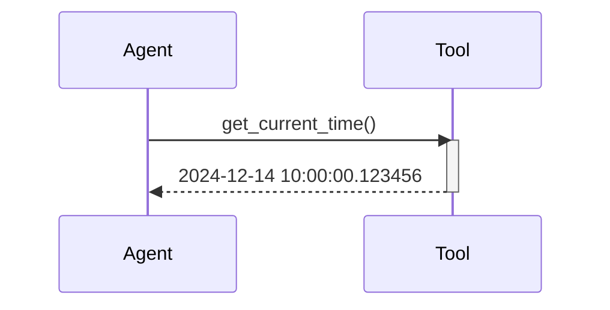

# Chapter 2: Tool

In the previous chapter, [Agent](01_agent.md), we learned how an agent acts like a smart assistant to perform tasks. But how does the agent actually *do* things? That's where **Tools** come in.

Imagine our chef agent wants to make a Bolognese sauce.  The agent knows the recipe (the task), but needs tools like a knife to chop vegetables, a pot to cook the sauce, and a spoon to stir.  Similarly, a `smolagents` agent needs tools to interact with the world, like searching the web or processing data.

## What is a Tool?

A tool is simply a function that performs a specific action.  It's like a kitchen utensil for our chef agent. Each tool has a defined purpose and takes specific inputs to produce an output. For example, a "search" tool might take a query as input and return search results.

## Creating a Tool

Let's create a simple tool to get the current time.

```python
from smolagents import tool

@tool
def get_current_time() -> str:
    """
    Gets the current time.
    """
    from datetime import datetime
    return str(datetime.now())
```

This code defines a tool called `get_current_time` using the `@tool` decorator. The docstring describes what the tool does. The function itself gets the current time and returns it as a string.  The `-> str` indicates that the output will be a string.

## Using a Tool

Now let's use our `get_current_time` tool.

```python
current_time = get_current_time()
print(current_time) # Output: Current date and time (e.g., 2024-12-14 10:00:00.123456)
```

This code calls the `get_current_time` tool, which returns the current time.  The result is then printed to the console.

## Inside a Tool

Here's a simplified sequence diagram showing how a tool is used by an [Agent](01_agent.md):



1. The agent calls the tool.
2. The tool executes its function.
3. The tool returns the result to the agent.

The `@tool` decorator automatically handles the internal implementation details, like defining the tool's name, description, inputs, and output type.  This information is used by the [Agent](01_agent.md) and the [Model](03_model.md) to understand how to use the tool.

```python
# Simplified code from tools.py
def tool(tool_function: Callable) -> Tool:
    # ... (Extract information from docstring and type hints)
    class SimpleTool(Tool):
        # ... (Set name, description, inputs, output_type)
        forward = staticmethod(tool_function)
    return SimpleTool()
```

## Conclusion

In this chapter, we learned about the `Tool` abstraction in `smolagents` and how it allows agents to perform specific actions. We saw how to create a simple tool using the `@tool` decorator and how to use it.  Next, we'll explore the [Model](03_model.md) abstraction and how it helps the agent decide which tools to use.


---

Generated by [AI Codebase Knowledge Builder](https://github.com/The-Pocket/Tutorial-Codebase-Knowledge)