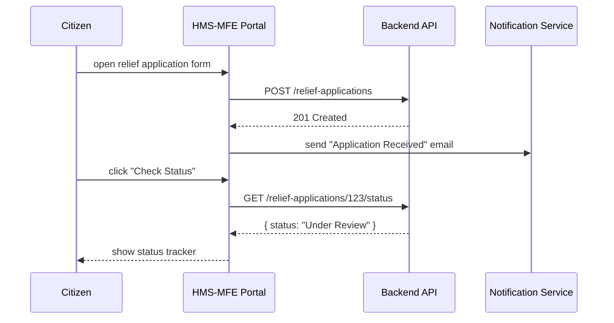
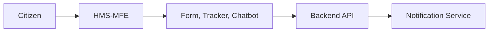

# Chapter 2: User Portal & Frontend Modules (HMS-MFE)

Welcome back! In [Chapter 1: Interface Layer](01_interface_layer_.md) we saw how both citizen and admin portals share common UI building blocks. Now we’ll zoom in on the **citizen-facing side**—the User Portal & Frontend Modules, a.k.a. **HMS-MFE**.

---

## Why HMS-MFE?

Imagine you need to apply for disaster relief funds from the Farm Service Agency (FSA). You want a simple, guided web form; a way to check “What’s my application status?”; and maybe even a chatbot to answer quick questions. HMS-MFE provides:

- Reusable **forms** and **UI widgets**  
- A **status tracker** so citizens see real-time updates  
- An embedded **chatbot** for live help  
- **Notifications** (email, SMS)  
- Built-in **accessibility** compliance  

All these modules plug into backend APIs seamlessly, giving citizens a smooth, consistent experience.

---

## Central Use Case: Disaster Relief Application

1. Citizen clicks “Apply for Relief”  
2. A multi-step **Form Module** collects data and uploads documents  
3. After submit, a **Status Tracker** shows “Under Review,” “Approved,” etc.  
4. A **Chatbot** answers FAQs (“What documents do I need?”)  
5. Notifications alert citizens when the status changes  

Below is the overall flow:



---

## Key Concepts

1. **Form Module**  
   Step-by-step forms with file uploads and validation.  
2. **Status Tracker**  
   Timeline UI showing current application stage.  
3. **Chatbot Widget**  
   FAQ bot that calls a Q&A API behind the scenes.  
4. **Notification System**  
   Hooks into backend events to send emails/SMS.  
5. **UI Widgets Library**  
   Buttons, inputs, date-pickers—all styled the same.  
6. **Accessibility**  
   ARIA labels, keyboard focus, color contrast built in.

---

## Building the Form Module

Let’s create a minimal React form that uses our shared UI library (`@hms-ui`).

```jsx
// src/components/ReliefForm.jsx
import { TextInput, FileUpload, Button } from '@hms-ui';

function ReliefForm({ onSubmit }) {
  return (
    <form onSubmit={onSubmit}>
      <TextInput name="applicantName" label="Your Name" required />
      <TextInput name="farmId" label="Farm ID" required />
      <FileUpload name="docs" label="Upload Supporting Docs" />
      <Button type="submit">Submit Application</Button>
    </form>
  );
}

export default ReliefForm;
```

Explanation:
- We import consistent form controls from `@hms-ui`.  
- `required` fields enforce validation in the browser.  
- `onSubmit` calls the backend.

---

## Adding the Status Tracker

Here’s a tiny component to show progress stages:

```jsx
// src/components/StatusTracker.jsx
function StatusTracker({ status }) {
  const stages = ['Submitted', 'Under Review', 'Approved', 'Funded'];
  return (
    <ul>
      {stages.map((s) => (
        <li key={s} className={s === status ? 'current' : ''}>
          {s}
        </li>
      ))}
    </ul>
  );
}

export default StatusTracker;
```

Explanation:
- `status` is fetched from the API  
- We highlight the current stage with a CSS class

---

## Embedding the Chatbot

A simple chatbot placeholder:

```jsx
// src/components/Chatbot.jsx
function Chatbot() {
  return (
    <div className="chatbot">
      <p>Hi! Ask me about your relief application.</p>
      {/* Real bot logic calls a Q&A API behind the scenes */}
    </div>
  );
}

export default Chatbot;
```

Later you can hook this up to an AI agent from [Chapter 8: AI Agents (HMS-A2A)](08_ai_agents__hms_a2a__.md).

---

## Putting It All Together

```jsx
// src/index.jsx
import ReactDOM from 'react-dom';
import ReliefForm from './components/ReliefForm';
import StatusTracker from './components/StatusTracker';
import Chatbot from './components/Chatbot';

function App() {
  // state and API calls omitted for brevity
  return (
    <>
      <h1>Disaster Relief Application</h1>
      <ReliefForm onSubmit={handleSubmit} />
      <StatusTracker status={appStatus} />
      <Chatbot />
    </>
  );
}

ReactDOM.render(<App />, document.getElementById('root'));
```

Explanation:
- `handleSubmit` sends data to `/relief-applications`  
- `appStatus` is refreshed via `GET /relief-applications/:id/status`

---

## Under the Hood: Folder Structure

```
/hms-mfe
  /components    # ReliefForm.jsx, StatusTracker.jsx, Chatbot.jsx
  /widgets       # shared UI widget overrides, theme files
  index.jsx      # boots the User Portal
```

1. **components/** holds each feature widget.  
2. **widgets/** lets you customize colors, fonts—much like painting a public-service kiosk.  
3. **index.jsx** decides what to render based on the route (e.g., `/apply`, `/status`).

---

## How It All Works

1. **Boot**: `index.jsx` loads theme and widgets.  
2. **Route**: User visits `/apply` → ReliefForm shows.  
3. **Event**: On submit, form data goes to backend.  
4. **Notification**: Notification Service sends email.  
5. **Update**: Citizen visits `/status` → StatusTracker polls status.

Diagram overview:



---

## Conclusion

In this chapter, you learned:

- What **HMS-MFE** is and why it matters for citizen services  
- How to build a simple **Form Module**, **Status Tracker**, and **Chatbot**  
- The internal folder layout and startup sequence  

Next up: dive into the **Admin/Gov Portal**, where officials review applications and manage workflows.  
[Chapter 3: Admin/Gov Portal (HMS-GOV)](03_admin_gov_portal__hms_gov__.md)

---

Generated by [AI Codebase Knowledge Builder](https://github.com/The-Pocket/Tutorial-Codebase-Knowledge)