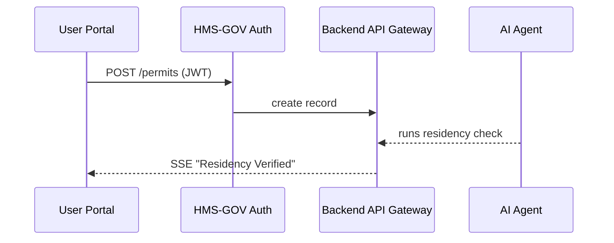

# Chapter 2: User Portal (HMS-MFE)  

*(part of the HMS-CUR tutorial series)*  

---

[⬅ Back to Chapter 1: Core System Platform (HMS-GOV)](01_core_system_platform__hms_gov__.md)

## 0. Why Do We Need a “Front Lobby”?

In Chapter 1 we built the digital city hall itself.  
Now citizens actually need a **front door**. That door is the *User Portal* (code-name **HMS-MFE** for “micro-front-end”).

Imagine Alex again:

> “I want to apply for a community-garden permit and then watch its status change *live* without calling six different desks.”

HMS-MFE solves three headaches:

1. One consistent UI instead of many disjoint agency pages.  
2. Real-time updates—green check marks pop in when an AI agent or human official finishes a step.  
3. Safe, cookie-less communication through secure APIs exposed by [HMS-GOV](01_core_system_platform__hms_gov__.md).

---

## 1. A 3-Minute Walk-Through

Step | What Alex Does | What He Sees
---- | ---------------| ------------
1 | Visits `https://portal.gov.example` | “Welcome, Alex” (after single sign-on).
2 | Clicks “Community Garden Permit” | A short form appears.
3 | Uploads `ProofOfResidence.pdf` & submits | A **Status Card** appears: “Waiting for Residency Check…”.
4 | Goes for coffee ☕ | Green ✔ “Residency Verified” flashes automatically.
5 | Receives email: “Permit Approved” | Portal also shows final PDF to download.

We will recreate this mini journey with fewer than 40 lines of code!

---

## 2. Key Building Blocks

| Real Lobby Analogy | HMS-MFE Module | Purpose |
|--------------------|---------------|---------|
| Reception desk | `AuthBanner` | Shows login info, pulls JWT from [Authorization & Identity Layer](03_authorization___identity_layer_.md). |
| Queue ticket screen | `StatusCard` | Streams live process updates. |
| Form counter | `RequestForm` | Micro-front-end that submits data to the back-end. |
| Overhead speaker | `EventChannel` | WebSocket or SSE that pushes updates to the UI. |
| Plug-in slot | `mfe-plugin.json` | Registers this front-end with HMS-GOV menus. |

---

## 3. Quick Start: Run the Portal Locally

Prerequisites  
* Node ≥ 18  
* HMS-GOV running on `localhost:4000` (from Chapter 1)

```bash
# 1. Clone only the MFE part
git clone https://github.com/example/hms-mfe.git
cd hms-mfe

# 2. Install & start
npm install
npm run dev   # default: http://localhost:5173
```

Open the browser. You should see:

```
Hello, Alex  |   🏛 Community Garden Permit
```

---

## 4. Coding the Use Case

Below are *tiny* React-style examples. No worries if you’ve never used React—think of components as Lego bricks.

### 4.1 The Request Form (12 lines)

```tsx
// src/components/RequestForm.tsx
export function RequestForm({ onSubmitted }: { onSubmitted(id: string) }) {
  const [file, setFile] = useState<File>();

  async function send() {
    const body = new FormData();
    body.append("doc", file!);
    const res = await fetch("/api/permits", { method: "POST", body });
    const { permitId } = await res.json();
    onSubmitted(permitId);     // tell parent we’re done
  }

  return (
    <div>
      <input type="file" onChange={e => setFile(e.target.files![0])} />
      <button onClick={send}>Submit</button>
    </div>
  );
}
```

What it does:

1. Collects a PDF.  
2. POSTs it to `/api/permits` (proxied to HMS-GOV).  
3. Returns a new **permitId** so we can start listening for status.

### 4.2 The Live Status Card (14 lines)

```tsx
// src/components/StatusCard.tsx
export function StatusCard({ id }: { id: string }) {
  const [steps, setSteps] = useState<string[]>([]);

  useEffect(() => {
    const sse = new EventSource(`/api/permits/${id}/events`);
    sse.onmessage = e => setSteps(prev => [...prev, JSON.parse(e.data).msg]);
    return () => sse.close();
  }, [id]);

  return (
    <ul>
      {steps.map((s, i) => <li key={i}>{s}</li>)}
    </ul>
  );
}
```

Here we open a **Server-Sent Events (SSE)** channel.  
Each new backend event (e.g., “Residency Verified”) appears instantly.

### 4.3 Glueing It Together (12 lines)

```tsx
// src/App.tsx
export default function App() {
  const [id, setId] = useState<string>();

  return (
    <main>
      <h1>Community Garden Permit</h1>
      {id
        ? <StatusCard id={id} />
        : <RequestForm onSubmitted={setId} />}
    </main>
  );
}
```

Run this, upload a file, and watch statuses roll in—no page refreshes needed.

---

## 5. Registering the Micro-Front-End

```json
// mfe-plugin.json
{
  "name": "garden-permit",
  "route": "/garden",
  "permissions": ["permit.write", "permit.read"],
  "version": "0.1.0"
}
```

Drop this file into HMS-GOV’s `plugins/` folder (see Chapter 1).  
The portal instantly shows a new sidebar link “🏡 Garden Permit.”

---

## 6. What Happens Behind the Curtain?



Plain-English flow:

1. The form POST travels with Alex’s JWT to HMS-GOV.  
2. The backend stores the permit and fires an “event stream” entry.  
3. The AI Representative Agent (see [AI Representative Agent](05_ai_representative_agent_.md)) validates residency.  
4. A success event is pushed to the portal over SSE/WebSocket, updating the UI.

---

## 7. Peeking at Implementation Files

### 7.1 Simple Express Proxy (Node, 13 lines)

```js
// server/proxy.js
import express from "express";
import { createProxyMiddleware } from "http-proxy-middleware";

const app = express();
app.use("/api", createProxyMiddleware({
  target: "http://localhost:4000",   // HMS-GOV
  changeOrigin: true
}));

app.listen(5174);
```

Why? During local dev we avoid CORS issues by forwarding `/api/*` to HMS-GOV.

### 7.2 Minimal SSE Endpoint (Go, 17 lines)

```go
// backend/events.go
func streamPermit(w http.ResponseWriter, r *http.Request) {
  id := mux.Vars(r)["id"]
  ch := subscribe(id)          // returns <-chan string

  w.Header().Set("Content-Type", "text/event-stream")
  for msg := range ch {
    fmt.Fprintf(w, "data: %s\n\n", msg)
    flusher.Flush()
  }
}
```

Any service (AI or human) can `publish(id, "Residency Verified")`; listeners instantly receive the update.

---

## 8. Common Questions

Q: *Do I need React?*  
A: No. Vue, Svelte, plain HTML—anything that can call `/api` and open SSE/WebSocket will work.

Q: *Is the portal accessible?*  
A: UI components follow the U.S. Web Design System (USWDS). Screen-reader roles are in the sample code.

Q: *How is security handled?*  
A: JWTs are validated by HMS-GOV; front-end never stores passwords. See [Authorization & Identity Layer](03_authorization___identity_layer_.md).

---

## 9. Recap

You learned how HMS-MFE:

✓ Presents a single, friendly lobby for all citizen tasks.  
✓ Talks to the core platform securely.  
✓ Shows real-time progress through event streams.  
✓ Registers itself in one JSON file—no redeploy of the monolith needed.

Next we’ll look at how login, multi-factor auth, and role management actually work under the hood. Head over to [Authorization & Identity Layer](03_authorization___identity_layer_.md).

---

---

Generated by [AI Codebase Knowledge Builder](https://github.com/The-Pocket/Tutorial-Codebase-Knowledge)