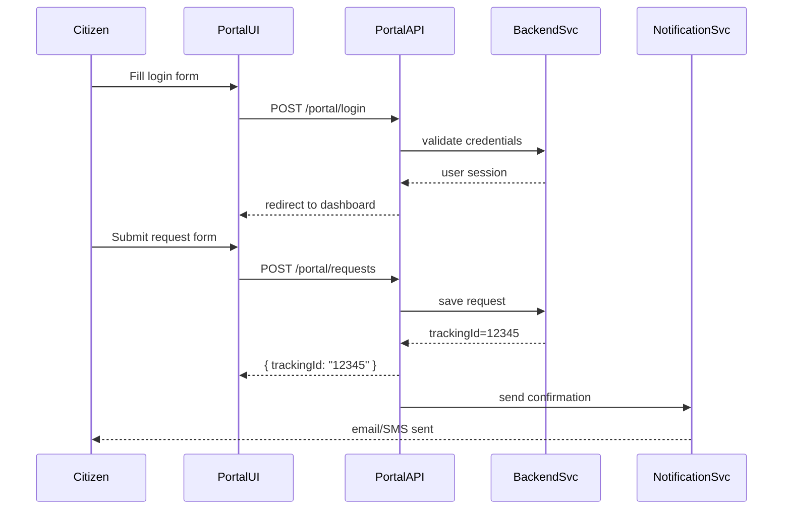

# Chapter 2: User Portal

Welcome back! In [Chapter 1: Interface Layer](01_interface_layer_.md), we learned how to build the “front desk” of HMS-EHR. Now, we’ll dive into one of the most important parts of that layer—the **User Portal**.

---

## Why a User Portal?

Imagine you need to renew your driver’s license on the DMV website. You want to:

- Log in securely  
- Fill out the renewal form  
- Track the status of your application  
- Receive email or SMS updates  
- Look up public guides and FAQs  

All these tasks live in the **User Portal**. It’s the citizen-facing web application where people submit requests, check progress, and find information.

---

## Key Concepts of the User Portal

1. Authentication  
2. Request Submission  
3. Status Dashboard  
4. Notifications  
5. Public Information Pages  

We’ll cover each one with simple examples.

---

### 1. Authentication

Before you submit any request, you need to log in. Here’s a minimal HTML login form (`src/portal/login.html`):

```html
<form id="login-form" action="/portal/login" method="post">
  <label>Username:
    <input name="username" required />
  </label>
  <label>Password:
    <input name="password" type="password" required />
  </label>
  <button type="submit">Login</button>
</form>
```

Explanation:

- Collects username and password  
- Sends a POST to `/portal/login`  
- Server will validate credentials and start a session  

---

### 2. Request Submission

Once logged in, a user can submit a request—for example, apply for a business license. A simple form (`src/portal/requestForm.html`):

```html
<form id="request-form" action="/portal/requests" method="post">
  <label>Business Name:
    <input name="businessName" required />
  </label>
  <label>License Type:
    <select name="licenseType">
      <option>General</option>
      <option>Food Service</option>
    </select>
  </label>
  <button type="submit">Submit Application</button>
</form>
```

After submitting, the portal returns a **tracking ID** so the user can follow up.

---

### 3. Status Dashboard

Users like to see all their requests in one place. A dashboard might look like:

| Tracking ID | Type         | Status      |
|-------------|--------------|-------------|
| 12345       | Food Service | Pending     |
| 67890       | General      | Approved    |

Behind the scenes, the portal fetches this data from an API:

```js
// src/portal/dashboard.js
async function loadDashboard() {
  const res = await fetch('/portal/status');
  const data = await res.json();
  renderTable(data.requests);
}
```

---

### 4. Notifications

Users expect alerts when something changes. After a request is approved, the portal can send:

- Email: “Your business license #12345 is approved.”  
- SMS: “Your DMV renewal is ready for download.”  

The portal triggers notifications via a background service.

---

### 5. Public Information Pages

Beyond personal requests, the portal often hosts:

- FAQs  
- Fee schedules  
- Application guides  

These are static pages (HTML/Markdown) served alongside the portal UI.

---

## A Step-by-Step Flow

Here’s what happens when a user logs in, submits a request, and sees a confirmation:



---

## Under the Hood: Core Routes

Below is a simplified Express router (`src/portal/routes.js`) that powers login, requests, and status:

```js
const express = require('express');
const router = express.Router();

// 1. Handle login
router.post('/portal/login', (req, res) => {
  // (1) check req.body.username/password
  // (2) create session if valid
  res.redirect('/portal/dashboard');
});

// 2. Create a new request
router.post('/portal/requests', (req, res) => {
  // Save the incoming request to the database
  const trackingId = saveToDb(req.body);
  res.json({ trackingId });
  // Trigger a confirmation notification (pseudo)
  sendNotification(req.user.email, trackingId);
});

// 3. Fetch all requests for this user
router.get('/portal/status', (req, res) => {
  const requests = fetchUserRequests(req.user.id);
  res.json({ requests });
});

module.exports = router;
```

Explanation:

- `/portal/login` starts a user session  
- `/portal/requests` saves a new application and returns a tracking ID  
- `/portal/status` returns a list of requests and statuses  

---

## Putting It All Together

- The **User Portal** is built on top of the [Interface Layer](01_interface_layer_.md).  
- It handles user auth, forms, dashboards, and notifications.  
- Under the hood, simple Express routes connect UI forms to backend services.  

Up next, we’ll see how government staff manage these requests in the [Admin/Gov Portal](03_admin_gov_portal_.md).

---

## What You’ve Learned

- The role of the **User Portal** in HMS-EHR  
- How to build login, request forms, and dashboards  
- A high-level sequence of user interactions  
- Basic Express routes that power these features  

Great job! In the next chapter, you’ll step behind the curtain and learn how administrators see and process these user-submitted requests in the [Admin/Gov Portal](03_admin_gov_portal_.md).

---

Generated by [AI Codebase Knowledge Builder](https://github.com/The-Pocket/Tutorial-Codebase-Knowledge)