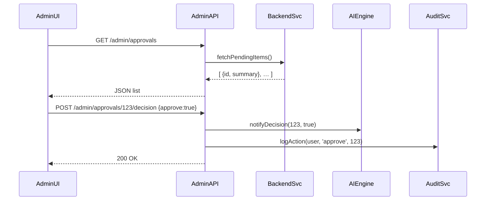

# Chapter 3: Admin/Gov Portal

Welcome back! In [Chapter 2: User Portal](02_user_portal_.md), we saw how citizens log in, submit requests, and track status. Now, let’s switch hats and step into the “control room” for policymakers, managers, and reviewers: the **Admin/Gov Portal**.

---

## Why an Admin/Gov Portal?

Imagine a federal financial regulator:

- Citizens submit transactions or licence applications via the User Portal.  
- Now our policy manager needs to:
  - See a summary of all pending requests  
  - Approve or reject applications  
  - Review AI-generated proposals (e.g., flag suspicious transactions)  
  - Audit every action for compliance  

Just like a power‐grid control room monitors outages and dispatches crews, this portal lets authorized staff oversee operations, make decisions, and keep an audit trail.

---

## Key Concepts

1. **Dashboard Overview**  
   A bird’s-eye view of metrics—pending approvals, alert counts, recent logins.

2. **Approval Workflow**  
   Lists of items waiting for a decision, with buttons to approve/reject.

3. **Audit Logs**  
   Immutable records of every action (who did what and when).

4. **AI Proposal Review**  
   Display AI-generated suggestions (e.g., “Flag transaction #789”) for human sign-off.

5. **Alerts & Notifications**  
   Real-time badges or emails when critical events occur (e.g., anomaly detected).

---

## Example: Building the Approval List

Let’s create a minimal HTML view for pending items.  
File: `src/admin/dashboard.html`

```html
<h1>Admin Dashboard</h1>
<section id="pending-list"></section>
<script>
  fetch('/admin/approvals')
    .then(r => r.json())
    .then(data => {
      const list = data.items.map(item =>
        `<div>
           <strong>${item.id}</strong>: ${item.summary}
           <button onclick="decide('${item.id}', true)">Approve</button>
           <button onclick="decide('${item.id}', false)">Reject</button>
         </div>`
      ).join('');
      document.getElementById('pending-list').innerHTML = list;
    });

  function decide(id, ok) {
    fetch(`/admin/approvals/${id}/decision`, {
      method: 'POST',
      headers:{ 'Content-Type':'application/json' },
      body: JSON.stringify({ approve: ok })
    }).then(() => alert('Decision recorded'));
  }
</script>
```

Explanation:
- Fetches `/admin/approvals` to show pending items.
- `Approve`/`Reject` buttons send a decision to the backend.

---

## What Happens Step-by-Step?



1. Admin UI requests pending items.  
2. Backend returns summaries.  
3. Admin clicks “Approve.”  
4. API notifies AI engine, logs the action, and sends confirmation.

---

## Admin Routes (Express)

File: `src/admin/routes.js`

```js
const express = require('express');
const router = express.Router();

// 1. List pending approvals
router.get('/admin/approvals', (req, res) => {
  const items = fetchPendingFromDb();     // pretend DB call
  res.json({ items });
});

// 2. Record a decision
router.post('/admin/approvals/:id/decision', (req, res) => {
  const { id } = req.params;
  const { approve } = req.body;
  // (1) Apply decision in data store
  saveDecision(id, req.user.id, approve);
  // (2) Notify AI proposals engine
  notifyAI(id, approve);
  // (3) Audit the action
  logAudit(req.user.id, id, approve);
  res.sendStatus(200);
});

module.exports = router;
```

Explanation:
- **GET `/admin/approvals`** retrieves pending items.  
- **POST `/admin/approvals/:id/decision`** saves the decision, calls the AI engine, and logs the action.

---

## Dive Into the Audit Log

Every time an admin makes a decision, we write an audit record.

File: `src/admin/auditService.js`

```js
function logAudit(userId, itemId, approve) {
  const entry = {
    timestamp: new Date().toISOString(),
    userId,
    itemId,
    action: approve ? 'APPROVED' : 'REJECTED'
  };
  // Append to a simple JSON log (or a real logging system)
  appendToLogFile('audit.log', JSON.stringify(entry));
}
module.exports = { logAudit };
```

Explanation:
- Captures who did what and when.
- Stores it in a persistent log for later review or compliance audits.

---

## Summary

In this chapter, you learned how to build the **Admin/Gov Portal**:
- A dashboard that shows pending items and key metrics  
- Routes for listing approvals and recording decisions  
- An audit log to track every action  
- Integration points for an AI governance engine

Next up, we’ll package reusable UI widgets for both the User and Admin portals in the [Frontend Component Library](04_frontend_component_library_.md).

---

Generated by [AI Codebase Knowledge Builder](https://github.com/The-Pocket/Tutorial-Codebase-Knowledge)