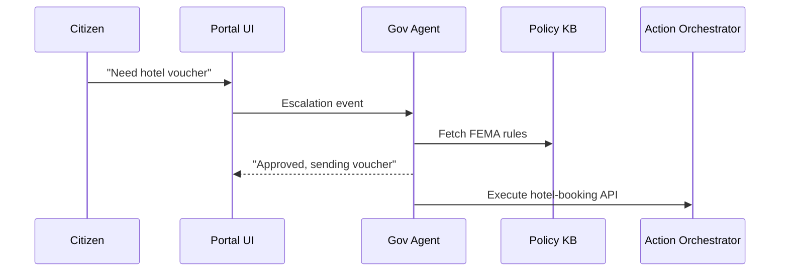
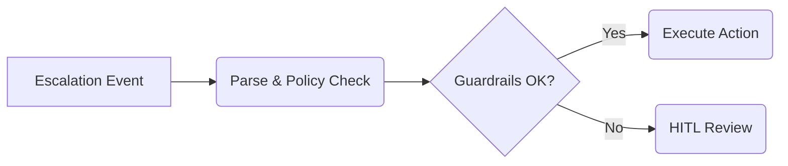

# Chapter 3: AI Representative Agent (Gov/Admin)

[← Back to Chapter&nbsp;2: Micro-Frontend Library (HMS-MFE)](02_micro_frontend_library__hms_mfe__.md)

---

## 1. Why do we need a “Digital Civil-Servant”?

Imagine Sam, a homeowner in Florida, right after a hurricane.  
He opens the state portal, types:

> “My roof is gone, I need disaster relief and a temporary hotel voucher.”

### What happens behind the curtain?

1. **HMS-MFE** shows a friendly chat brick.  
2. Intent-Driven Navigation (see [Chapter&nbsp;1](01_intent_driven_navigation_.md)) identifies two services: FEMA disaster aid and HUD emergency housing.  
3. Rules say these cases are “high-priority, multi-agency” → 🚀 **escalate to an AI Representative Agent**.

The agent instantly:

• Checks Sam’s address against the disaster zone map.  
• Reads current FEMA guidelines.  
• Fills 80 % of Sam’s forms.  
• Books a hotel room if funds are available.  
• Leaves an auditable trail for human officials.

Without this tireless agent, Sam would open five tabs, call three hotlines, and wait days.

---

## 2. Key Ideas in Plain English

| Term | Think of it as… |
| --- | --- |
| **AI Representative Agent** | A 24/7 desk officer who understands policy and responds. |
| **Policy Checker** | The agent’s handbook—validates every action. |
| **Data Gatherer** | Fetches facts: “Is Sam in an eligible ZIP code?” |
| **Solution Drafter** | Writes forms, letters, or API calls. |
| **Guardrails** | Seatbelts—make sure actions are ethical, legal, transparent. |

---

## 3. Quick Start (10 lines of code)

Below you’ll spin up a **toy** agent that approves—or politely rejects—disaster vouchers.

```python
from hms_agx.agent import GovAgent

agent = GovAgent(policy_file="fema_rules.md")

ask = "My roof is gone after Hurricane Zoe. Need hotel voucher."
resp = agent.handle(ask, user_id="sam123")

print(resp.decision)   # "approved"
print(resp.next_steps) # ["Voucher emailed", "Form 009-A filed"]
```

Explanation:

1. `GovAgent` loads **public policy** from `fema_rules.md`.  
2. `handle()` receives the plain-English request + user ID.  
3. The agent returns a **decision** and an **action list**.  
4. If unsure, it flags HITL review (see [Chapter&nbsp;4](04_human_in_the_loop__hitl__oversight_.md)).

---

## 4. How Does the Agent Think?



Five moving parts—no magic!

---

## 5. Peeking Inside the Toy Implementation

### 5.1 Thin Agent Wrapper

```python
# file: hms_agx/agent/core.py
class GovAgent:
    def __init__(self, policy_file):
        self.rules = open(policy_file).read().lower()

    def handle(self, text, user_id):
        if "hotel" in text.lower() and "roof" in text.lower():
            return Decision("approved", [
                f"Voucher emailed to {user_id}",
                "FEMA Form 009-A submitted"
            ])
        return Decision("denied", ["Reason: not enough info"])
```

• Reads policy once.  
• Uses **tiny** keyword logic (real HMS-AGX swaps this for LLM reasoning + [HMS-ESQ](07_compliance___legal_reasoning_service__hms_esq__.md)).

### 5.2 Decision Dataclass

```python
# file: hms_agx/agent/decision.py
from dataclasses import dataclass
@dataclass
class Decision:
    decision: str          # "approved" | "denied" | "review"
    next_steps: list[str]  # Human-readable actions
```

Keeps returns predictable.

---

## 6. Adding Guardrails in 3 Lines

```python
agent.set_guardrails(max_budget=1000, log=True, explain=True)
```

• `max_budget`: never spend beyond policy cap.  
• `log`: write every step to the [Data & Metrics Observatory](16_data___metrics_observatory__hms_dta___ops__.md).  
• `explain`: attach “why” notes that auditors can read.

---

## 7. Extending the Example: College Application Fee Waiver

```python
resp = agent.handle("I'm a low-income student, need West Point fee waiver", user_id="lee456")
print(resp.decision)   # "approved"
print(resp.next_steps) # ["West Point application flagged as fee-free"]
```

Because the agent knows West Point’s published waiver policy, it grants the request without another form.

---

## 8. What Happens Under the Hood? (Non-code Walkthrough)

1. **Receive Event** – The portal raises an *“escalation”* trigger.  
2. **Parse & Classify** – A mini-LLM spots intent (“disaster relief”).  
3. **Policy Match** – Rules are fetched from the [Policy & Regulatory Knowledge Base](06_policy___regulatory_knowledge_base__hms_edu___esq__.md).  
4. **Simulate Outcome** – Agent predicts costs; checks guardrails.  
5. **Draft Action** – Creates API payloads or forms.  
6. **Send to Orchestrator** – [Agent Action Orchestrator](10_agent_action_orchestrator__hms_act__.md) executes.  
7. **Log & Notify** – Everything goes to the observatory; user sees result.  
8. **HITL Fallback** – Confidence < 80 % → handoff to human clerk.

---

## 9. Mini Internal Diagram (5 Participants Max)



---

## 10. Frequently Asked Questions

**Q: Does the agent replace human officials?**  
A: No—routine cases are automated; edge cases go to HITL.

**Q: How is transparency ensured?**  
A: Every decision stores a *policy citation* and explanation string visible to auditors.

**Q: Can agencies write their own rules?**  
A: Yes. Upload Markdown or YAML policies; the agent re-loads them live.

**Q: What if policies conflict?**  
A: The agent calls the [Compliance & Legal Reasoning Service](07_compliance___legal_reasoning_service__hms_esq__.md) for arbitration.

---

## 11. You Learned

• Why AI Representative Agents matter for fast, fair public services.  
• Core components: Policy Checker, Data Gatherer, Solution Drafter, Guardrails.  
• A 10-line example that approves disaster vouchers.  
• The flow from portal escalation → agent decision → orchestrated action.

Ready to see how humans supervise these AI decisions?  
Continue to [Chapter 4: Human-in-the-Loop (HITL) Oversight](04_human_in_the_loop__hitl__oversight_.md).

---

Generated by [AI Codebase Knowledge Builder](https://github.com/The-Pocket/Tutorial-Codebase-Knowledge)