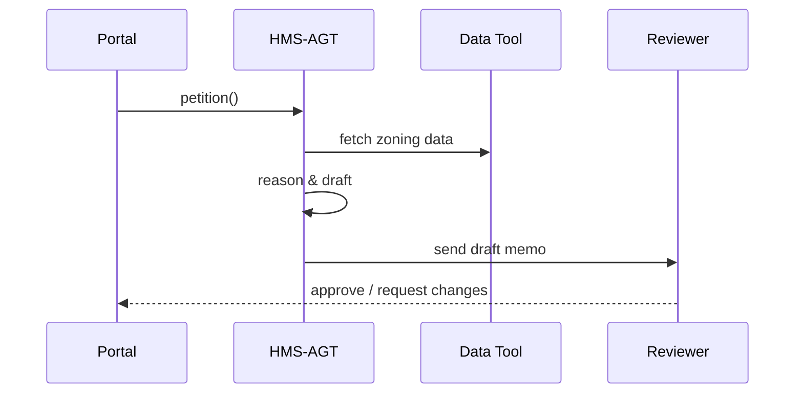

# Chapter 3: AI Representative Agent (HMS-AGT)

*(continuation of [Role & Identity Management (Accounts & Authorization)](02_role___identity_management__accounts___authorization__.md))*  

---

## 1. Why Do We Need an “AI Civil-Servant-in-a-Box”?

### 60-Second Story – “Omar’s Flood-Insurance Appeal”  
Omar owns a house that was recently re-zoned into a high-risk flood area. He thinks the **National Flood Insurance Program (NFIP)** mis-classified his property and wants a re-evaluation.

**Traditional path**

1. Download a 14-page appeal form (PDF).  
2. Mail supporting docs to three different offices.  
3. Wait 90+ days for a cryptic letter.

**With HMS-AGT**

1. Omar uploads a single ZIP on **floodhelp.gov** (built in Chapter 1).  
2. HMS-AGT instantly:  
   a. Reads Omar’s submission.  
   b. Pulls zoning maps & historical claims.  
   c. Drafts a policy-compliant response.  
   d. Forwards it to a human reviewer.  
3. Omar gets a status update within minutes, not months.

**Moral:** HMS-AGT is the tireless brain that turns citizen requests into actionable, policy-safe next steps.

---

## 2. Key Concepts in Plain English

| Term | Friendly Explanation |
|------|----------------------|
| **Petition** | Any digital request: permit application, FOIA query, budget question, etc. |
| **Reasoning Core** | The LLM (large language model) that “thinks.” |
| **Tool** | A safe, scoped action HMS-AGT can take (query database, call API, send email). |
| **Prompt Template** | The “script” we feed the LLM so it behaves like a civil servant. |
| **Autonomy Level** | How far the agent can go before asking a human (0 = none, 5 = fully automatic). |
| **Hand-off Router** | The module that forwards drafts to humans or other subsystems. |

Analogy:  
Think of HMS-AGT as a junior policy analyst who:

1. Reads the case file (petition).  
2. Consults the handbook (prompt template).  
3. Uses government databases (tools).  
4. Writes a memo (draft).  
5. Walks it to the supervisor (hand-off).

---

## 3. Quick-Start: Calling the Agent from a Portal

Below we petition the agent to review Omar’s flood zone:

```javascript
// portal/submitAppeal.js   (18 lines)
import { AgentClient } from '@hms-agt/client';
import { getToken } from '@hms-auth/client'; // Chapter 2 badge 🪪

async function submitAppeal(file) {
  const agent = new AgentClient({ baseURL: 'https://agt.hms.gov' });
  const token = await getToken();          // citizen badge

  const res = await agent.petition({
    headers: { Authorization: `Bearer ${token}` },
    type: 'nfip:appeal',
    payload: { attachment: file, policyYear: 2024 }
  });

  console.log('⏳ Agent ticket #', res.ticketId);
}

export default submitAppeal;
```

Explanation  
1. `AgentClient.petition` sends Omar’s docs plus metadata.  
2. Returns a `ticketId` we can track with the `StatusTimeline` brick from Chapter 1.  
3. All under 20 lines!

---

### 3.1 What Happens Next? (High-Level)



---

## 4. Inside HMS-AGT – A Gentle Walkthrough

1. **Receive** – Validates the petitioner’s badge (see Chapter 2).  
2. **Plan** – Builds a chain-of-thought: *“Need flood map → Need claims history → Draft answer.”*  
3. **Act** – Calls tools in order.  
4. **Draft** – Generates a response using a policy-aware prompt.  
5. **Hand-off** – Ships the draft to the [Human-in-the-Loop Control Panel](05_human_in_the_loop__hitl__control_panel_.md).  

All steps are logged for auditing in [Security & Compliance Engine](11_security___compliance_engine__hms_esq__.md).

---

## 5. Under-the-Hood Code Peeks

### 5.1 Mini Prompt Template (6 lines)

```txt
// prompts/nfipAppeal.txt
You are a NFIP case officer.
Follow FEMA Manual §4.2 when evaluating.
First, summarize the petitioner’s evidence.
Then decide if more data is needed.
Finally, draft a memo titled “Initial Findings”.
```

The template is plain text stored in Git—easy to review and version.

### 5.2 Registering a New Tool (12 lines)

```javascript
// tools/getFloodMap.js
export const getFloodMap = {
  name: 'getFloodMap',
  description: 'Retrieve FEMA flood zone for a lat/lon',
  run: async ({ lat, lon }) => {
    // tiny wrapper around FEMA API
    const r = await fetch(`https://api.fema.gov/zone?lat=${lat}&lon=${lon}`);
    return await r.json();
  }
};
```

Explain:  
The agent can only call whitelisted functions like `getFloodMap`. No arbitrary code execution.

### 5.3 The Reasoning Loop (18 lines)

```javascript
// core/reason.js
import { openai } from './llm';
import { tools } from './index';      // auto-collected

export async function runAgent(plan) {
  let context = {};
  for (const step of plan) {
    if (step.tool) {
      context[step.name] = await tools[step.tool].run(step.args);
    }
    if (step.draft) {
      const prompt = step.draft.replace('{{ctx}}', JSON.stringify(context));
      return await openai.complete({ prompt, max_tokens: 400 });
    }
  }
}
```

Explanation  
1. Follows the **plan** array (`[{tool:'getFloodMap'}, {draft:true}]`).  
2. Accumulates results in `context`.  
3. Sends final prompt to the LLM.  

Short, readable, and testable.

---

## 6. Controlling Autonomy

Agencies set an **Autonomy Level** per agent:

| Level | Behavior |
|-------|----------|
| 0 | Suggest only; human must click every tool. |
| 1 | Fetch data but cannot draft. |
| 2 | Draft but needs approval to send. |
| 3 | Auto-send low-risk drafts. |
| 4 | Full auto except for legal notices. |
| 5 | Full auto (rare in gov). |

The slider lives in the [HITL Control Panel](05_human_in_the_loop__hitl__control_panel_.md).

---

## 7. Debugging & Extending

### 7.1 View an Execution Trace

```javascript
const trace = await agent.getTrace(ticketId);
console.table(trace.steps);
```

Outputs a table like:

```
┌─┬──────────────┬───────────────┐
│#│ step         │ status        │
├─┼──────────────┼───────────────┤
│1│ getFloodMap  │ ✅ completed  │
│2│ draftMemo    │ ✅ completed  │
└─┴──────────────┴───────────────┘
```

Great for auditors & developers alike.

### 7.2 Add a Custom Policy Check (14 lines)

```javascript
// plugins/uscirfCheck.js
export function uscirfCheck(draft) {
  const bannedPhrases = ['politically sensitive'];
  for (const p of bannedPhrases)
    if (draft.includes(p)) throw new Error('Content flagged by USCIRF policy');
}
agent.useDraftValidator(uscirfCheck);
```

Now every outgoing memo is screened.

---

## 8. How HMS-AGT Fits with the Rest of HMS-ACT

* **Incoming petitions** arrive from portals (Chapter 1) with authenticated badges (Chapter 2).  
* **Agent talks** to backend services via the [Agent Interaction Protocol (HMS-MCP)](04_agent_interaction_protocol__hms_mcp__.md).  
* **Human reviewers** oversee drafts in the [HITL Control Panel](05_human_in_the_loop__hitl__control_panel_.md).  
* **Logs & metrics** stream to the [Monitoring & Telemetry Stack](12_monitoring___telemetry_stack__hms_ops__.md).

---

## 9. Recap

You learned:

1. What HMS-AGT does and why it matters.  
2. The life-cycle of a petition from submission to human review.  
3. How to call the agent, register tools, and adjust autonomy.  
4. Where HMS-AGT sits inside the broader HMS-ACT ecosystem.

Ready to see the formal **protocol** that lets agents, portals, and services speak the same language?  
Jump to [Agent Interaction Protocol (HMS-MCP)](04_agent_interaction_protocol__hms_mcp__.md).

---

Generated by [AI Codebase Knowledge Builder](https://github.com/The-Pocket/Tutorial-Codebase-Knowledge)