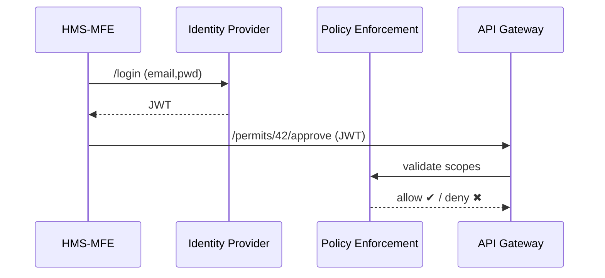

# Chapter 3: Authorization & Identity Layer
*(part of the HMS-CUR tutorial series)*  

[⬅ Back to Chapter 2: User Portal (HMS-MFE)](02_user_portal__hms_mfe__.md)

---

## 0. Why Bother With Yet Another Layer?

Picture Alex again, now standing in a virtual **TSA Pre-Check** line.  
He flashes a badge, glides through security, and instantly sees only the gates he’s cleared to enter.  

In HMS, that badge is a **JSON Web Token (JWT)** issued by the *Authorization & Identity Layer* (A&I).  
Without it:

```
Citizen → ??? → API “Access Denied” 🔒
```

With it:

```
Citizen → A&I ✔ → API “Welcome, Alex” 🏛
```

This chapter shows how A&I:

1. Verifies **who** is calling (citizen, clerk, AI agent, external bot).  
2. Checks **what** the caller may touch (garden-permit forms vs. payroll data).  
3. Logs every **privilege escalation** for auditors.  
4. Plugs into **federal PIV/CAC cards** or **state SSO** with almost no code changes.

We’ll secure a simple use-case:  
> “Alex uploads proof of residence, while a City Clerk escalates to *approve* the permit.”

You will issue tokens, escalate privileges, and watch the audit log—all in ~40 lines of code.

---

## 1. Key Concepts (Blink-of-an-Eye Tour)

| Airport Analogy | A&I Term | 1-Sentence Explanation |
|-----------------|----------|------------------------|
| Passport Control | **Authentication** | Prove you are Alex (or a bot). |
| Boarding Pass | **Authorization** | Confirm you can enter Gate B16 (an API route). |
| TSA *Pre-Check* vs. Regular | **Role & Scope** | Different lanes: `citizen`, `clerk`, `ai-agent`. |
| Supervisor Override | **Privilege Escalation** | Temporarily add `permit.approve`. Must be logged. |
| CCTV Cameras | **Audit Trail** | Immutable log of who did what, when. |
| “We Trust No One” | **Zero-Trust** | Every request re-checks the badge—no implicit trust. |

Stick these in your mental backpack; we will use all of them.

---

## 2. A Five-Minute Hands-On Walkthrough

We’ll run three actors side-by-side:

1. **Alex** (role `citizen`)  
2. **Clara the Clerk** (role `clerk`)  
3. **Bot-QA** (role `ai-agent`)  

> Prerequisites: HMS-GOV from Chapter 1 on `localhost:4000`.

### 2.1 Alex Logs In (Authentication)

```python
# examples/alex_login.py
import requests, json
resp = requests.post("http://localhost:4000/idp/login",
                     json={"email": "alex@example.com", "pwd": "garden123"})
alex_jwt = resp.json()["access"]
print(alex_jwt[:25], "...")
```

Explanation  
1. `/idp/login` is the Identity Provider (IdP) endpoint.  
2. Response contains a signed JWT (our badge).  

### 2.2 Alex Tries to Approve His Own Permit (Fails Authorization)

```python
hdrs = {"Authorization": f"Bearer {alex_jwt}"}
r = requests.post("http://localhost:4000/api/permits/42/approve", headers=hdrs)
print(r.status_code, r.text)
```

Expected output  
```
403 {"error":"missing scope: permit.approve"}
```

A&I blocked the request—Alex only owns `permit.write` & `permit.read`.

### 2.3 Clerk Clara Escalates Privilege

```python
# examples/clara_escalate.py
resp = requests.post("http://localhost:4000/idp/login",
                     json={"email": "clara@city.gov", "pwd": "clerk321"})
clara_jwt = resp.json()["access"]

# escalate for 10 minutes
r = requests.post("http://localhost:4000/idp/escalate",
                  headers={"Authorization": f"Bearer {clara_jwt}"},
                  json={"add_scopes": ["permit.approve"], "ttl": 600})
clara_super = r.json()["access"]
```

Explanation  
1. Clara logs in as normal.  
2. She calls `/idp/escalate` adding `permit.approve` for 600 s.  
3. The API returns a **new token** (`clara_super`) carrying the extra scope.

### 2.4 Clerk Approves Alex’s Permit (Succeeds)

```python
hdrs = {"Authorization": f"Bearer {clara_super}"}
print(requests.post("http://localhost:4000/api/permits/42/approve", headers=hdrs).json())
```

Output  
```
{"status":"approved"}
```

### 2.5 Check the Audit Trail

```bash
tail -n 3 hms-gov/logs/audit.log
```

Sample lines  
```
2024-03-18T14:01Z PERMIT_APPROVE permitId=42 by=clara@city.gov
2024-03-18T14:01Z PRIV_ESCALATE user=clara@city.gov scopes=permit.approve ttl=600
2024-03-18T14:00Z LOGIN_SUCCESS user=clara@city.gov ip=127.0.0.1
```

Mission accomplished! Every move is traceable.

---

## 3. What Happens Under the Hood?

### 3.1 High-Level Flow



Tiny legend  
• **IDP** issues tokens.  
• **PEP** (Policy Enforcement Point) sits in front of every backend.

### 3.2 Token Anatomy (Annotated)

Decoded JWT payload for `clara_super`:

```json
{
  "sub": "clara@city.gov",
  "roles": ["clerk"],
  "scopes": ["permit.read", "permit.write", "permit.approve"],
  "iat": 1710764500,
  "exp": 1710765100   // 10 min later
}
```

Think of it as a **digital boarding pass** with expiry.

---

## 4. Inside the Codebase (Mini-Dive)

Directory map (only A&I parts):

```
hms-gov/
 └─ idp/
     ├─ routes.py
     ├─ token.py
     └─ adapters/
         ├─ pivcac.py
         └─ state_sso.py
```

### 4.1 Creating a Token (token.py, 15 lines)

```python
# idp/token.py
import jwt, time

SECRET = "sup3r-secret-key"  # env var in real life

def make(sub, roles, scopes, ttl=900):
    now = int(time.time())
    payload = {
        "sub": sub,
        "roles": roles,
        "scopes": scopes,
        "iat": now,
        "exp": now + ttl
    }
    return jwt.encode(payload, SECRET, algorithm="HS256")
```

Explanation  
• Generates a signed JWT valid for *ttl* seconds.  
• `sub` is subject (user id), `scopes` drive authorization.

### 4.2 Verifying & Enforcing (routes.py, 18 lines)

```python
# idp/routes.py
from flask import request, jsonify
from .token import make, SECRET, jwt
from functools import wraps

def require(scope):
    def deco(fn):
        @wraps(fn)
        def inner(*a, **k):
            token = request.headers["Authorization"].split()[1]
            try:
                data = jwt.decode(token, SECRET, algorithms=["HS256"])
            except jwt.ExpiredSignatureError:
                return jsonify(error="token expired"), 401
            if scope not in data["scopes"]:
                return jsonify(error=f"missing scope: {scope}"), 403
            return fn(*a, **k)
        return inner
    return deco

@app.route("/api/permits/<pid>/approve", methods=["POST"])
@require("permit.approve")
def approve(pid):
    # ...business logic...
    return jsonify(status="approved")
```

Explanation  
1. `@require("permit.approve")` checks the scope.  
2. Failure paths map to `401` (bad/expired token) or `403` (not allowed).

### 4.3 Plugging In PIV/CAC (adapters/pivcac.py, 12 lines)

```python
# idp/adapters/pivcac.py
def verify_piv(cert, pin):
    # 1. Call federal PKI validation service (mocked)
    # 2. Extract subject CN (e.g., "clara@city.gov")
    # 3. Return user id on success, None on failure
    ...
```

You can swap this adapter for `state_sso.py` without touching other code—  
the A&I layer stays *adapter-pattern* friendly.

---

## 5. Common Pitfalls & FAQ

Q: “Why not just put `role=admin` in the DB?”  
A: Tokens travel with every request, enabling *stateless* scaling—API Gateway can run 100 pods without shared session storage.

Q: “Do I need OAuth2?”  
A: For internal services, signed JWTs are sufficient. When you integrate external apps (e.g., a Federal Transit Administration portal), you can expose OAuth2 on top of the same IdP.

Q: “Zero-Trust sounds paranoid.”  
A: In the public sector, systems often straddle multiple security domains (city, state, federal). Re-checking credentials per call is safer than assuming an internal network is clean.

---

## 6. Recap

You learned how the Authorization & Identity Layer:

✓ Authenticates users via SSO, PIV/CAC, or good old passwords.  
✓ Authorizes API access using *scopes* baked into short-lived JWTs.  
✓ Allows time-boxed privilege escalation (with full audit).  
✓ Provides pluggable adapters so each agency keeps its existing identity stack.  

Ready to steer citizens and clerks to the *right* next step automatically?  
Turn the page to [Intent-Driven Navigation Framework](04_intent_driven_navigation_framework_.md).

---

[Next: Intent-Driven Navigation Framework ➡](04_intent_driven_navigation_framework_.md)

---

Generated by [AI Codebase Knowledge Builder](https://github.com/The-Pocket/Tutorial-Codebase-Knowledge)