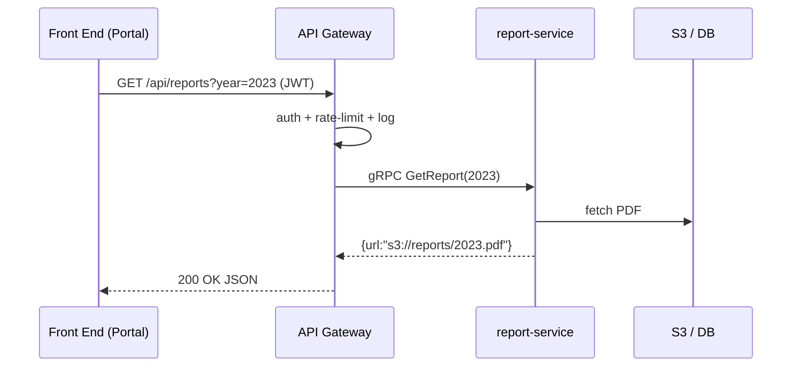

# Chapter 3: Backend API Gateway (HMS-API / HMS-MKT)


*[Jump back to the previous chapter — Intent-Driven Navigation & Guided Journeys](02_intent_driven_navigation___guided_journeys_.md)*  

---

## 1 . Why Does an API Gateway Exist?

Story time — picture Maya, a policy analyst at the **Cybersecurity and Infrastructure Security Agency (CISA)**.

1. Maya opens the Admin Portal and clicks **“Generate Annual Compliance Report.”**  
2. Her browser fires a single HTTP request to **`https://api.homegov.gov/reports`**.  
3. Behind the scenes the **API Gateway**:
   • verifies Maya’s badge (OAuth token)  
   • checks she hasn’t made 500 requests in the last minute  
   • translates `reports?year=2023&type=cyber` into a gRPC call  
   • routes the call to the *report-service* microservice  
   • records everything for the audit log  

If CISA, the Weather Service, or NEH ever change their internal micro-services, Maya’s front-end code **never changes**.  
The Gateway is the secure toll-booth that abstracts all that complexity.

---

## 2 . Key Ideas in Plain English

| Term                | Beginner-Friendly Meaning                              |
|---------------------|--------------------------------------------------------|
| API Gateway         | One front door for **all** backend traffic.            |
| Authentication      | Checking **who** is knocking (e.g., JWT, API key).     |
| Rate Limiting       | Preventing spam by capping requests (e.g., 100/min).   |
| Request Translation | Turning one format into another (REST ➜ gRPC, etc.).   |
| Routing             | Sending the call to the correct microservice.          |
| Audit Log           | Tamper-proof record of every single request/response.  |

---

## 3 . Quick Start – Consuming the Gateway from the Portal

Below is the *exact* call you would place inside the MFE you built in [Chapter 1](01_interface_layer__hms_mfe___user___admin_portals__.md).

```ts
// File: services/report-service.ts
export async function fetchCompliance(year: number) {
  const res = await fetch(`/api/reports?year=${year}`, {
    headers: {
      // token came from the login flow
      Authorization: `Bearer ${localStorage.token}`
    }
  });
  return res.json(); // { status: "ok", url: "s3://..." }
}
```

Explanation  
1. We hit only `/api/*`. The Gateway hides the real hostnames.  
2. The `Authorization` header is mandatory; the Gateway rejects missing or expired tokens.  
3. What you get back is plain JSON—easy to render in React.

---

## 4 . Quick Start – The World’s Smallest Gateway

For learning purposes we’ll mock a Gateway in 15 lines of Node.js.  
(Production uses **Kong + OpenResty**, but this tiny sample shows the flow.)

```js
// File: gateway/index.js
import express from 'express';
import jwt from 'jsonwebtoken';
const app = express();

app.use(checkAuth);
app.use(rateLimit);

app.get('/reports', (req, res) => {
  // pretend we call the microservice
  res.json({ status: 'ok', url: 's3://reports/2023.pdf' });
});

function checkAuth(req, _res, next) {
  try { jwt.verify(req.headers.authorization?.split(' ')[1], 'secret'); next();}
  catch { next({ status: 401, msg: 'Invalid token' }); }
}

function rateLimit(req, _res, next) {
  /* skip real impl – allow 100/min per user */
  next();
}

app.listen(9000);
```

Explanation  
• `checkAuth` blocks any request without a valid JWT.  
• `rateLimit` would normally use Redis; here it’s a stub.  
• All paths (`/reports`, `/policies`, `/complaints`) run through the same middle-wares.

---

## 5 . What Happens Under the Hood?



Takeaways  
• The Gateway is the **single choke-point**.  
• Microservices are never exposed to the public internet.  
• Every leg of the trip is written to the audit log.

---

## 6 . Core Features & Mini-Snippets

### 6.1 Authentication Plug-In

```lua
-- File: kong/plugins/hms-auth.lua
local jwt = require("resty.jwt")
return {
  access = function(conf)
    local token = kong.request.get_header("Authorization"):gsub("Bearer ", "")
    local verified = jwt:verify(conf.public_key, token)
    if not verified.verified then
      return kong.response.exit(401, {message="Unauthorized"})
    end
  end
}
```

Beginner notes  
• Runs **inside** Kong for every request.  
• Uses the agency’s public key to validate the signature.  
• On fail: Gateway returns 401 before anything else happens.

---

### 6.2 Rate Limiting with Redis

```lua
-- pseudo-code, 6 lines
local key = "ratelimit:"..userId
local hits = redis.incr(key)
if hits == 1 then redis.expire(key, 60) end
if hits > 100 then return 429
```

Simple idea: each user gets a bucket of 100 tokens per minute.

---

### 6.3 Path-Based Routing

```yaml
# File: kong/routes.yaml
- name: reports
  paths: ["/reports"]
  service: report-service
- name: policies
  paths: ["/policies"]
  service: policy-service
```

Even if *report-service* moves from `10.0.3.12` to `10.0.9.55`, the front-end URL **never changes**.

---

## 7 . Translating Requests

Many legacy federal systems speak SOAP. One tiny Lua filter can translate JSON ➜ SOAP on the fly.

```lua
-- pseudo-code
local body = kong.request.get_raw_body()      -- JSON
local soap = json2soap(body)                  -- convert
kong.service.request.set_raw_body(soap)
```

You shield the mobile app from ugly XML forever.

---

## 8 . Running Locally for Devs

```bash
# start the mini gateway on port 9000
$ node gateway/index.js
# open another terminal; pretend you are Maya
$ curl -H "Authorization: Bearer fake" http://localhost:9000/reports
```

Expected output:

```json
{ "status": "ok", "url": "s3://reports/2023.pdf" }
```

Now wire your Portal to `http://localhost:9000/api` and everything works offline.

---

## 9 . Common Pitfalls & Easy Fixes

| Mistake                                 | Quick Fix                                   |
|-----------------------------------------|---------------------------------------------|
| Exposing microservice ports directly    | Always use `service:` references, never IP. |
| Mixing auth logic across services       | Keep **all** auth in the Gateway plug-in.   |
| Silent rate-limit drops (HTTP 200)      | Return proper `429 Too Many Requests`.      |
| Forgetting audit logs for 5xx failures  | Log both **request & response**, even errors.|

---

## 10 . Recap & What’s Next

You built:

• A single secure entry point for every API call.  
• Plug-ins for authentication, rate-limiting, translation, and routing.  
• A local mock to experiment without docker-swarm complexity.

In the next chapter we’ll dive into **who** is allowed to do **what** once they’re inside.  
Head over to [Access Control & Authorization (RBAC/ABAC)](04_access_control___authorization__rbac_abac__.md).

---

---

Generated by [AI Codebase Knowledge Builder](https://github.com/The-Pocket/Tutorial-Codebase-Knowledge)