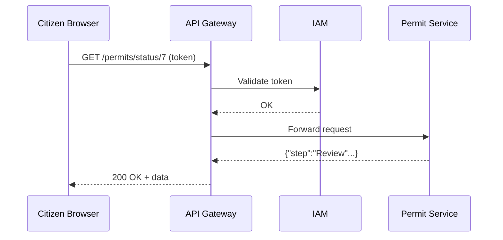

# Chapter 3: Backend API Gateway (HMS-API / HMS-SVC)

*(continuing from [Chapter&nbsp;2: Frontend Component Library & Design System](02_frontend_component_library___design_system_.md))*  

---

## 1. Why Do We Need an API Gateway?

Recall the “Permit Status Inquiry” screen we built in Chapter 2. When a citizen clicks **Check Status** their browser must:

1. Prove the request is coming from an authenticated, rate-limited user.  
2. Find the right micro-service (“Permits Service”) among dozens of internal apps—Finance, WAPA Power Rates, Defense Grants, etc.  
3. Log the request for future audits by the **Comptroller of the Currency** or the **FDIC**.  

If every micro-service had to handle those cross-cutting chores, we would drown in duplicate code and misaligned policies.  
**HMS-API / HMS-SVC** is our single, secured *toll booth* that performs those tasks once, consistently, and transparently.

---

## 2. Core Concepts (Plain English)

| Term | Everyday Analogy | What It Does |
|------|------------------|--------------|
| API Gateway | Toll booth at campus gate | Takes all external traffic, verifies badge, then points you to the right building. |
| Micro-Service | Individual agency office | Performs a narrow job: permits, power rates, licensing. |
| Route | Lane assignment | Maps `/permits/*` to the Permit Service, `/power/*` to WAPA Service. |
| Middleware | Security guard | Inspects, stamps, or blocks a request before it proceeds. |
| Observability | CCTV camera | Records every car (request) for audits & debugging. |

---

## 3. A 5-Minute “Hello Gateway” Walk-Through

We will create:

1. A **minimal Gateway** (Node + Express).  
2. Two dummy micro-services: `permitSvc`, `powerSvc`.  

### 3.1 File Layout

```
hms-backend/
├─ gateway/
│  └─ index.js
├─ services/
   ├─ permitSvc.js
   └─ powerSvc.js
```

### 3.2 Micro-Service Stubs (≤ 10 lines each)

`services/permitSvc.js`

```js
import express from 'express';
const app = express();

app.get('/status/:id', (req, res) => {
  res.json({ id: req.params.id, step: 'Review', officer: 'J. Smith' });
});

app.listen(4001);
```

`services/powerSvc.js`

```js
import express from 'express';
const app = express();

app.get('/rates', (_, res) => {
  res.json({ agency: 'WAPA', rate_cents_per_kwh: 8.4 });
});

app.listen(4002);
```

### 3.3 Minimal Gateway

`gateway/index.js`

```js
import express from 'express';
import morgan from 'morgan';          // logging middleware
import { verifyToken } from './iam.js' // fake auth helper

const app = express();
app.use(morgan('tiny'));      // 1. log
app.use(verifyToken);         // 2. auth (see Chapter 4)

// 3. routing rules
app.use('/permits',  (req, res) =>
  res.proxy(`http://localhost:4001${req.originalUrl}`));

app.use('/power',    (req, res) =>
  res.proxy(`http://localhost:4002${req.originalUrl}`));

app.listen(3000);
```

Explanation  
• `morgan` writes `GET /permits/status/123 200` to the console—a helpful audit trail.  
• `verifyToken` denies requests without a valid JWT (we’ll wire that properly in [Identity & Access Management (IAM)](04_identity___access_management__iam__.md)).  
• `res.proxy` is a tiny helper (10 lines, omitted) that forwards the request and pipes the response back.

### 3.4 Test the Flow

```bash
# Terminal 1
node services/permitSvc.js
node services/powerSvc.js

# Terminal 2
node gateway/index.js

# Terminal 3
curl -H "Authorization: Bearer demo" http://localhost:3000/permits/status/7
```

Expected output:

```json
{ "id": "7", "step": "Review", "officer": "J. Smith" }
```

A single public URL (`localhost:3000`) now fronts any number of internal services.

---

## 4. What Happens Under the Hood?



Key points:  
1. **All** external traffic enters via `G` (Gateway).  
2. `I` (IAM) handles security checks—never re-implemented by `P`.  
3. Logs are written at `G`; the Permit Service focuses strictly on permit logic.

---

## 5. Gateway Building Blocks

### 5.1 Authentication & Authorization Middleware

```js
// iam.js
export function verifyToken(req, res, next) {
  const token = req.headers.authorization?.split(' ')[1];
  if (token === 'demo') return next();      // 💡 stub only
  res.status(401).json({ error: 'Unauthorized' });
}
```

Later we’ll swap the stub for the real IAM client in [Chapter 4](04_identity___access_management__iam__.md).

### 5.2 Rate Limiting (Protecting Against Abuse)

```js
import rateLimit from 'express-rate-limit';

app.use(rateLimit({ windowMs: 60_000, max: 100 })); // 100 requests per min
```

Now a rogue script cannot overwhelm our Permit Service.

### 5.3 Service Discovery (Scaling Beyond localhost)

In production the Gateway reads a service registry (e.g., Consul) so your rule can stay generic:

```js
route('/permits', 'permit-service'); // hostname resolved at runtime
```

---

## 6. Internal Implementation Sketch

Inside HMS-API the request takes a conveyor-belt trip:

1. **Ingress Controller** – TLS termination, raw traffic filter.  
2. **Policy Engine** – checks JWT, agency quotas, PII masking rules.  
3. **Router** – decides which upstream service to call.  
4. **Telemetry Hook** – pushes metrics to [Monitoring & Metrics (HMS-OPS)](15_monitoring___metrics__hms_ops__.md).  
5. **Egress** – forwards the sanitized request.

Because each step is a plug-in, agencies may add a *“Financial Transactions must be signed”* policy without touching other code.

---

## 7. Frequently Asked Beginner Questions

**Q: Can I bypass the Gateway and call a micro-service directly?**  
A: In production, internal services sit on a private network—only the Gateway is exposed. Bypassing it would skip audits and violate federal policy.

**Q: What if two services need the same header transformation?**  
A: Implement once as Gateway middleware; every route inherits it for free.

**Q: Does this replace the IAM layer?**  
A: No. IAM *issues* and *validates* tokens; the Gateway merely *calls* IAM to do so (much like TSA checks your passport but the State Department issued it).

---

## 8. Recap

You learned that the **Backend API Gateway**:

• Acts as the single, secured entry point into HMS.  
• Authenticates, rate-limits, routes, and logs every request.  
• Lets micro-services (Permits, WAPA Rates, Defense Grants) focus on domain logic.

In the next chapter we’ll dive deeper into the **Identity & Access Management (IAM)** layer that signs those JWTs and manages user roles.

👉 Continue to [Identity & Access Management (IAM)](04_identity___access_management__iam__.md)

---

Generated by [AI Codebase Knowledge Builder](https://github.com/The-Pocket/Tutorial-Codebase-Knowledge)