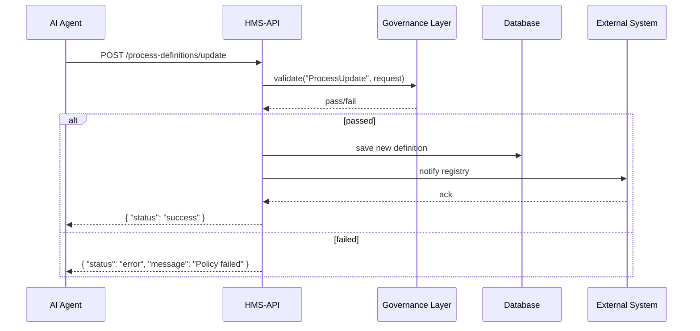

# Chapter 3: Backend API (HMS-API / HMS-SVC)

Welcome back! In [Chapter 2: Interface Layer](02_interface_layer_.md) we built the screens and forms that citizens and staff use. Now, let’s dive **under the hood**—into the **Backend API** (also called **HMS-API** or **HMS-SVC**). Think of it as the warehouse and shipping dock for all your policy and process data.

---

## 3.1 Why We Need a Backend API

Imagine the Environmental Protection Agency has an AI tool that suggests new pollution-control policies. Once the tool makes its suggestion, we need:

1. **A place to send that suggestion** (an API endpoint).  
2. **Business rules and compliance checks** (via the Governance Layer).  
3. **A database** to store the new policy.  
4. **A way to notify external systems** (e.g., a public-records registry).

The **Backend API** ties all these steps together behind a simple set of HTTP endpoints. Front-end apps or AI agents call these endpoints to **create**, **read**, **update**, or **delete** (CRUD) policies and process definitions.  

---

## 3.2 Key Concepts

1. **Endpoints**  
   - `/policies` for policy CRUD  
   - `/process-definitions` for process flow definitions  
2. **Request & Response**  
   - Send JSON in, get JSON out  
3. **Service Layer**  
   - Contains business logic (governance checks, DB calls)  
4. **Governance Integration**  
   - Every change runs through the [Governance Layer](01_governance_layer_.md)  
5. **External System Hooks**  
   - After save, send updates to outside registries or engines  

---

## 3.3 Using the Backend API

Below is a minimal Python example showing how a client might talk to HMS-API:

```python
# hms_api_client.py
from hms_mcp import ApiClient

api = ApiClient(base_url="https://api.fed-agency.gov")

# 1. Create a new policy
policy_data = {
    "name": "LimitCO2Emissions",
    "description": "Require factories to report CO2 levels monthly"
}
resp = api.create_policy(policy_data)
print("Created policy ID:", resp["id"])

# 2. List all policies
all_policies = api.get_policies()
print("Total policies:", len(all_policies))

# 3. Update a policy description
api.update_policy(resp["id"], {"description": "Quarterly reporting"})
print("Policy updated!")
```

Explanation:  
- `create_policy(...)` sends a `POST /policies` request.  
- `get_policies()` calls `GET /policies`.  
- `update_policy(id, data)` sends a `PUT /policies/{id}`.

---

## 3.4 What Happens Under the Hood

Here’s the flow when, say, an AI Agent pushes a process-definition update:



1. **AI Agent** calls the Backend API.  
2. **HMS-API** asks the **Governance Layer** to check rules.  
3. If it **passes**, HMS-API saves to **DB** and notifies **External System**.  
4. Finally, it returns success or error to the caller.

---

## 3.5 Internal Implementation

Let’s peek at the minimal files that power HMS-API.

### File: app.py

```python
from fastapi import FastAPI
from routes.policy_router import router as policy_router

app = FastAPI()
app.include_router(policy_router, prefix="/policies")
```

- We create a FastAPI app.  
- We “mount” our policy routes under `/policies`.

### File: routes/policy_router.py

```python
from fastapi import APIRouter, HTTPException
from services.policy_service import PolicyService

router = APIRouter()
service = PolicyService()

@router.post("/")
def create_policy(payload: dict):
    try:
        return service.create_policy(payload)
    except ValueError as e:
        raise HTTPException(status_code=400, detail=str(e))
```

- The route takes JSON, calls `PolicyService`, and returns the result.

### File: services/policy_service.py

```python
from governance_layer import GovernanceLayer
from db import Database

class PolicyService:
    def __init__(self):
        self.gov = GovernanceLayer()
        self.db  = Database()

    def create_policy(self, data):
        # 1. Compliance check
        ok, msg = self.gov.validate("NewPolicyCheck", {"data": data})
        if not ok:
            raise ValueError(msg)
        # 2. Persist
        policy_id = self.db.insert("policies", data)
        return {"id": policy_id, **data}
```

- We validate with the [Governance Layer](01_governance_layer_.md).  
- If it passes, we store the policy in the database.

---

## 3.6 Summary & Next Steps

In this chapter, you learned how **HMS-API**:

- Exposes simple HTTP endpoints for CRUD operations.  
- Integrates with the [Governance Layer](01_governance_layer_.md) to enforce rules.  
- Stores data in a database and notifies external systems.

Next up: Let’s see how **Specialized AI Agents** leverage these APIs to propose and refine policies automatically in [Chapter 4: Specialized AI Agents (HMS-A2A)](04_specialized_ai_agents__hms_a2a__.md).

---

Generated by [AI Codebase Knowledge Builder](https://github.com/The-Pocket/Tutorial-Codebase-Knowledge)