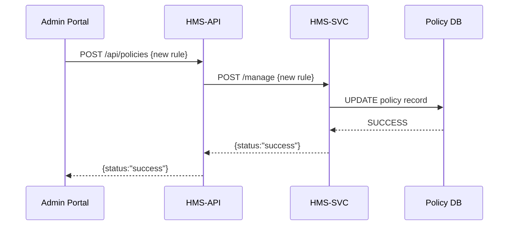

# Chapter 3: Backend API (HMS-API)

In [Chapter 2: Microservices Infrastructure](02_microservices_infrastructure_.md), we saw how our system splits into small “departments” (microservices) like HMS-SVC, HMS-ACH, and HMS-A2A. Now we’ll learn about the **HMS-API**, the central gateway that ties all these services together—think of it as the post office of HMS-GOV.

---

## Why Do We Need HMS-API?

Imagine a citizen filling out a permit form on the portal or an admin updating policy rules. We need one place to:

- Receive requests
- Check authorizations
- Route each request to the correct service
- Collect responses and send them back

That’s exactly what HMS-API does: it receives, sorts, and dispatches ALL policy-related requests.

---

## Central Use Case: Updating a Policy

**Scenario:** A state clerk uses the Admin Portal to update a fishing regulation.

1. Clerk clicks “Save Policy” in the [Admin/Gov Portal (HMS-GOV)](08_admin_gov_portal__hms_gov__.md).  
2. Portal sends `POST /api/policies` to HMS-API with the new rule.  
3. HMS-API verifies the clerk’s token.  
4. HMS-API forwards the data to the HMS-SVC service.  
5. HMS-SVC updates the database and replies “OK.”  
6. HMS-API returns success back to the portal.

---

## Key Concepts

1. **Single Entry Point**  
   Clients only talk to HMS-API, never directly to individual services.  
2. **Routing & Load-Balancing**  
   HMS-API knows the URL of each microservice and forwards requests accordingly.  
3. **Middleware**  
   – **Authentication**: Check tokens before routing.  
   – **Logging**: Record who did what and when.  
4. **JSON Contracts**  
   All requests and responses use JSON, so inputs/outputs are predictable.  
5. **Error Handling**  
   Convert low-level service errors into friendly HTTP responses.

---

## How to Use HMS-API

### 1. Send a Request

Example: Update a policy rule.

Request  
```
POST http://localhost:3000/api/policies
Content-Type: application/json
Authorization: Bearer clerk-token
Body:
{
  "policyId": "fish-001",
  "rule": "max_weight = 30 lbs"
}
```

Possible Response  
```json
{ "status": "success", "policyId": "fish-001" }
```

---

### 2. HMS-API Routes Your Request

#### routes/policies.js
```javascript
import express from 'express'
import fetch from 'node-fetch'
const router = express.Router()

// 1. Receive the JSON body
router.post('/', async (req, res) => {
  const policyData = req.body

  // 2. Forward to the policy service (HMS-SVC)
  const svcResp = await fetch('http://hms-svc/manage', {
    method: 'POST',
    headers: { 'Content-Type': 'application/json' },
    body: JSON.stringify(policyData)
  })

  // 3. Read the service response
  const result = await svcResp.json()
  if (!svcResp.ok) {
    // 4. If error, forward the status code and message
    return res.status(svcResp.status).json(result)
  }

  // 5. On success, send back to client
  res.json(result)
})

export default router
```

Explanation:  
1. We read the clerk’s JSON request.  
2. Use `fetch` to call HMS-SVC’s `/manage` endpoint.  
3. Parse the JSON reply.  
4. If HMS-SVC returned an error (like 400), we pass it along.  
5. Otherwise, we return success.

---

### 3. HMS-API Setup & Middleware

#### index.js
```javascript
import express from 'express'
import policiesRouter from './routes/policies.js'
import authMiddleware from './middleware/auth.js'

const app = express()
app.use(express.json())          // Parse JSON bodies
app.use(authMiddleware)          // Check auth token
app.use('/api/policies', policiesRouter)  // Mount our route

app.listen(3000, () => console.log('HMS-API listening on 3000'))
```

#### middleware/auth.js
```javascript
export default function authMiddleware(req, res, next) {
  const auth = req.headers.authorization
  if (auth !== 'Bearer clerk-token') {
    return res.status(401).json({ error: 'Unauthorized' })
  }
  next()  // Token is valid 👉 proceed
}
```

Explanation:  
- `express.json()` lets us read `req.body`.  
- `authMiddleware` enforces a simple token check.  
- We mount our policies router under `/api/policies`.

---

## What Happens Under the Hood?



Step-by-step:  
1. **Portal** sends a policy update to **HMS-API**.  
2. **HMS-API** authenticates, then forwards to **HMS-SVC**.  
3. **HMS-SVC** writes to the database.  
4. **HMS-SVC** replies with success.  
5. **HMS-API** forwards that success back to the Portal.

---

## Conclusion

You’ve learned how **HMS-API** acts as the single gateway for all policy and workflow requests in HMS-GOV. It authenticates callers, routes to the correct microservice, handles errors, and returns JSON responses. With HMS-API in place, UIs and external systems never need to know the internal microservice details—they just send requests to one place.

Next up: syncing data with outside systems.  
[Chapter 4: External System Sync](04_external_system_sync_.md)

---

Generated by [AI Codebase Knowledge Builder](https://github.com/The-Pocket/Tutorial-Codebase-Knowledge)