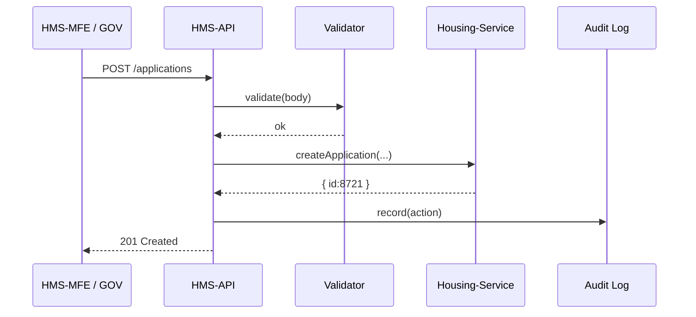

# Chapter 3: Backend API Layer (HMS-API)

[⬅︎ Back to Chapter 2: Intent-Driven Navigation Engine](02_intent_driven_navigation_engine_.md)

---

## 1. Why do we need an HMS-API?

Imagine a veteran named **Luis** who lives in Arizona.  
He opens **HMS-MFE** (citizen shell) and clicks  

> “Apply for VA housing grant”

Across town, Contract Specialist **Ms. Rivera** logs into **HMS-GOV** and presses  

> “Approve application #8721”

Both actions must:

1. Change official records  
2. Follow federal rules (no shortcuts!)  
3. Leave a perfect paper-trail for auditors

That “paper-trail desk” is **HMS-API**.  
It is the single, secure counter where every digital form—citizen, staff, or AI—gets stamped, validated, and routed to the correct back-office microservice.

---

## 2. Mental model: a clerk behind a counter

```
 Citizen / Officer / Bot
          │  (asks)
          ▼
  ┌────────────────────┐
  │  HMS-API “Clerk”   │
  │  • Checks ID       │
  │  • Verifies form   │
  │  • Time-stamps     │
  │  • Hands to dept.  │
  └────────────────────┘
          │
          ▼
   Specialist Services
```

Keep this picture in mind. Every line of code you’ll write for HMS-API answers the question:  
“*What would a careful government clerk do next?*”

---

## 3. Key concepts (plain English)

| Term | Quick definition | Analogy |
|------|------------------|---------|
| Endpoint | A URL you can call (`POST /applications`) | The window number on a service desk |
| Request Validator | Checks the request body & caller’s role | A clerk verifying you filled every box |
| Router | Sends the request to the right microservice | Clerk walking papers to the Housing Dept. |
| Program | The government benefit or service (e.g., Medicaid) | A folder drawer label |
| Protocol | A specific action in a Program (e.g., Renewal, Approval) | A form inside the drawer |
| Audit Log | Immutable record of who did what, when | Time-stamped receipt |

---

## 4. A 60-second tour with real URLs

Citizen side (HMS-MFE):

```
POST /api/programs/va-housing/applications
Body: { applicantId: "luis", address: "...", income: 45000 }
```

Staff side (HMS-GOV):

```
PATCH /api/applications/8721/approve
Body: { officerId: "rivera", note: "All docs complete." }
```

Both hit the same HMS-API, but the API will:

1. **Verify** caller identity (Chapter 4 will show how)  
2. **Validate** body shape (missing `income`? → 400 Bad Request)  
3. **Enforce** policy (officer must have `grant.approver` role)  
4. **Forward** to the correct microservice (`housing-grant-svc`)  
5. **Log** the action for auditors

---

## 5. Trying it out locally (mock mode)

```bash
# 1. Install and start the API
npm ci
npm run dev:api    # starts on http://localhost:5000

# 2. Submit a fake application
curl -X POST \
  http://localhost:5000/api/programs/va-housing/applications \
  -H "Content-Type: application/json" \
  -d '{"applicantId":"luis","address":"Mesa, AZ","income":45000}'
```

Expected output:

```json
{
  "id": "app_8721",
  "status": "SUBMITTED",
  "receivedAt": "2025-03-14T21:17:00Z"
}
```

If you omit `income`, you will get:

```json
{ "error": "Validation failed: income is required" }
```

---

## 6. How the “clerk” works inside



Only five actors—simple enough to trace with a debugger.

---

## 7. Peek at the code (Node + Express flavor)

### 7.1 Entry point: `src/index.ts`

```ts
import express from 'express';
import { createAppRouter } from './routers/applications';
import { logAction } from './lib/audit';

const app = express();
app.use(express.json());
app.use('/api', createAppRouter({ logAction }));

app.listen(5000, () => console.log('HMS-API running'));
```

*What it shows:* spins up Express, plugs in the applications router, injects the audit helper.

---

### 7.2 Applications router: `src/routers/applications.ts`

```ts
import { Router } from 'express';
import { validateBody } from '../lib/validate';
import { housingSvc } from '../services/housing';

export function createAppRouter({ logAction }) {
  const r = Router();

  // 1. Citizen submits
  r.post('/programs/va-housing/applications', 
    validateBody(['applicantId','address','income']),
    async (req, res) => {
      const result = await housingSvc.create(req.body);
      await logAction(req, 'application.submitted', result.id);
      res.status(201).json(result);
    });

  // 2. Officer approves
  r.patch('/applications/:id/approve', 
    validateBody(['officerId','note']),
    async (req, res) => {
      const result = await housingSvc.approve(req.params.id, req.body);
      await logAction(req, 'application.approved', result.id);
      res.json(result);
    });
  
  return r;
}
```

Line-by-line:

1. `validateBody` guarantees required fields.  
2. Calls the **housing microservice** (pretend gRPC / REST—hidden here).  
3. `logAction` writes a JSON blob to the audit table.  

All under 20 lines per endpoint—easy to reason about.

---

### 7.3 Re-usable helpers

• `lib/validate.ts` – tiny schema checker (10 lines)  
• `lib/audit.ts` – appends to a `logs` file (in real life → database / S3)  
• `services/housing.ts` – mocks the housing microservice

You can explore them, but the pattern above repeats for every Program & Protocol.

---

## 8. How HMS-API talks to other chapters

1. **Gets caller identity** from [Access & Identity Control (Zero-Trust IAM)](04_access___identity_control__zero_trust_iam__.md) before any routing.  
2. **Sources Program & Protocol definitions** from [Core Program Model](05_core_program_model_.md) and [Protocol Blueprint](06_protocol_blueprint_.md).  
3. **Delegates heavy work** to specialists inside [Microservices Fabric (HMS-SVC)](07_microservices_fabric__hms_svc__.md).  
4. **Surfaces telemetry** to [Metrics & Monitoring Feedback Loop](12_metrics___monitoring_feedback_loop_.md).

Think of HMS-API as the glue in the middle.

---

## 9. Common pitfalls & tips

| Pitfall | How to avoid |
|---------|--------------|
| “Fat” endpoints doing business logic | Push heavy rules into microservices; API stays thin |
| Missing audit entries | Wrap every mutating call with `logAction()` helper |
| Duplicate validation code | Centralize in `lib/validate.ts` and reuse |
| Accidental public data leak | Enforce role checks in IAM middleware (next chapter) |

---

## 10. Recap & what’s next

In this chapter you:

✓ Met HMS-API, the system’s **official clerk**  
✓ Submitted a mock housing grant and saw validation & logging  
✓ Learned the step-by-step request journey  
✓ Read compact Express code that mirrors real production patterns

Next we will zoom into **how HMS knows *who* is calling** and why it trusts (or denies) them. Welcome to zero-trust security in [Chapter 4: Access & Identity Control (Zero-Trust IAM)](04_access___identity_control__zero_trust_iam__.md).

---

Generated by [AI Codebase Knowledge Builder](https://github.com/The-Pocket/Tutorial-Codebase-Knowledge)