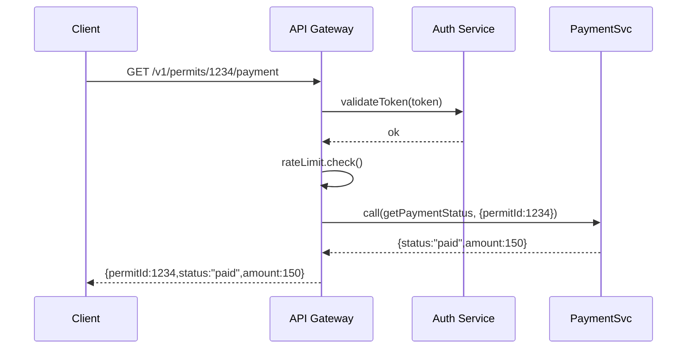

# Chapter 3: Backend API Layer

Welcome back! In [Chapter 2: Backend Microservices Layer (HMS-SVC)](02_backend_microservices_layer__hms_svc__.md) we created small, independent services like **PaymentSvc** and **PermitSvc**. Now we’ll build the **Backend API Layer**—your “central desk” for all data and functionality across microservices.

---

## 1. Why an API Layer?

Imagine you walk into City Hall to:

- File a new building permit  
- Check payment status for a traffic fine  
- Submit feedback on a public hearing  

Instead of wandering around every office, you go to one counter. The **Backend API Layer** is that unified desk:

- It exposes a simple, consistent HTTP interface  
- Enforces request/response contracts (schemas)  
- Checks authentication & permissions  
- Applies rate limits (so one user can’t overload the system)  
- Supports multiple versions (v1, v2…) without breaking clients  

### Concrete Use Case: Querying Permit Payment

A citizen wants to see if their building permit fee (ID 1234) is paid:

1. Browser calls  
   GET `/api/v1/permits/1234/payment`  
2. API layer  
   - Validates the URL & parameters  
   - Verifies the user’s token  
   - Checks rate limit  
   - Forwards request to **PaymentSvc**  
3. Response  
   ```json
   { "permitId": 1234, "status": "paid", "amount": 150.00 }
   ```

---

## 2. Key Concepts

1. **Endpoints**  
   Define URL paths and HTTP methods (GET, POST, etc.).  
2. **Contracts & Validation**  
   Use JSON schemas to enforce request/response shapes.  
3. **Authentication & Authorization**  
   Verify tokens (JWT, OAuth) and check user roles.  
4. **Rate Limiting**  
   Prevent abuse by limiting requests per minute.  
5. **Versioning**  
   Support `/v1/…`, `/v2/…` so older clients keep working.

---

## 3. Defining an Endpoint

Below is a minimal Node.js example using Express-like syntax:

```javascript
// file: api-gateway/routes.js
const gateway = require('hms-sys-api').init({ name: 'ApiGateway', version: 'v1' })

// 1) Define GET /permits/:id/payment
gateway.get('/permits/:id/payment', {
  auth: true,                // require login
  schema: {                  // simple response schema
    type: 'object',
    properties: {
      permitId: { type: 'integer' },
      status: { type: 'string' },
      amount: { type: 'number' }
    },
    required: ['permitId','status','amount']
  },
  rateLimit: { points: 10, per: 60 }  // 10 calls/minute
}, async (req, res) => {
  // 2) Forward to PaymentSvc
  const result = await gateway.callService('PaymentSvc', {
    action: 'getPaymentStatus',
    permitId: parseInt(req.params.id, 10)
  })
  res.send(result)
})
```

Explanation:

1. `init` wires in auth, rate limiter, versioning  
2. `gateway.get` sets up path, rules, and handler  
3. Inside handler we call the microservice by name  

---

## 4. What Happens Under the Hood?

Step-by-step when a client calls  
GET `/api/v1/permits/1234/payment`:

1. **Routing**: Gateway matches path `/v1/permits/:id/payment`.  
2. **Validation**: Checks URL parameter `id` and response schema.  
3. **Auth**: Sends token to Auth Service ([Chapter 1: Core Infrastructure](01_core_infrastructure__hms_sys__.md)).  
4. **Rate Limit**: Decrements user’s “points.”  
5. **Forward**: Calls **PaymentSvc** via HMS-SYS messaging or HTTP.  
6. **Collect & Return**: Formats JSON and returns to client.  
7. **Logging**: Records the request for audit.



---

## 5. Peek at Internal Implementation

Here’s a simplified slice of the gateway core:

```javascript
// file: hms-sys-api/core.js
exports.init = ({ name, version }) => {
  // wire up HTTP server, Auth client, rate limiter, service client
  const router = require('express')()
  // version prefix
  const base = `/api/${version}`

  return {
    get: (path, opts, handler) => {
      router.get(base + path,
        authMiddleware(opts.auth),
        rateLimiter(opts.rateLimit),
        validateSchema(opts.schema),
        async (req, res) => {
          // proxy to microservice
          const data = await serviceClient.call(req, opts, handler)
          res.json(data)
        }
      )
    },
    callService: serviceClient.call
  }
}
```

- **authMiddleware** checks JWT tokens  
- **rateLimiter** enforces points per window  
- **validateSchema** uses a JSON schema library  
- **serviceClient.call** hides messaging or HTTP  

---

## 6. Summary

In this chapter we learned:

- The API layer is the “city‐hall counter” for all data and actions.  
- It defines endpoints, enforces contracts, auth, rate limits, and versions.  
- How to declare a simple GET endpoint that talks to **PaymentSvc**.  
- The internal flow: routing → auth → rate limit → forwarding → response.  

Next up is deep diving into the **Financial Services Module (HMS-ACH)** where we’ll see how to handle real-world payments.  
[Chapter 4: Financial Services Module (HMS-ACH)](04_financial_services_module__hms_ach__.md)

---

Generated by [AI Codebase Knowledge Builder](https://github.com/The-Pocket/Tutorial-Codebase-Knowledge)