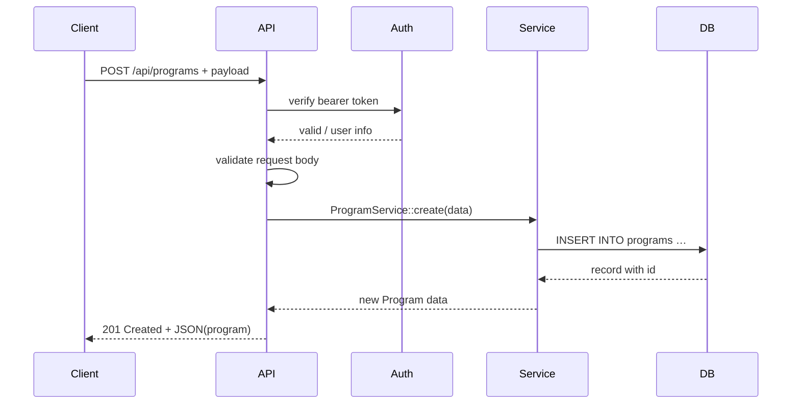

# Chapter 3: Backend API Service

Welcome back! In [Chapter 2: Protocol](02_protocol_.md), you learned how to define workflows inside a Program. Now let’s see **how** clients actually talk to HMS behind the scenes—through the **Backend API Service**.

---

## Why a Backend API Service?

Think of a government service counter at City Hall. Citizens bring forms, IDs, and fees. The clerk checks their identity, reviews the form, routes it to the right office, enforces rules, and hands back a receipt.

The **Backend API Service** is that virtual counter for HMS:

- It **authenticates** callers (like checking IDs).  
- It **validates** incoming data (like reviewing forms).  
- It **routes** calls to the correct business logic (like sending your form to the right department).  
- It **enforces governance** (policy checks, audit logs) before returning responses.

This central gateway makes sure every request is safe, correct, and compliant.

---

## Key Concepts

1. **Authentication & Authorization**  
   Verify who’s calling (agency, admin, citizen) and what they’re allowed to do.

2. **Validation**  
   Ensure request data is well-formed (required fields, correct types).

3. **Routing & Controllers**  
   Direct each request to the proper controller/action (e.g., `ProgramController@store`).

4. **Governance Policies**  
   Apply rules like rate-limits, audit logging, or custom policy checks.

5. **Standardized Responses**  
   Return clear HTTP codes and JSON bodies to clients.

---

## Using the Backend API Service

Let’s walk through a common scenario: **submitting a new Program** to HMS via the API.

### Example: Submitting a Program

1. Obtain a Bearer token (login flow not shown).  
2. Send a POST request:

```bash
curl -X POST https://hms-api.gov/api/programs \
  -H "Authorization: Bearer YOUR_TOKEN" \
  -H "Content-Type: application/json" \
  -d '{
    "name": "Electric Bus Grant",
    "description": "Funding for electric buses in rural areas"
  }'
```

Explanation:
- URL: `/api/programs`  
- Header `Authorization`: your API token  
- JSON body: your Program fields  

3. On success, you’ll get:

HTTP/1.1 201 Created  
```json
{
  "id": 42,
  "name": "Electric Bus Grant",
  "description": "Funding for electric buses in rural areas",
  "created_at": "2024-06-01T12:00:00Z"
}
```

---

## Under the Hood: Request Flow

Here’s what happens step-by-step when that request arrives:



1. **API** receives the HTTP request.  
2. **Auth** checks the token and user roles.  
3. **API** validates fields (name, description).  
4. **Service** runs business rules and writes to **DB**.  
5. **API** returns a standardized JSON response.

---

## Inside the Code

Let’s peek at the key pieces that power this flow.

### 1. Authentication Middleware

File: `app/Http/Middleware/Authenticate.php`

```php
public function handle($request, Closure $next)
{
    $token = $request->header('Authorization');
    if (! AuthService::validateToken($token)) {
        return response()->json(['error'=>'Unauthorized'], 401);
    }
    return $next($request);
}
```

This runs on every API route, checking your token before anything else.

### 2. Validation Request

File: `app/Http/Requests/StoreProgramRequest.php`

```php
public function rules()
{
    return [
        'name'        => 'required|string',
        'description' => 'required|string',
    ];
}
```

The framework automatically runs these rules and returns a 422 error if data is missing or wrong.

### 3. Controller & Service

File: `app/Http/Controllers/ProgramController.php`

```php
public function store(StoreProgramRequest $request)
{
    $data = $request->validated();
    $program = ProgramService::create($data);
    return response()->json($program, 201);
}
```

File: `app/Services/ProgramService.php`

```php
class ProgramService {
    public static function create(array $data)
    {
        // e.g., enforce policy checks before saving
        return Program::create($data);
    }
}
```

- The **Controller** glues HTTP → service.  
- The **Service** houses business logic and governance enforcement.  

---

## Conclusion

In this chapter, you learned how the **Backend API Service** acts as the central gateway for all HMS interactions:

- Checked identity and permissions  
- Validated incoming data  
- Routed calls to controllers/services  
- Enforced governance policies  
- Returned consistent responses  

Next up, we’ll look in detail at **how each individual endpoint** is defined, documented, and secured in [Chapter 4: API Endpoint](04_api_endpoint_.md).

---

Generated by [AI Codebase Knowledge Builder](https://github.com/The-Pocket/Tutorial-Codebase-Knowledge)