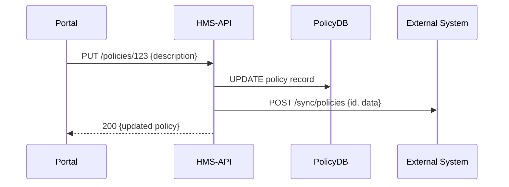

# Chapter 3: Backend API Services (HMS-API / HMS-MKT)

Welcome back! In [Chapter 2: Microservices Architecture](02_microservices_architecture_.md), we learned how HMS-AGX is split into small, independent services. Now it’s time to see **how** those services expose programmable endpoints for managing data, policies, and processes. These are our **Backend API Services**: **HMS-API** (core policy/data APIs) and **HMS-MKT** (marketplace-style data flows).

---

## 1. Motivation & Use Case

Imagine a federal agency’s policy team needs to:

- **Create** a new benefit policy  
- **Read** existing policy details  
- **Update** rules when laws change  
- **Delete** obsolete policies  
- **Sync** every change to an external grants system in real time  

Without a central API service, each admin portal or AI agent would duplicate database logic and sync code—increasing bugs and maintenance. Instead, HMS-API acts like our “warehouse” (storing policies) and “delivery truck” (shipping updates to external systems), so every client speaks the same language.

---

## 2. Key Concepts

1. **RESTful Endpoints**  
   Clear URLs like `/api/policies/{id}` that map to operations.

2. **CRUD Operations**  
   HTTP verbs:  
   - GET → Read  
   - POST → Create  
   - PUT → Update  
   - DELETE → Delete  

3. **Data Store**  
   A dedicated **PolicyDB** (or MarketDB for HMS-MKT) behind each service.

4. **External Synchronization**  
   After every change, the service pushes updates to outside systems.

5. **Versioning & Audit**  
   Each record change can carry a version number or timestamp for traceability.

---

## 3. Calling the API from a Client

Here’s how an admin portal might **update** a policy’s description:

```python
import requests

token = request.headers["Authorization"]
url   = "https://api.gov/policies/123"

# 1. Read the current policy
resp = requests.get(url, headers={"Authorization": token})
print("Before:", resp.json())

# 2. Update the description
update = {"description": "Eligible for benefit through Dec 2025"}
resp   = requests.put(url, json=update, headers={"Authorization": token})

print("After:", resp.json())
```

Explanation:
- We GET `/policies/123` to fetch details.
- We PUT updated JSON back to the same URL.
- The service handles storing and syncing.

---

## 4. Under the Hood: Sequence Diagram

What happens when the portal calls `PUT /policies/123`?



1. **Portal** sends an authenticated PUT.  
2. **HMS-API** updates its **PolicyDB**.  
3. **HMS-API** forwards the change to the **External System**.  
4. Finally, it returns the updated policy to the caller.

---

## 5. Inside HMS-API: Code Sketch

We’ll break the code into small files so it’s easy to follow.

### a) Main Service File  
File: `hms_api/app.py`

```python
from flask import Flask, request, jsonify
from hms_sys.identity import verify_token
from hms_api.db import get_policy, update_policy
from hms_api.sync import sync_external

app = Flask(__name__)

@app.route("/api/policies/<id>", methods=["GET", "PUT", "DELETE"])
def policies(id):
    user = verify_token(request.headers["Authorization"])
    # Read
    if request.method == "GET":
        policy = get_policy(id)
        return jsonify(policy), 200

    # Update
    if request.method == "PUT":
        data = request.get_json()
        updated = update_policy(id, data)
        sync_external(id, updated)
        return jsonify(updated), 200

    # Delete
    if request.method == "DELETE":
        update = {"deleted": True}
        delete_policy(id)
        sync_external(id, update)
        return "", 204
```

Each branch is under 10 lines—easy to scan and understand!

### b) Database Helpers  
File: `hms_api/db.py`

```python
# Simplified in-memory store
_store = {}

def get_policy(id):
    return _store.get(id, {"id": id, "description": ""})

def update_policy(id, data):
    record = {"id": id, **data, "version": "v2"}
    _store[id] = record
    return record

def delete_policy(id):
    _store.pop(id, None)
```

### c) External Sync Logic  
File: `hms_api/sync.py`

```python
import requests

def sync_external(id, data):
    # Post every change to an outside system
    requests.post(
        "https://external.gov/api/policies/sync",
        json={"id": id, "data": data}
    )
```

These small modules show how **HMS-API** stores, updates, and syncs policy data. **HMS-MKT** follows the same pattern, just targeting marketplace tables.

---

## 6. Summary

In this chapter you learned how **HMS-API** and **HMS-MKT**:

- Expose RESTful endpoints for **CRUD** operations  
- Store data in dedicated databases  
- Automatically **sync** changes to external systems  
- Keep each code module small and focused  

With these backend services in place, any admin portal or AI agent can manage policies or marketplace items in a consistent, secure way.

Next up: building the user-facing interfaces in  
[Chapter 4: Frontend Interface Layer (HMS-MFE / HMS-GOV)](04_frontend_interface_layer__hms_mfe___hms_gov__.md)  
See you there!

---

Generated by [AI Codebase Knowledge Builder](https://github.com/The-Pocket/Tutorial-Codebase-Knowledge)