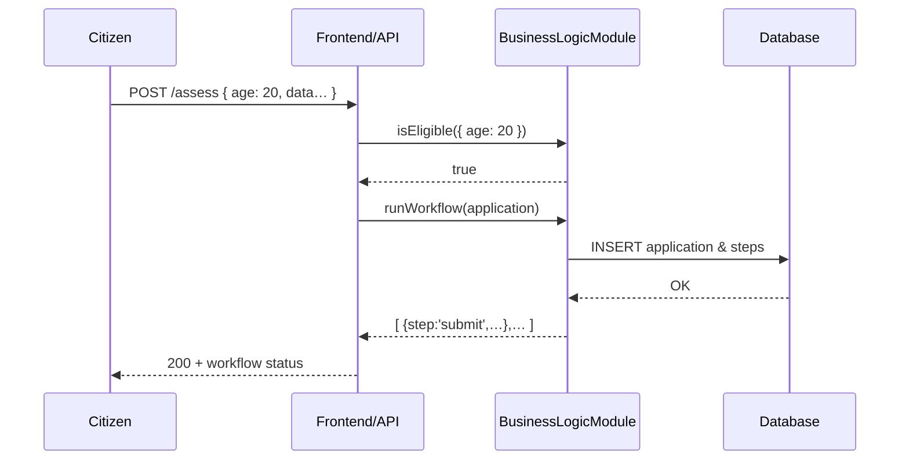

# Chapter 3: Business Logic Modules

In [Chapter 2: Program / Protocol Models](02_program___protocol_models_.md) we saw how we define *blueprints* for each service. Now, let’s learn how HMS-AGX actually *runs* those blueprints by using **Business Logic Modules**, the “government departments” of our code.

---

## 1. Motivation: Why Business Logic Modules?

Imagine a citizen applying for a small-business grant:

1. They fill out an online form.  
2. We must check **eligibility** (e.g. business age, revenue).  
3. If eligible, we run a **workflow**: submit for review → schedule site visit → approve.

We want to keep these checks and steps in one place, so **every** frontend (web portal, mobile app, partner API) behaves the same. That’s exactly what a **Business Logic Module** does: it’s a self-contained folder under `Modules/` that enforces rules and workflows for a single service.

---

## 2. Key Concepts

- **Modules/**  
  A top-level folder where each subfolder is one “department” (e.g. `Assessments`, `Inspections`, `Scheduling`).

- **Public API**  
  Each module exposes a small set of methods (e.g. `isEligible()`, `runWorkflow()`) that frontends call.

- **Encapsulation**  
  All complex rules, validations, database calls, and step-by-step logic live *inside* the module. Frontends never duplicate these rules.

- **Consistency**  
  By centralizing logic, citizen experiences and audit trails stay uniform no matter which UI they use.

---

## 3. Using a Module: Example with Assessments

Let’s build a simple `Assessments` module that:

1. Checks if the applicant is at least 18.  
2. Runs a three-step assessment workflow.

### 3.1 Eligibility Check

```js
// Modules/Assessments/eligibility.js
function isEligible(applicant) {
  // Only adults can apply
  return applicant.age >= 18;
}

module.exports = isEligible;
```
This small function returns `true` or `false`.

### 3.2 Workflow Steps

```js
// Modules/Assessments/process.js
const STEPS = ['submit', 'review', 'approve'];

function runWorkflow(application) {
  // In a real app you’d record each step in the DB
  return STEPS.map(step => ({ step, status: 'completed' }));
}

module.exports = runWorkflow;
```
Here we simulate a three-step workflow and return statuses.

### 3.3 Module Entry Point

```js
// Modules/Assessments/index.js
const isEligible = require('./eligibility');
const runWorkflow = require('./process');

module.exports = { isEligible, runWorkflow };
```
Frontends only import this `index.js` and never look deeper.

### 3.4 Calling the Module in Your Service

```js
// service.js
const express = require('express');
const { isEligible, runWorkflow } = require('./Modules/Assessments');
const app = express();
app.use(express.json());

app.post('/assess', (req, res) => {
  if (!isEligible(req.body)) {
    return res.status(400).send('Applicant is not eligible');
  }
  const result = runWorkflow(req.body);
  res.json({ workflow: result });
});

app.listen(3000, () => console.log('API listening'));
```
Now, whether it’s a React app, mobile client, or partner integration, everyone uses the same eligibility rules and workflow.

---

## 4. Under the Hood: What Happens When You Call a Module?

Here’s a simple sequence of events when a citizen submits an assessment:



1. **Frontend/API** receives the request.  
2. It calls the **module’s** `isEligible`.  
3. If eligible, it calls `runWorkflow`.  
4. The module writes to the **database** and returns step statuses.  
5. The citizen sees a consistent result.

---

## 5. Inside a Real Module

A more realistic module might:

- Validate complex fields (dates, IDs).  
- Call other modules (e.g. `Modules/Scheduling`).  
- Emit events for audit logs.  
- Use database models defined in [Chapter 2: Program / Protocol Models](02_program___protocol_models_.md).

For instance:

```js
// Modules/Assessments/index.js
const { Program, Protocol } = require('../app/Models/Core');
const isEligible = require('./eligibility');
const runWorkflow = require('./process');

async function submitApplication(data) {
  if (!isEligible(data)) throw new Error('Not eligible');

  // Load blueprint from Program model
  const blueprint = await Program.findByName('Assessment');
  // Enforce any dynamic protocol steps
  const steps = blueprint.getProtocolSteps();

  return runWorkflow(data, steps);
}

module.exports = { submitApplication };
```

This code ties together:

1. **Eligibility** (our own rule file).  
2. **Blueprint** (Program/Protocol from Chapter 2).  
3. **Workflow engine** (process.js).

---

## 6. Conclusion

You’ve learned how **Business Logic Modules** in `Modules/` act like government departments, centralizing all rules and workflows for a service. This ensures every citizen or staff interface uses the *same* logic, improving consistency and governance.  

Next, we’ll explore how to oversee all these modules with policies and guardrails in the [AI Governance Framework](04_ai_governance_framework_.md).

---

Generated by [AI Codebase Knowledge Builder](https://github.com/The-Pocket/Tutorial-Codebase-Knowledge)