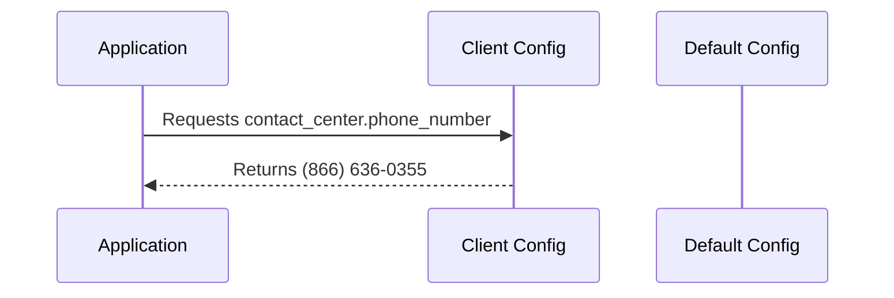

# Chapter 3: Client Configuration (`client_config`)

In the previous chapter, [Authentication (Devise)](02_authentication__devise_.md), we learned how to secure our application.  Now, let's imagine our application needs to be deployed in different states, like Maine and California.  Each state might have different rules, contact information, or even features they want enabled.  How do we manage these differences without creating separate applications? This is where client configuration comes in.  It's like having different profiles on your phone – each profile has its own settings and apps.

## `client_config`: Your Application's Settings Profiles

The `client_config` directory is where we store these different "profiles" for our application.  Each client (e.g., a state) gets its own subdirectory within `client_config`.  Inside each client's directory, we can customize settings, feature toggles, and other configurations.

Let's say we want to customize the contact information displayed on our application for Maine.  Our central use case is displaying the correct phone number for Maine residents.

## Example: Customizing Contact Information for Maine

Within the `client_config` directory, we'll find a subdirectory for Maine (`me`).  Inside this directory, we'll find a `config` directory and within that, a `settings.yml` file. This file contains various settings specific to Maine.

```yaml
# client_config/me/config/settings.yml
contact_center:
  alt_name: 'CoverME.gov Customer Service'
  phone_number: '(866) 636-0355'
  state: 'ME'
  # ... other settings
```

This snippet shows how we can customize the contact center name and phone number for Maine.  The `state` setting helps identify the client.

## How Client Configuration Works

When the application needs a specific setting, it first checks the client-specific configuration.  If the setting is found there, it uses that value.  Otherwise, it falls back to a default configuration (which we'll discuss in [Application Configuration (settings.yml)](05_application_configuration__settings_yml_.md)).



In this example, the application requests the `contact_center.phone_number` setting. The Client Config returns the Maine-specific phone number.

## Internal Implementation

The application uses a mechanism to determine the current client (e.g., based on the domain name or a configuration setting).  It then loads the appropriate client configuration files.  This is typically handled within the application initialization process.  We'll explore this further in later chapters.

## Feature Toggles within Client Configuration

Client configuration can also be used to manage [Feature Toggles (EnrollRegistry)](04_feature_toggles__enrollregistry_.md).  For example, let's say Maine wants to enable a custom email template:

```yaml
# client_config/me/system/config/templates/features/enroll_app/css.yml
registry:
  - namespace:
      - :css_components
    features:
      - key: :custom_email_templates
        is_enabled: true
        # ... other settings
```

This snippet enables the `custom_email_templates` feature for Maine.

## Conclusion

In this chapter, we learned how client configuration allows us to customize our application for different clients, like states. We saw how to customize settings and feature toggles within the `client_config` directory.  This allows us to easily manage variations in our application without creating separate codebases.

Next, we'll explore how to manage feature toggles in more detail: [Feature Toggles (EnrollRegistry)](04_feature_toggles__enrollregistry_.md).


---

Generated by [AI Codebase Knowledge Builder](https://github.com/The-Pocket/Tutorial-Codebase-Knowledge)