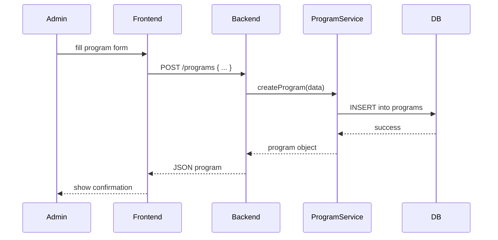

# Chapter 3: Core Models (Program & Protocol)

Welcome back! In [Chapter 2: Domain Structure & Routing](02_domain_structure___routing__.md) we learned how requests find the right silo. Now we’ll define the fundamental data structures—**Core Models**—that describe what a “program” is, how it works, and who can use it.

---

## 1. Why Core Models Matter

Imagine the federal “No Poverty” initiative. It needs a clear definition of:

- **What** the program is (forms, name, goals).
- **Who** can access it (eligibility rules).
- **How** it runs (the step-by-step process or protocol).

Core Models are like the legal statutes and forms in a regulatory handbook.  
They let admins set up new programs, enforce rules, and let developers extend workflows.

Use case: A citizen applies for housing aid under the “No Poverty” program. We need to know:

1. Which program they’re applying to.
2. Which protocol (application steps) they’ll follow.
3. If they’re eligible.

---

## 2. Key Concepts

### 2.1 Program
A Program ties together:
- `id` (unique code, e.g., `no-poverty`)
- `name` (e.g., “No Poverty Initiative”)
- `tenantId` (which state or agency—see [Chapter 1: Tenant & CodifySubprojects](01_tenant___codifysubprojects_.md))
- `protocolId` (which process it follows)
- `eligibilityRules` (simple criteria)

### 2.2 Protocol
A Protocol describes the workflow:
- `id` (e.g., `basic-app-process`)
- `name` (e.g., “Basic Application Process”)
- `steps` (ordered list of step names)

---

## 3. Using Core Models

### 3.1 Define a Protocol

```js
// src/models/protocol.js
class Protocol {
  constructor(id, name, steps = []) {
    this.id = id
    this.name = name
    this.steps = steps
  }
}
module.exports = Protocol
```
This model holds the sequence of steps a user follows.

### 3.2 Define a Program

```js
// src/models/program.js
class Program {
  constructor(id, name, tenantId, protocolId, eligibilityRules = {}) {
    this.id = id
    this.name = name
    this.tenantId = tenantId
    this.protocolId = protocolId
    this.eligibilityRules = eligibilityRules
  }
}
module.exports = Program
```
This ties a protocol and eligibility rules to a tenant.

### 3.3 Create a Protocol Instance

```js
const Protocol = require('./models/protocol')

const basicProcess = new Protocol(
  'basic-app-process',
  'Basic Application Process',
  ['submit-form', 'review', 'decision']
)

console.log(basicProcess)
```
Output:  
{ id: 'basic-app-process', name: 'Basic Application Process', steps: [ 'submit-form', 'review', 'decision' ] }

### 3.4 Create a Program Instance

```js
const Program = require('./models/program')

// Suppose tenant 'federal' exists from [Chapter 1]
const povertyProgram = new Program(
  'no-poverty',
  'No Poverty Initiative',
  'federal',               // tenantId
  'basic-app-process',     // protocolId
  { minIncome: 0, maxIncome: 20000 }
)

console.log(povertyProgram)
```
Output shows our program, tied to a tenant and protocol, with simple income rules.

### 3.5 Check Eligibility

```js
function isEligible(program, citizen) {
  const { minIncome, maxIncome } = program.eligibilityRules
  return citizen.income >= minIncome && citizen.income <= maxIncome
}

// Example:
console.log(isEligible(povertyProgram, { income: 15000 })) // true
```
This simple function enforces program rules.

---

## 4. Under the Hood: How a Program Is Created

Here’s what happens when an admin creates a new program:



### 4.1 Program Service (src/services/programService.js)

```js
const ProgramRepo = require('../repositories/programRepo')

async function createProgram(data) {
  // (1) validate data, (2) enforce tenant from auth
  // skip validation details…
  return await ProgramRepo.save(data)
}

module.exports = { createProgram }
```

### 4.2 Program Repository (src/repositories/programRepo.js)

```js
const db = require('../db')

async function save(program) {
  const sql = `
    INSERT INTO programs (id,name,tenant_id,protocol_id,eligibility)
    VALUES (?,?,?,?,?)
  `
  await db.query(sql, [
    program.id,
    program.name,
    program.tenantId,
    program.protocolId,
    JSON.stringify(program.eligibilityRules)
  ])
  return program
}

module.exports = { save }
```

This keeps SQL in one place so services stay clean.

---

## 5. Conclusion & Next Steps

You now know how **Core Models** define the shape of programs and protocols, enforce eligibility, and support clear workflows. Next up: building a rich knowledge graph of these models in [Chapter 4: HMS-AGX (Knowledge Graph)](04_hms_agx__knowledge_graph__.md).

---

Generated by [AI Codebase Knowledge Builder](https://github.com/The-Pocket/Tutorial-Codebase-Knowledge)