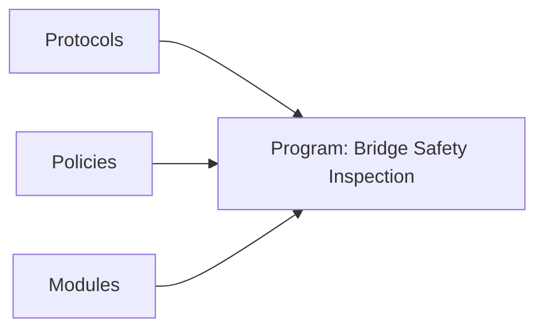
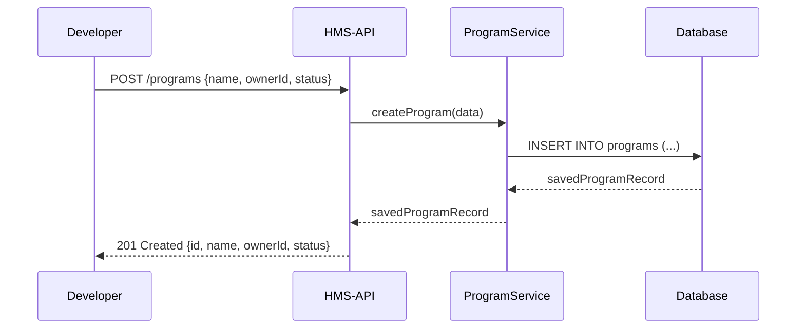

# Chapter 3: Core Program Model

In [Chapter 2: Core User Model & Auth](02_core_user_model___auth_.md) we learned how to register users, assign roles, and secure our API calls with JWTs. Now it’s time to build the backbone of every agency initiative—the **Program** model.

---

## 1. Motivation: Blueprint for Public Service Initiatives

Imagine the Department of Transportation wants to launch a “Bridge Safety Inspection Program”:

- Track all inspection tasks (site visits, reports).  
- Assign inspectors (users from Chapter 2).  
- Enforce inspection protocols (covered in [Chapter 4](04_core_protocol_model_.md)).  
- Link to policies (covered in [Chapter 5](05_policy_management_api_.md)).  
- Plug in custom business logic modules (covered in [Chapter 6](06_module_system___business_logic_.md)).

A **Program** acts like a project binder that groups everything under one roof—name, owner, current status, plus links to protocols, policies, and modules.

---

## 2. Key Concepts

### 2.1 Program  
A container or “project binder” for a government initiative (e.g., “Bridge Safety Inspection”).

### 2.2 Attributes  
Every Program has:

- `id` – Unique identifier (auto-generated).  
- `name` – Human-friendly title.  
- `ownerId` – The user responsible (from [Chapter 2](02_core_user_model___auth_.md)).  
- `status` – e.g. `draft`, `active`, `archived`.  

### 2.3 Relationships  
A Program links to:

- **Protocols** ([next chapter](04_core_protocol_model_.md))  
- **Policies** ([Chapter 5](05_policy_management_api_.md))  
- **Modules** ([Chapter 6](06_module_system___business_logic_.md))

Mermaid overview of these links:



---

## 3. Getting Started: Create and Fetch a Program

Here’s how to **create** a new Program and then **fetch** its details using the HMS-API SDK.

### 3.1 Create a Program

```js
// createProgram.js
const { ProgramService } = require('hms-api')

async function run() {
  const program = await ProgramService.createProgram({
    name: 'Bridge Safety Inspection',
    ownerId: 'user-123',       // from AuthService.login()
    status: 'draft'            // can be draft | active | archived
  })
  console.log('✅ Program created:', program.id)
}
run().catch(console.error)
```

Below the hood, you’ll use a UI form with:  
- `input-focus` for name input  
- `select-base` (or dropdown-colors) for status  

### 3.2 Fetch Program Details

```js
// getProgram.js
const { ProgramService } = require('hms-api')

async function run() {
  const details = await ProgramService.getProgram('program-456')
  console.log('Program Info:', {
    name: details.name,
    owner: details.ownerId,
    status: details.status
  })
}
run().catch(console.error)
```

This returns a JSON object with all attributes and arrays of linked protocol/policy IDs.

---

## 4. Under the Hood: Request Flow

A simple sequence of what happens when you call `createProgram`:



---

## 5. Internal Implementation

### 5.1 Service Layer (`src/services/program.service.ts`)

```ts
import { v4 as uuid } from 'uuid'
import { programRepo } from '../repositories/program.repo'

export async function createProgram(data: {
  name: string
  ownerId: string
  status: string
}) {
  const id = uuid()                             // generate unique ID
  const record = await programRepo.insert({ id, ...data })
  return record                                 // { id, name, ownerId, status }
}
```

- We use `uuid()` for `id`.  
- `programRepo.insert()` handles the database logic.  

### 5.2 Repository Layer (`src/repositories/program.repo.ts`)

```ts
// Pseudocode — details depend on your ORM/SQL library
export const programRepo = {
  insert: async (rec) => db.table('programs').insert(rec).returning('*')
}
```

---

## 6. Visualizing Programs & Their Links

Here’s a component diagram showing how a Program ties into other core models:

```mermaid
graph TD
  subgraph Program["Program: Bridge Safety Inspection"]
    Proto[Protocols] -.-> Program
    Poli[Policies]   -.-> Program
    Mod[Modules]     -.-> Program
  end
```

- Dashed arrows indicate “has many” relationships.  
- Protocol details live in [Chapter 4](04_core_protocol_model_.md).  

---

## 7. Conclusion & Next Steps

In this chapter you learned how to:

- Create a **Program** as the “blueprint” for an initiative.  
- Fetch program details for dashboards or wizards.  
- See the end‐to‐end request flow and peek under the hood.  

Next up, we dive into **[Core Protocol Model](04_core_protocol_model_.md)**—defining the step-by-step rules every program follows.

---

Generated by [AI Codebase Knowledge Builder](https://github.com/The-Pocket/Tutorial-Codebase-Knowledge)